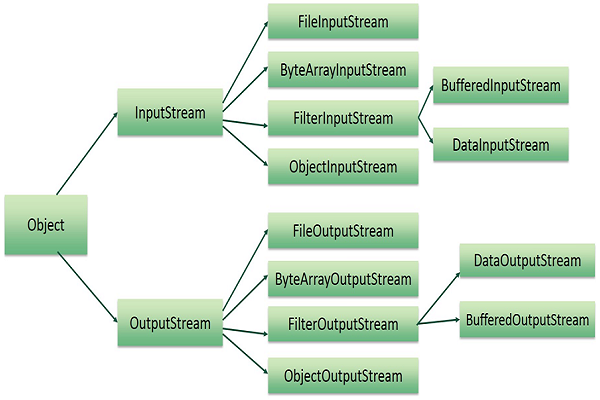
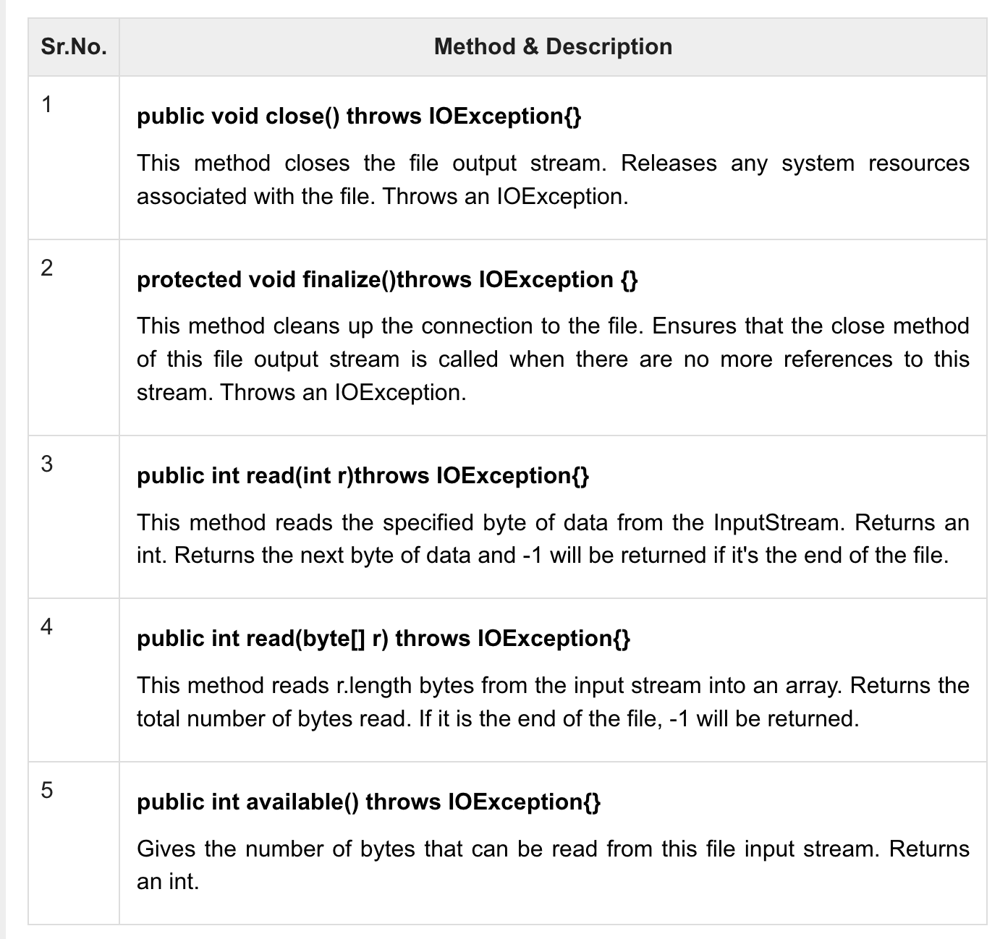
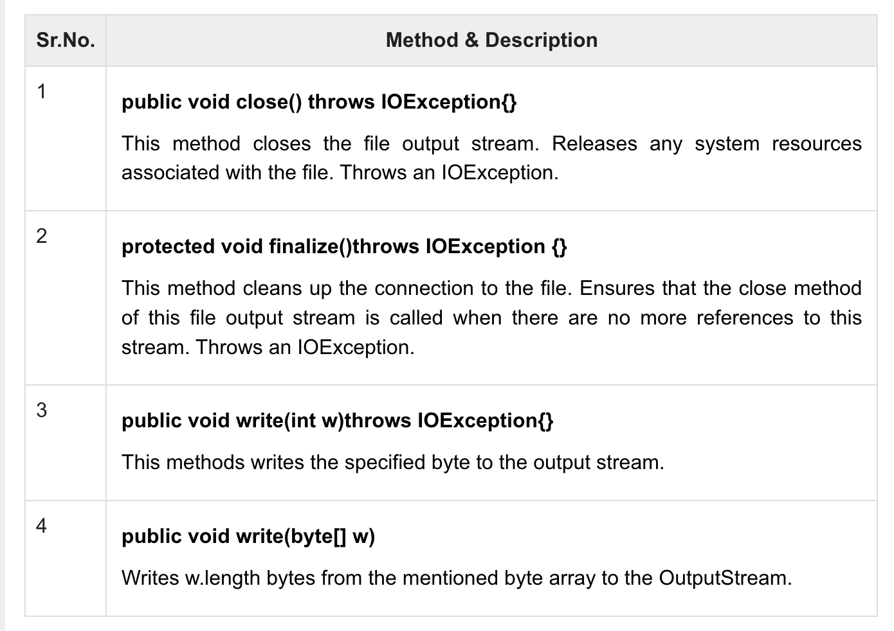
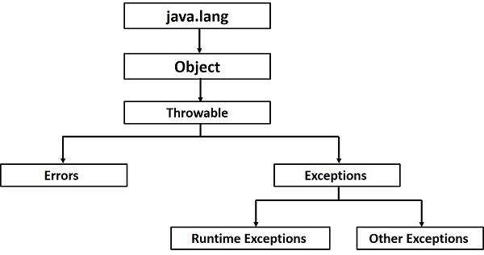
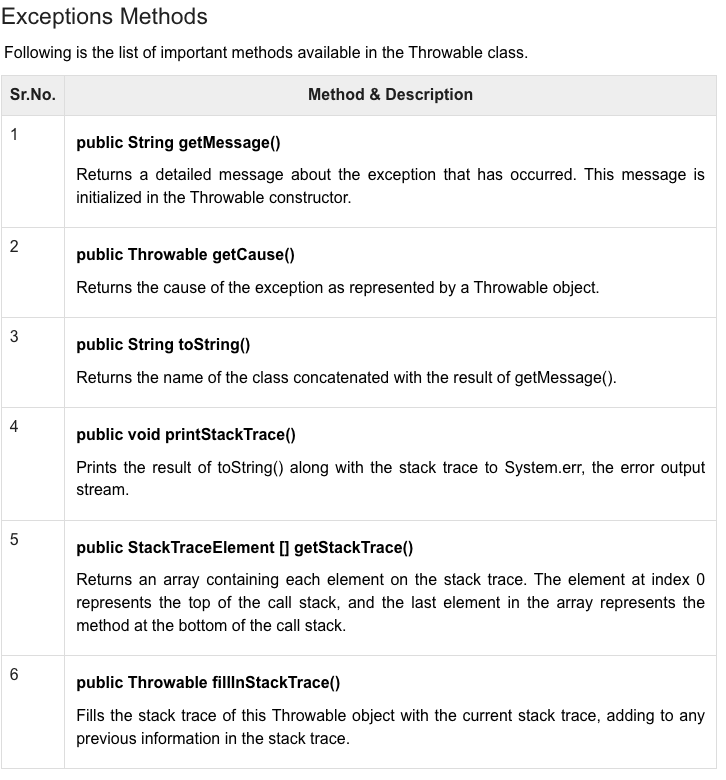
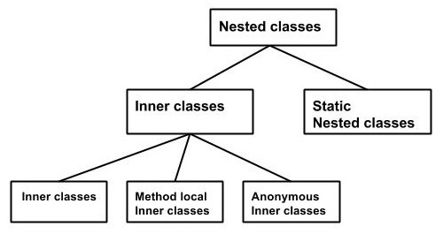
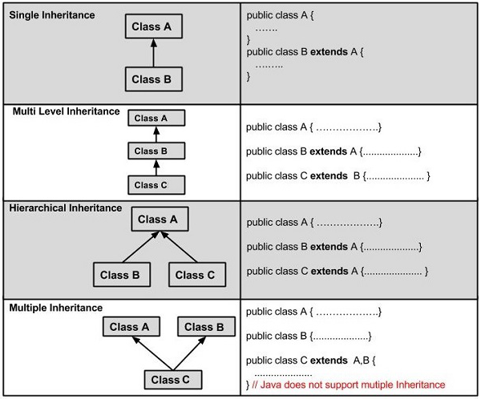
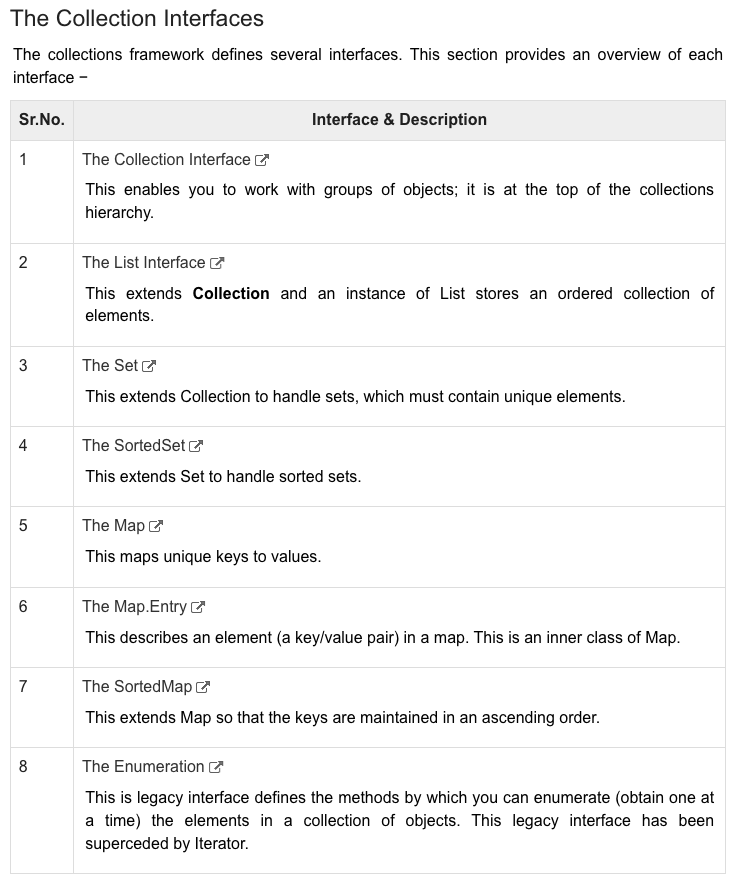
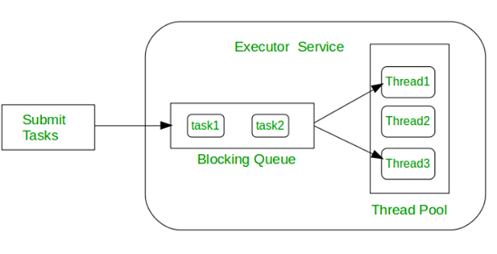
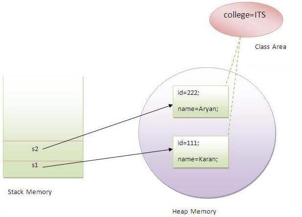

# java-basic-to-master

have resume of :

head First JAVA, 2nd edition.pdf
java - the complete reference - 11 edition.pdf


## what is computation

* problem solving
* knowledge of concepts
* programming skill


concepts : 

* data structures
* iteration and recursion 

* abstraction 
* organize and modularize (readability)

* algorithms (searching and sorting)
* complexity of algoritms


computer -> do calculations, store somewhere(remember)


type of knowledge

declarative knowledge - statements of fact

imperative knowledge - recipe or how-to -> sequence of steps

two types of computers

fixed program -> calculator
store program - machine stores and exucute instructions

turing showed that you can compute anything using 6 primitives
move left, move right, read , write, scan and do nothing.

expressions ->  variable(object) + operation

syntax error -> wrong word
semantic error -> the order of the words

## java tutorial

Java is an object-oriented, class-based, concurrent, secured and general-purpose computer-programming language.

Java is a programming language and a platform. Java is a high level, robust, object-oriented and secure programming language.

Java was developed by Sun Microsystems (which is now the subsidiary of Oracle) in the year 1995. James Gosling is known as the father of Java. Before Java, its name was Oak.

Platform: Any hardware or software environment in which a program runs, is known as a platform. Since Java has a runtime environment (JRE) and API, it is called a platform.

Simple.java

### Types of Java Applications

There are mainly 4 types of applications that can be created using Java programming:

Standalone Application - Standalone applications are also known as desktop applications or window-based applications

Web Application - An application that runs on the server side and creates a dynamic page is called a web application. Currently, Servlet, JSP, Struts, Spring, Hibernate, JSF, etc. technologies are used for creating web applications in Java.

Enterprise Application - An application that is distributed in nature, such as banking applications, etc. is called an enterprise application. It has advantages like high-level security, load balancing, and clustering. In Java, EJB is used for creating enterprise applications.

Mobile Application - An application which is created for mobile devices is called a mobile application. Currently, Android and Java ME are used for creating mobile applications.

### Java Platforms / Editions

Java SE (Java Standard Edition)

It is a Java programming platform. It includes Java programming APIs such as java.lang, java.io, java.net, java.util, java.sql, java.math etc. It includes core topics like OOPs, String, Regex, Exception, Inner classes, Multithreading, I/O Stream, Networking, AWT, Swing, Reflection, Collection, etc.

Java EE (Java Enterprise Edition)

It is an enterprise platform that is mainly used to develop web and enterprise applications. It is built on top of the Java SE platform. It includes topics like Servlet, JSP, Web Services, EJB, JPA, etc.

Java ME (Java Micro Edition)

It is a micro platform that is dedicated to mobile applications.

JavaFX

It is used to develop rich internet applications. It uses a lightweight user interface API.

current version - Java SE 18 (to be released by March 2022)

java is 

Simple
Object-Oriented
Portable
Platform independent
Secured
Robust
Architecture neutral
Interpreted
High Performance
Multithreaded
Distributed
Dynamic

Java is best known for its security. With Java, we can develop virus-free systems. Java is secured because:

No explicit pointer

Java Programs run inside a virtual machine sandbox

Classloader: Classloader in Java is a part of the Java Runtime Environment (JRE) which is used to load Java classes into the Java Virtual Machine dynamically. It adds security by separating the package for the classes of the local file system from those that are imported from network sources.

Bytecode Verifier: It checks the code fragments for illegal code that can violate access rights to objects.

Security Manager: It determines what resources a class can access such as reading and writing to the local disk.


Distributed

Java is distributed because it facilitates users to create distributed applications in Java. RMI and EJB are used for creating distributed applications. This feature of Java makes us able to access files by calling the methods from any machine on the internet.

Dynamic

Java is a dynamic language. It supports the dynamic loading of classes. It means classes are loaded on demand. It also supports functions from its native languages, i.e., C and C++.

Java supports dynamic compilation and automatic memory management (garbage collection).

To compile(generate simple.class -> bytecode):
javac Simple.java

To execute:
java Simple

valid java main() method signature

public static void main(String[] args)  
public static void main(String []args)  
public static void main(String args[])  
public static void main(String... args)  
static public void main(String[] args)  
public static final void main(String[] args)  
final public static void main(String[] args)  
final strictfp public static void main(String[] args)  

you can set temporary or permant path in Java

We must understand the differences between JDK, JRE, and JVM before proceeding further to Java.

JVM (Java Virtual Machine) is an abstract machine. It is called a virtual machine because it doesn't physically exist. It is a specification that provides a runtime environment in which Java bytecode can be executed. It can also run those programs which are written in other languages and compiled to Java bytecode.

Loads code
Verifies code
Executes code
Provides runtime environment

JRE is an acronym for Java Runtime Environment. It is also written as Java RTE. The Java Runtime Environment is a set of software tools which are used for developing Java applications. It is used to provide the runtime environment. It is the implementation of JVM. It physically exists. It contains a set of libraries + other files that JVM uses at runtime.

JRE = + JVM + SET OF libraries + other files

JDK is an acronym for Java Development Kit. The Java Development Kit (JDK) is a software development environment which is used to develop Java applications and applets. It physically exists. It contains JRE + development tools.

JDK is an implementation of any one of the below given Java Platforms released by Oracle Corporation:

Standard Edition Java Platform
Enterprise Edition Java Platform
Micro Edition Java Platform


JVM (Java Virtual Machine) is an abstract machine. It is a specification that provides runtime environment in which java bytecode can be executed.


A variable is a container which holds the value while the Java program is executed. A variable is assigned with a data type.

Variable is a name of memory location. There are three types of variables in java: local, instance and static.

There are two types of data types in Java: primitive and non-primitive.

A variable is the name of a reserved area allocated in memory.

A variable declared inside the body of the method is called local variable.

A local variable cannot be defined with "static" keyword.

variable declared inside the class but outside the body of the method, is called an instance variable.

A variable that is declared as static is called a static variable. It cannot be local. You can create a single copy of the static variable and share it among all the instances of the class. Memory allocation for static variables happens only once when the class is loaded in the memory.

Variable.java

widening - to increase the width, scope, or extent of widen a road widen an investigation.

widening -> int to float

```java
int a=10;  
float f=a;  
```

Narrowing (Typecasting)

narrowing -> float to int

```java
float f=10.5f;  
//int a=f;//Compile time error  
int a=(int)f;  
```

Primitive data types: The primitive data types include 
boolean, char, byte, short, int, long, float and double.

boolean data type
byte data type
char data type

short data type
int data type
long data type

float data type
double data type


Non-primitive data types: The non-primitive data types include Classes, Interfaces, and Arrays.


Byte Data Type

1 byte -> 8 bits ->  (max) 127 to -128 (min)

The byte data type is an example of primitive data type. It isan 8-bit signed two's complement integer. Its value-range lies between -128 to 127 (inclusive). Its minimum value is -128 and maximum value is 127. Its default value is 0.

The byte data type is used to save memory in large arrays where the memory savings is most required. It saves space because a byte is 4 times smaller than an integer. It can also be used in place of "int" data type.

```java
byte a = 10, byte b = -20  
```

The short data type is a 16-bit signed two's complement integer. Its value-range lies between -32,768 to 32,767

The int data type is a 32-bit signed two's complement integer. Its value-range lies between - 2,147,483,648 (-2^31) to 2,147,483,647 (2^31 -1)

The long data type is a 64-bit two's complement integer. Its value-range lies between -9,223,372,036,854,775,808(-2^63) to 9,223,372,036,854,775,807(2^63 -1)(inclusive).

```java
long a = 100000L, long b = -200000L  
```

The float data type is a single-precision 32-bit IEEE 754 floating point.Its value range is unlimited. It is recommended to use a float (instead of double) if you need to save memory in large arrays of floating point numbers. The float data type should never be used for precise values, such as currency. 

```java
float f1 = 234.5f  
```

The double data type is a double-precision 64-bit IEEE 754 floating point. Its value range is unlimited. The double data type is generally used for decimal values just like float. The double data type also should never be used for precise values, such as currency.

The char data type is a single 16-bit Unicode character. Its value-range lies between '\u0000' (or 0) to '\uffff' (or 65,535 inclusive).The char data type is used to store characters.

```java
chart letterA = 'a'
```

Java us 2 bytes - It is because java uses Unicode system not ASCII code system. The \u0000 is the lowest range of Unicode system. 

Unicode is a universal international standard character encoding that is capable of representing most of the world's written languages.

Before Unicode, there were many language standards:

* ASCII (American Standard Code for Information Interchange) for the United States.
* ISO 8859-1 for Western European Language.
* KOI-8 for Russian.
* GB18030 and BIG-5 for chinese, and so on.


This caused two problems:
* A particular code value corresponds to different letters in the various language standards. (no standard)
* The encodings for languages with large character sets have variable length.Some common characters are encoded as single bytes, other require two or more byte.

lowest value:\u0000
highest value:\uFFFF

Operator in Java is a symbol that is used to perform operations. For example: +, -, *, / etc.

here are many types of operators in Java which are given below:

Unary Operator,
Arithmetic Operator,
Shift Operator,
Relational Operator,
Bitwise Operator,
Logical Operator,
Ternary Operator and
Assignment Operator.


java unary operator

incrementing/decrementing a value by one
negating an expression
inverting the value of a boolean

```java
System.out.println(x++);//10 (11)  
System.out.println(++x);//12  
System.out.println(x--);//12 (11)  
System.out.println(--x);//10  
````

result : 10 12 12 10

```java
int a=10;  
int b=-10;  
boolean c=true;  
boolean d=false;  
System.out.println(~a);//-11 (minus of total positive value which starts from 0)  
System.out.println(~b);//9 (positive of total minus, positive starts from 0)  
System.out.println(!c);//false (opposite of boolean value)  
System.out.println(!d);//true  
```

java arithmetic 

```java
System.out.println(a+b);//15  
System.out.println(a-b);//5  
System.out.println(a*b);//50  
System.out.println(a/b);//2  
System.out.println(a%b);//0  
```


The Java left shift operator << is used to shift all of the bits in a value to the left side of a specified number of times.

```java
System.out.println(10<<2);//10*2^2=10*4=40  
System.out.println(10<<3);//10*2^3=10*8=80  
System.out.println(20<<2);//20*2^2=20*4=80  
System.out.println(15<<4);//15*2^4=15*16=240  
```

The Java right shift operator >> is used to move the value of the left operand to 
right by the number of bits specified by the right operand.

```java
System.out.println(10>>2);//10/2^2=10/4=2  
System.out.println(20>>2);//20/2^2=20/4=5  
System.out.println(20>>3);//20/2^3=20/8=2  
```

Java Shift Operator Example: >> vs >>>

```java
//For positive number, >> and >>> works same  
System.out.println(20>>2);  
System.out.println(20>>>2);  
//For negative number, >>> changes parity bit (MSB) to 0  
System.out.println(-20>>2);  
System.out.println(-20>>>2);  
```

Java AND Operator Example: Logical && and Bitwise &

The logical && operator doesn't check the second condition if the first condition is false. It checks the second condition only if the first one is true.

The bitwise & operator always checks both conditions whether first condition is true or false.

```java
nt a=10;  
int b=5;  
int c=20;  
System.out.println(a<b&&a<c);//false && true = false  
System.out.println(a<b&a<c);//false & true = false  
```

Java AND Operator Example: Logical && vs Bitwise &

```java
int a=10;  
int b=5;  
int c=20;  
System.out.println(a<b&&a++<c);//false && true = false  
System.out.println(a);//10 because second condition is not checked  
System.out.println(a<b&a++<c);//false && true = false  
System.out.println(a);//11 because second condition is checked  
```

Java OR Operator Example: Logical || and Bitwise |

The logical || operator doesn't check the second condition if the first condition is true. It checks the second condition only if the first one is false.

The bitwise | operator always checks both conditions whether first condition is true or false.

```java
int a=10;  
int b=5;  
int c=20;  
System.out.println(a>b||a<c);//true || true = true  
System.out.println(a>b|a<c);//true | true = true  
//|| vs |  
System.out.println(a>b||a++<c);//true || true = true  
System.out.println(a);//10 because second condition is not checked  
System.out.println(a>b|a++<c);//true | true = true  
System.out.println(a);//11 because second condition is checked  
```

Java Ternary operator is used as one line replacement for if-then-else statement and used a lot in Java programming. It is the only conditional operator which takes three operands.

Ternary.java


Java assignment operator is one of the most common operators. It is used to assign the value on its right to the operand on its left.

```java
int a=10;  
int b=20;  
a+=4;//a=a+4 (a=10+4)  
b-=4;//b=b-4 (b=20-4)  
a*=2;//9*2  
a/=2;//18/2  
```


Java keywords are also known as reserved words. Keywords are particular words that act as a key to a code. These are predefined words by Java so they cannot be used as a variable or object name or class name.


* abstract: Java abstract keyword is used to declare an abstract class. An abstract class can provide the implementation of the interface. It can have abstract and non-abstract methods.
* boolean: Java boolean keyword is used to declare a variable as a boolean type. It can hold True and False values only.
* break: Java break keyword is used to break the loop or switch statement. It breaks the current flow of the program at specified conditions.
* byte: Java byte keyword is used to declare a variable that can hold 8-bit data values.
* case: Java case keyword is used with the switch statements to mark blocks of text.
* catch: Java catch keyword is used to catch the exceptions generated by try statements. It must be used after the try block only.
* char: Java char keyword is used to declare a variable that can hold unsigned 16-bit Unicode characters
* class: Java class keyword is used to declare a class.
* continue: Java continue keyword is used to continue the loop. It continues the current flow of the program and skips the remaining code at the specified condition.
* default: Java default keyword is used to specify the default block of code in a switch statement.
* do: Java do keyword is used in the control statement to declare a loop. It can iterate a part of the program several times.
* double: Java double keyword is used to declare a variable that can hold 64-bit floating-point number.
* else: Java else keyword is used to indicate the alternative branches in an if statement.
* enum: Java enum keyword is used to define a fixed set of constants. Enum constructors are always private or default.
* extends: Java extends keyword is used to indicate that a class is derived from another class or interface.
* final: Java final keyword is used to indicate that a variable holds a constant value. It is used with a variable. It is used to restrict the user from updating the value of the variable.
* finally: Java finally keyword indicates a block of code in a try-catch structure. This block is always executed whether an exception is handled or not.
* float: Java float keyword is used to declare a variable that can hold a 32-bit floating-point number.
* for: Java for keyword is used to start a for loop. It is used to execute a set of instructions/functions repeatedly when some condition becomes true. If the number of iteration is fixed, it is recommended to use for loop.
* if: Java if keyword tests the condition. It executes the if block if the condition is true.
* implements: Java implements keyword is used to implement an interface.
* import: Java import keyword makes classes and interfaces available and accessible to the current source code.
* instanceof: Java instanceof keyword is used to test whether the object is an instance of the specified class or implements an interface.
* int: Java int keyword is used to declare a variable that can hold a 32-bit signed integer.
* interface: Java interface keyword is used to declare an interface. It can have only abstract methods.
* long: Java long keyword is used to declare a variable that can hold a 64-bit integer.
native: Java native keyword is used to specify that a method is implemented in native code using JNI (Java Native Interface).
* new: Java new keyword is used to create new objects.
* null: Java null keyword is used to indicate that a reference does not refer to anything. It removes the garbage value.
* package: Java package keyword is used to declare a Java package that includes the classes.
* private: Java private keyword is an access modifier. It is used to indicate that a method or variable may be accessed only in the class in which it is declared.
* protected: Java protected keyword is an access modifier. It can be accessible within the package and outside the package but through inheritance only. It can't be applied with the class.
* public: Java public keyword is an access modifier. It is used to indicate that an item is accessible anywhere. It has the widest scope among all other modifiers.
* return: Java return keyword is used to return from a method when its execution is complete.
* short: Java short keyword is used to declare a variable that can hold a 16-bit integer.
* static: Java static keyword is used to indicate that a variable or method is a class method. The static keyword in Java is mainly used for memory management.
* strictfp: Java strictfp is used to restrict the floating-point calculations to ensure portability.
* super: Java super keyword is a reference variable that is used to refer to parent class objects. It can be used to invoke the immediate parent class method.
* switch: The Java switch keyword contains a switch statement that executes code based on test value. The switch statement tests the equality of a variable against multiple values.
synchronized: Java synchronized keyword is used to specify the critical sections or methods in multithreaded code.
* this: Java this keyword can be used to refer the current object in a method or constructor.
* throw: The Java throw keyword is used to explicitly throw an exception. The throw keyword is mainly used to throw custom exceptions. It is followed by an instance.
* throws: The Java throws keyword is used to declare an exception. Checked exceptions can be propagated with throws.
* transient: Java transient keyword is used in serialization. If you define any data member as transient, it will not be serialized.
* try: Java try keyword is used to start a block of code that will be tested for exceptions. The try block must be followed by either catch or finally block.
* void: Java void keyword is used to specify that a method does not have a return value.
* volatile: Java volatile keyword is used to indicate that a variable may change asynchronously.
* while: Java while keyword is used to start a while loop. This loop iterates a part of the program several times. If the number of iteration is not fixed, it is recommended to use the while loop.

continue

```java
//for loop  
for(int i=1;i<=10;i++){  
    if(i==5){  
        //using continue statement  
        continue;//it will skip the rest statement  
    }  
    System.out.println(i);  
}  
```


Java default keyword

A Java default keyword is an access modifier. If you didn't assign any access modifier to variables, methods, constructors and, classes, by default, it is considered as default access modifier.

The default access modifier is accessible within the package only.

Java null reserved word

In Java, null is a reserved word for literal values. It seems like a keyword, but actually, it is a literal similar to true and false.

The access to a null reference generates a NullPointerException.

Java strictfp keyword 

ensures that you will get the same result on every platform if you perform operations in the floating-point variable. The precision may differ from platform to platform that is why java programming language have provided the strictfp keyword, so that you get same result on every platform. So, now you have better control over the floating-point arithmetic.

The strictfp keyword can be applied on methods, classes and interfaces.

```java
strictfp class A{}//strictfp applied on class  

strictfp interface M{}//strictfp applied on interface  

class A{  
    strictfp void m(){}//strictfp applied on method  
}  
```


Volatile Keyword in Java

Volatile keyword is used to modify the value of a variable by different threads. It is also used to make classes thread safe. It means that multiple threads can use a method and instance of the classes at the same time without any problem. The volatile keyword can be used either with primitive type or objects.

The volatile keyword does not cache the value of the variable and always read the variable from the main memory. The volatile keyword cannot be used with classes or methods. However, it is used with variables. It also guarantees visibility and ordering. It prevents the compiler from the reordering of code.

```java
class Test  {  
    static volatile int var =5;  
}  
```

When to use it?

* You can use a volatile variable if you want to read and write long and double variable automatically.
* It can be used as an alternative way of achieving synchronization in Java.
* All reader threads will see the updated value of the volatile variable after completing the write operation. If you are not using the volatile keyword, different reader thread may see different values.
* It is used to inform the compiler that multiple threads will access a particular statement. It prevents the compiler from doing any reordering or any optimization.
* If you do not use volatile variable compiler can reorder the code, free to write in cache value of volatile variable instead of reading from the main memory.


to check your java version in the command

```terminal
java - version
```

java comments 

```java
/*
multiline comments

*/

// this is inline comment

// javadoc comments

/**
 * Multiple lines of Javadoc text are written here,
 * wrapped normally...
 */

/** An especially short bit of Javadoc. */

```


Object − Objects have states and behaviors. Example: A dog has states - color, name, breed as well as behavior such as wagging their tail, barking, eating. An object is an instance of a class.

Class − A class can be defined as a template/blueprint that describes the behavior/state that the object of its type supports.

Methods − A method is basically a behavior. A class can contain many methods. It is in methods where the logics are written, data is manipulated and all the actions are executed.

Instance Variables − Each object has its unique set of instance variables. An object's state is created by the values assigned to these instance variables.

Case Sensitivity − Java is case sensitive, which means identifier Hello and hello would have different meaning in Java.

Class Names − For all class names the first letter should be in Upper Case. If several words are used to form a name of the class, each inner word's first letter should be in Upper Case.

Example: class MyFirstJavaClass

Method Names − All method names should start with a Lower Case letter. If several words are used to form the name of the method, then each inner word's first letter should be in Upper Case.

Example: public void myMethodName()


Java Modifiers

Access Modifiers − default, public , protected, private

Non-access Modifiers − final, abstract, strictfp


java variables

Local Variables

Class Variables (Static Variables)

Instance Variables (Non-static Variables)

Enums were introduced in Java 5.0. Enums restrict a variable to have one of only a few predefined values. The values in this enumerated list are called enums.

enums can be declared as their own or inside a class. Methods, variables, constructors can be defined inside enums as well.


In Java language, an interface can be defined as a contract between objects on how to communicate with each other. 


f you don't want others (or yourself) to overwrite existing values, use the final keyword (this will declare the variable as "final" or "constant", which means unchangeable and read-only):

java multiple variables : 

int x = 5, y = 6, z = 50;

Java Identifiers
All Java variables must be identified with unique names.

These unique names are called identifiers.

```java
// Good
int minutesPerHour = 60;
```

Primitive data types - includes byte, short, int, long, float, double, boolean and char

Non-primitive data types - such as String, Arrays and Classes (you will learn more about these in a later chapter)


java numbers 

Integer types stores whole numbers, positive or negative (such as 123 or -456), without decimals. Valid types are byte, short, int and long. Which type you should use, depends on the numeric value.

Floating point types represents numbers with a fractional part, containing one or more decimals. There are two types: float and double.


ASCII values as char
char myVar1 = 65, myVar2 = 66, myVar3 = 67;

The main difference between primitive and non-primitive data types are:

Primitive types are predefined (already defined) in Java. Non-primitive types are created by the programmer and is not defined by Java (except for String).

Non-primitive types can be used to call methods to perform certain operations, while primitive types cannot.

A primitive type has always a value, while non-primitive types can be null.

A primitive type starts with a lowercase letter, while non-primitive types starts with an uppercase letter.

The size of a primitive type depends on the data type, while non-primitive types have all the same size.

Examples of non-primitive types are Strings, Arrays, Classes, Interface, etc.

### Java Type Casting


Type casting is when you assign a value of one primitive data type to another type.

In Java, there are two types of casting:

Widening Casting (automatically) - converting a smaller type to a larger type size
byte -> short -> char -> int -> long -> float -> double

Narrowing Casting (manually) - converting a larger type to a smaller size type
double -> float -> long -> int -> char -> short -> byte

Widening Casting

```java

int myInt = 9;
double myDouble = myInt;

```

Narrowing Casting

```java

double myDouble = 9.78d;
int myInt = (int) myDouble; // manual casting: double to int

```


java is an object oriented language that supports : 

Polymorphism

Inheritance

Encapsulation

Abstraction

Classes

Objects

Instance

Method

Message Passing

Object − Objects have states and behaviors. Example: A dog has states - color, name, breed as well as behaviors – wagging the tail, barking, eating. An object is an instance of a class.

Class − A class can be defined as a template/blueprint that describes the behavior/state that the object of its type support.


A class can contain any of the following variable types.

Local variables − Variables defined inside methods, constructors or blocks are called local variables. The variable will be declared and initialized within the method and the variable will be destroyed when the method has completed.

Instance variables − Instance variables are variables within a class but outside any method. These variables are initialized when the class is instantiated. Instance variables can be accessed from inside any method, constructor or blocks of that particular class.

Class variables − Class variables are variables declared within a class, outside any method, with the static keyword.

Constructors

very class has a constructor. If we do not explicitly write a constructor for a class, the Java compiler builds a default constructor for that class.

```java

public class Puppy {
    public Puppy() {

    }

    public Puppy(String name) {

    }
}
```

Java also supports Singleton Classes where you would be able to create only one instance of a class.


Creating an Object

There are three steps when creating an object from a class −

Declaration − A variable declaration with a variable name with an object type.

Instantiation − The 'new' keyword is used to create the object.

Initialization − The 'new' keyword is followed by a call to a constructor. This call initializes the new object.


Java Package - In simple words, it is a way of categorizing the classes and interfaces.

Decision Making statements


* if statements
* switch statement


Loop statements

* do while loop
* while loop
* for loop
* for-each loop

Jump statements

* break statement
* continue statement


if statement

* Simple if statement
* if-else statement
* if-else-if ladder
* Nested if-statement


In Java, Switch statements are similar to if-else-if statements. The switch statement contains multiple blocks of code called cases and a single case is executed based on the variable which is being switched.

* The case variables can be int, short, byte, char, or enumeration. String type is also supported since version 7 of Java
* Cases cannot be duplicate
* Default statement is executed when any of the case doesn't match the value of expression. It is optional.
* Break statement terminates the switch block when the condition is satisfied.
It is optional, if not used, next case is executed.
* While using switch statements, we must notice that the case expression will be of the same type as the variable. However, it will also be a constant value.

```java

int num = 2;

switch(num) {
    case 0: System.out.println("number is 0"); break;
    case 1: System.out.println("number is 1"); break;
    default: System.out.println(num); 
}

```


for statement

We use the for loop only when we exactly know the number of times, we want to execute the block of code.

ForExample.java

```java

int sum =0;

for(int i = 1; i <=10; i++>) {
    sum=sum+i;
}


```

Java for-each loop

Java provides an enhanced for loop to traverse the data structures like array or collection. In the for-each loop, we don't need to update the loop variable. The syntax to use the for-each loop in java is given below.

```java
String[] names = {"Java","C","C++","Python","JavaScript"}

for(String name: names) System.out.println(name);
```

Java while loop

The while loop is also used to iterate over the number of statements multiple times. However, if we don't know the number of iterations in advance, it is recommended to use a while loop. Unlike for loop, the initialization and increment/decrement doesn't take place inside the loop statement in while loop.


```java

int i = 0;

while(i<=10>) {
    Sysmte.out.println(i);
}

```

Java do-while loop

The do-while loop checks the condition at the end of the loop after executing the loop statements. When the number of iteration is not known and we have to execute the loop at least once, we can use do-while loop.


```java

int i = 0;

do {
    System.out.println(i);
}while(i <=10)

```

Jump Statements

Jump statements are used to transfer the control of the program to the specific statements. In other words, jump statements transfer the execution control to the other part of the program. 


java break statement


As the name suggests, the break statement is used to break the current flow of the program and transfer the control to the next statement outside a loop or switch statement. However, it breaks only the inner loop in the case of the nested loop.


The break statement cannot be used independently in the Java program, i.e., it can only be written inside the loop or switch statement.


```java

for(int i = 0; i <= 10; i++) {
    System.out.println(i);
    if(i == 6) break;    
}

```

0
1
2
3
4
5
6

Java continue statement

Unlike break statement, the continue statement doesn't break the loop, whereas, it skips the specific part of the loop and jumps to the next iteration of the loop immediately.

```java


for(int i = 0; i <= 10; i++) {
    if(i == 6) continue;    
    System.out.println(i);
}

```

0
1
2
3
4
5
7
8
9
10

ContinueExample.java


nested swtich example

```java

char branch = 'C';                 
int collegeYear = 4;  
switch( collegeYear )  
{  
    case 1:  
        System.out.println("English, Maths, Science");  
        break;  
    case 2:  
        switch( branch )   
        {  
            case 'C':  
                System.out.println("Operating System, Java, Data Structure");  
                break;  
            case 'E':  
                System.out.println("Micro processors, Logic switching theory");  
                break;  
            case 'M':  
                System.out.println("Drawing, Manufacturing Machines");  
                break;  
        }  
        break;  
    case 3:  
        switch( branch )   
        {  
            case 'C':  
                System.out.println("Computer Organization, MultiMedia");  
                break;  
            case 'E':  
                System.out.println("Fundamentals of Logic Design, Microelectronics");  
                break;  
            case 'M':  
                System.out.println("Internal Combustion Engines, Mechanical Vibration");  
                break;  
        }  
        break;  
    case 4:  
        switch( branch )   
        {  
            case 'C':  
                System.out.println("Data Communication and Networks, MultiMedia");  
                break;  
            case 'E':  
                System.out.println("Embedded System, Image Processing");  
                break;  
            case 'M':  
                System.out.println("Production Technology, Thermal Engineering");  
                break;  
        }  
        break;  
}  

```

Java Wrapper in Switch Statement

Java allows us to use four wrapper classes: Byte, Short, Integer and Long in switch statement.

```java
Integer age = 18;        
switch (age)  
{  
    case (16):            
        System.out.println("You are under 18.");  
        break;  
    case (18):                
        System.out.println("You are eligible for vote.");  
        break;  
    case (65):                
        System.out.println("You are senior citizen.");  
        break;  
    default:  
        System.out.println("Please give the valid age.");  
        break;  
}             
```

Java Enum in Switch Statement

Java allows us to use enum in switch statement. Java enum is a class that represent the group of constants. (immutable such as final variables). We use the keyword enum and put the constants in curly braces separated by comma.

EnumSwitchExample.java

java keywords

https://www.w3schools.com/java/java_ref_keywords.asp

math library

https://www.w3schools.com/java/java_ref_math.asp


java docs

https://www.tutorialspoint.com/java/java_documentation.htm

java email library to send email

https://www.tutorialspoint.com/java/java_sending_email.htm


Java divides the operators into the following groups:

* Arithmetic operators
* Assignment operators
* Comparison operators
* Logical operators
* Bitwise operators


Java Special Characters

\'	'	Single quote

\"	"	Double quote

\\	\	Backslash

\n	New Line	

\r	Carriage Return	

\t	Tab	

\b	Backspace	

\f	Form Feed


The solution to avoid this problem, is to use the backslash escape character.

```java
String txt = "We are the so-called \"Vikings\" from the north.";
String txt = "It\'s alright.";
```

The Java Math class has many methods that allows you to perform mathematical tasks on numbers.

The Math.max(x,y) method can be used to find the highest value of x and y:

The Math.sqrt(x) method returns the square root of x:

The Math.abs(x) method returns the absolute (positive) value of x:

```java
Math.max(5, 10);
Math.min(5, 10);
Math.sqrt(64);
Math.abs(-4.7);
Math.random();
```

ternary operator

There is also a short-hand if else, which is known as the ternary operator because it consists of three operands.

```java
variable = (condition) ? expressionTrue :  expressionFalse;
```

```java
int time = 20;
Stringr result = (time < 20) ? "soon":"late";
```

switch

```java
switch(expression) {
  case x:
    // code block
    break;
  case y:
    // code block
    break;
  default:
    // code block
}
```

java for

```java
for (statement 1; statement 2; statement 3) {
  // code block to be executed
}
```

Statement 1 is executed (one time) before the execution of the code block.

Statement 2 defines the condition for executing the code block.

Statement 3 is executed (every time) after the code block has been executed.


for each

used to loop thorugh elements in java collection


```java
for (type variableName : arrayName) {
  // code block to be executed
}
```

Java Arrays

Arrays are used to store multiple values in a single variable, instead of declaring separate variables for each value.

```java
String[] cars = {"Volvo", "BMW", "Ford", "Mazda"};
int[] myNum = {10, 20, 30, 40};
cars[0] = "Opel";
System.out.println(cars[0]);

//array length
System.out.println(cars.length);

// traditional for loop on collection
for (int i = 0; i < cars.length; i++) {
  System.out.println(cars[i]);
}

```

Multidimensional Arrays

A multidimensional array is an array of arrays.

To create a two-dimensional array, add each array within its own set of curly braces:

```java
int[][] myNumbers = { {1, 2, 3, 4}, {5, 6, 7} };
int x = myNumbers[1][2];  // 7 

```


Java Literals

A literal is a source code representation of a fixed value. They are represented directly in the code without any computation.

byte, int, long, and short can be expressed in decimal(base 10), hexadecimal(base 16) or octal(base 8) number systems as well.


```java
byte a = 68;
char a = 'A';

int decimal = 100;
int octal = 0144;
int hexa =  0x64;

```

String and char types of literals can contain any Unicode characters.

```java
char a = '\u0001';
String a = "\u0001";
```


\n	Newline (0x0a)

\r	Carriage return (0x0d)

\f	Formfeed (0x0c)

\b	Backspace (0x08)

\s	Space (0x20)

\t	tab

\"	Double quote

\'	Single quote

\\	backslash

\ddd	Octal character (ddd)

\uxxxx	Hexadecimal UNICODE character (xxxx)


static variable example : 

```java
public class Employee {

   // salary  variable is a private static variable
   private static double salary;

   // DEPARTMENT is a constant
   public static final String DEPARTMENT = "Development ";

   public static void main(String args[]) {
      salary = 1000;
      System.out.println(DEPARTMENT + "average salary:" + salary);
   }
}
```

Modifiers are keywords that you add to those definitions to change their meanings. Java language has a wide variety of modifiers, including the following −

Java Access Modifiers

Non Access Modifiers

To use a modifier, you include its keyword in the definition of a class, method, or variable.

Access Control Modifiers

Java provides a number of access modifiers to set access levels for classes, variables, methods and constructors. 

Visible to the package, the default. No modifiers are needed.

Visible to the class only (private).

Visible to the world (public).

Visible to the package and all subclasses (protected).

Non-Access Modifiers

Java provides a number of non-access modifiers to achieve many other functionality.

The static modifier for creating class methods and variables.

The final modifier for finalizing the implementations of classes, methods, and variables.

The abstract modifier for creating abstract classes and methods.

The synchronized and volatile modifiers, which are used for threads.

The bitwise operators

Java defines several bitwise operators, which can be applied to the integer types, long, int, short, char, and byte.

Bitwise operator works on bits and performs bit-by-bit operation. Assume if a = 60 and b = 13; now in binary format they will be as follows −

a = 0011 1100

b = 0000 1101

-----------------

a&b = 0000 1100

a|b = 0011 1101

a^b = 0011 0001

~a  = 1100 0011


* << (left shift)	Binary Left Shift Operator. The left operands value is moved left by the number of bits specified by the right operand.	A << 2 will give 240 which is 1111 0000

C <<= 2 is same as C = C << 2

*  (right shift) >>	Binary Right Shift Operator. The left operands value is moved right by the number of bits specified by the right operand.	A >> 2 will give 15 which is 1111

* (zero fill right shift) >>>	Shift right zero fill operator. The left operands value is moved right by the number of bits specified by the right operand and shifted values are filled up with zeros.	A >>>2 will give 15 which is 0000 1111


instanceof Operator

This operator is used only for object reference variables. The operator checks whether the object is of a particular type (class type or interface type)

```java
( Object reference variable ) instanceof  (class/interface type)
```

```java
String name = "James"
Vehicle a = new Car();

// following will return true since name is type of String
boolean result = name instanceof String;
// This operator will still return true, if the object being compared is the assignment compatible with the type on the right.
boolean result =  a instanceof Car;  // true

```

Precedence of Java Operators

For example, x = 7 + 3 * 2; here x is assigned 13, not 20 because operator * has higher precedence than +, so it first gets multiplied with 3 * 2 and then adds into 7.

Here, operators with the highest precedence appear at the top of the table, those with the lowest appear at the bottom. Within an expression, higher precedence operators will be evaluated first.


Postfix	expression++ expression--	Left to right

Unary	++expression –-expression +expression –expression ~ !	Right to left

Multiplicative	* / %	Left to right

Additive	+ -	Left to right

Shift	<< >> >>>	Left to right

Relational	< > <= >= instanceof	Left to right

Equality	== !=	Left to right

Bitwise AND	&	Left to right

Bitwise XOR	^	Left to right

Bitwise OR	|	Left to right

Logical AND	&&	Left to right

Logical OR	||	Left to right

Conditional	?:	Right to left

Assignment	= += -= *= /= %= ^= |= <<= >>= >>>=	Right to left


A method is a block of code which only runs when it is called.

You can pass data, known as parameters, into a method.

Methods are used to perform certain actions, and they are also known as functions.

Why use methods? To reuse code: define the code once, and use it many times.

```java
public class Main {
    static void myMethod() {
        // code to be executed
    }
}
```

static means that the method belongs to the Main class and not an object of the Main class.

Parameters and Arguments

Information can be passed to methods as parameter. Parameters act as variables inside the method.

With method overloading, multiple methods can have the same name with different parameters:

```java
int myMethod(int x)
float myMethod(float x)
double myMethod(double x, double y)

static int plusMethod(int x, int y) {
  return x + y;
}

static double plusMethod(double x, double y) {
  return x + y;
}

```

Java Scope

In Java, variables are only accessible inside the region they are created. This is called scope.

Method Scope

Variables declared directly inside a method are available anywhere in the method

```java
public static void main(String[] args) {

    // Code here CANNOT use x

    int x = 100;

    // Code here can use x
    System.out.println(x);
}
```

Block Scope

A block of code refers to all of the code between curly braces {}.

Variables declared inside blocks of code are only accessible by the code between the curly braces

```java

public static void main(String[] args) {

    // Code here CANNOT use x

    { // This is a block

        // Code here CANNOT use x

        int x = 100;

        // Code here CAN use x
        System.out.println(x);

    } // The block ends here

    // Code here CANNOT use x           

}
```

Java Recursion

Recursion is the technique of making a function call itself. This technique provides a way to break complicated problems down into simple problems which are easier to solve.

```java
public static int sum(int k) {
    if (k > 0) {
        return k + sum(k - 1);
    } else {
        return 0;
    }
}
```

10 + sum(9)
10 + ( 9 + sum(8) )
10 + ( 9 + ( 8 + sum(7) ) )
...
10 + 9 + 8 + 7 + 6 + 5 + 4 + 3 + 2 + 1 + sum(0)
10 + 9 + 8 + 7 + 6 + 5 + 4 + 3 + 2 + 1 + 0

Halting Condition

Just as loops can run into the problem of infinite looping, recursive functions can run into the problem of infinite recursion. Infinite recursion is when the function never stops calling itself. Every recursive function should have a halting condition, which is the condition where the function stops calling itself. In the previous example, the halting condition is when the parameter k becomes 0.

```java
public static int sum(int start, int end) {
    if (end > start) {
      return end + sum(start, end - 1);
    } else {
      return end;
    }
}
```

Normally, when we work with Numbers, we use primitive data types such as byte, int, long, double, etc.

However, in development, we come across situations where we need to use objects instead of primitive data types. In order to achieve this, Java provides wrapper classes.

All the wrapper classes (Integer, Long, Byte, Double, Float, Short) are subclasses of the abstract class Number.

The object of the wrapper class contains or wraps its respective primitive data type. Converting primitive data types into object is called boxing, and this is taken care by the compiler. Therefore, while using a wrapper class you just need to pass the value of the primitive data type to the constructor of the Wrapper class.

And the Wrapper object will be converted back to a primitive data type, and this process is called unboxing. The Number class is part of the java.lang package.


```java
    Integer x = 5; // boxes int to an Integer object
    x =  x + 10;   // unboxes the Integer to a int
    System.out.println(x); 
```

Nested for Loop

If we have a for loop inside the another loop, it is known as nested for loop. 


Java Labeled For Loop
We can have a name of each Java for loop. To do so, we use label before the for loop. It is useful while using the nested for loop as we can break/continue specific for loop.

```java
//Using Label for outer and for loop  
aa:  
    for(int i=1;i<=3;i++){  
        bb:  
            for(int j=1;j<=3;j++){  
                if(i==2&&j==2){  
                    break aa;  
                }  
                System.out.println(i+" "+j);  
            }  

```
If you use break bb;, it will break inner loop only which is the default behaviour of any loop.

Java Infinitive for Loop

If you use two semicolons ;; in the for loop, it will be infinitive for loop.

```java
for(;;){  
//code to be executed  
}  
```

it became obvious that Java would also be useful on the server side. The result was the servlet. A servlet is a small program that executes on the server.

Because servlets (like all Java programs) are compiled into bytecode and executed by the JVM, they are highly portable. Thus, the same servlet can be used in a variety of different server environments. The only requirements are that the server support the JVM and a servlet container

To better understand how Java is robust, consider two of the main reasons for program failure: memory management mistakes and mishandled exceptional conditions (that is, run-time errors). 

In computer science, robustness is the ability of a computer system to cope with errors during execution and cope with erroneous input. 


Java was designed to meet the real-world requirement of creating interactive, networked programs. To accomplish this, Java supports multithreaded programming

Java is designed for the distributed environment of the Internet because it handles TCP/IP protocols. In fact, accessing a resource using a URL is not much different from accessing a file. Java also supports Remote Method Invocation (RMI). This feature enables a program to invoke methods across a network.

Dynamic

Java programs carry with them substantial amounts of run-time type information that is used to verify and resolve accesses to objects at run time.

Java 1 -> 1.1

Java 2 -> 1.2 added support for a number of new features, such as Swing and the Collections Framework, and it enhanced the Java Virtual Machine and various programming tools. 


Java 1.3 ->  first major upgrade to the original Java 2 release. For the most part, it added to existing functionality and “tightened up” the development environment. 

j2se 1.4 - >  it added the new keyword assert, chained exceptions, and a channel-based I/O subsystem. It also made changes to the Collections Framework and the networking classes.

J2SE 5 -> expanded the scope, power, and range of the language.

* Generics
* Annotations
* Autoboxing and auto-unboxing
* Enumerations
* Enhanced, for-each style for loop
* Variable-length arguments (varargs) 
* Static import
* Formatted I/O
* Concurrency utilities


Java SE 6 - but it did enhance the API libraries, added several new packages, and offered improvements to the run time.

Java SE 7 -> jdk 7 -> first major release of Java since Sun Microsystems was acquired by Oracle. new features, including significant additions to the language and the API libraries. Upgrades to the Java run-time system that support non- Java languages were also included. The purpose of Project Coin was to identify a number of small changes to the Java language that would be incorporated into JDK 7.

* A String can now control a switch statement.
*  Binary integer literals.
*  Underscores in numeric literals.
*  An expanded try statement, called try-with-resources, that supports
automatic resource management. (For example, streams can be closed
automatically when they are no longer needed.)
*  Type inference (via the diamond operator) when constructing a generic
instance.
*  Enhanced exception handling in which two or more exceptions can be
caught by a single catch (multi-catch) and better type checking for
exceptions that are rethrown.
*  Although not a syntax change, the compiler warnings associated with
some types of varargs methods were improved, and you have more control over the warnings.

 Two of the most important were the enhancements to the NIO Framework and the addition of the Fork/Join Framework.

 The Fork/Join Framework provides important support for parallel programming.

Parallel programming is the name commonly given to the techniques that make effective use of computers that contain more than one processor, including multicore systems.

The Fork/Join Framework addressed parallel programming by:

* Simplifying the creation and use of tasks that can execute concurrently 
* Automatically making use of multiple processors

Java SE 8 -> 1.8. JDK 8 -> 


the lambda expression -> lambda expressions add functional programming features to Java

The addition of lambda expressions also caused a new operator (the –>) and a new syntax element to be added to the language.

One of the most important was the new stream API, which is packaged in java.util.stream. The stream API supports pipeline operations on data and is optimized for lambda expressions. Another new package was ava.util.function. It defines a number of functional interfaces, which provide additional support for lambda expressions.

Another lambda-inspired feature affects interface. is now possible to define a default implementation for a method specified by an interface. If no implementation for a default method is created, then the default defined by the interface is used. This feature enables interfaces to be gracefully evolved over time because a new method can be added to an interface without breaking existing code

ther new features in JDK 8 include a new time and date API, type annotations, and the ability to use parallel processing when sorting an array, among others.

Java SE 9. -> 

The primary new JDK 9 feature was modules, which enable you to specify the relationship and dependencies of the code that comprises an application. Modules also add another dimension to Java’s access control features. The inclusion of modules caused a new syntax element and several keywords to be added to Java. Furthermore, a tool called jlink was added to the JDK, which enables a programmer to create a run-time image of an application that contains only the necessary modules

 JShell, which is a tool that supports interactive program experimentation and learning.

Support for private interface methods.
JDK 9 added a search feature to the javadoc tool and a new tag called @index to support it.

JDK 9 deprecated the entire applet API.

 Java SE 10 - 

Support for local variable type inference.

With local variable type inference, it is now possible to let the type of a local variable be inferred from the type of its initializer, rather than being explicitly specified.

To support this new capability, the context-sensitive identifier var was added to Java as a reserved type name.

Type inference can streamline code by eliminating the need to redundantly specify a variable’s type when it can be inferred from its initializer. It can also simplify declarations in cases in which the type is difficult to discern or cannot be explicitly specified.

Local variable type inference has become a common part of the contemporary programming

 JDK 10 also redefined the Java version string, changing the meaning of the version numbers so that they better align with the new time-based release schedule.

https://www.javatpoint.com/java-versions

Java SE 11 -  

he primary new language feature in JDK 11 is support for the use of var in a lambda expression

new networking API, which will be of interest to a wide range of developers. Called the HTTP Client API, it is packaged in java.net.http, and it provides enhanced, updated, and improved networking support for HTTP clients.

Also, another execution mode was added to the Java launcher that enables it to directly execute simple single-file programs. JDK 11 also removes some features

Support for another deployment-related technology called Java Web Start has also been removed from JDK 11. As the execution environment has continued to evolve, both applets and Java Web Start were rapidly losing relevance. Another key change in JDK 11 is that JavaFX is no longer included in the JDK.

* java 12
* java 13
* java 14
* java 15
* java 16
* java 17
* java 18(march 2022)

https://en.wikipedia.org/wiki/Java_version_history#Java_11


Object-oriented programming (OOP) is at the core of Java.

All computer programs consist of two elements: code and data. Furthermore, a program can be conceptually organized around its code or around its data.


An essential element of object-oriented programming is abstraction. Humans manage complexity through abstraction. For example, people do not think of a car as a set of tens of thousands of individual parts. They think of it as a well- defined object with its own unique behavior. This abstraction allows people to use a car to drive to the grocery store without being overwhelmed by the complexity of the individual parts. They can ignore the details of how the engine, transmission, and braking systems work. Instead, they are free to utilize the object as a whole.

The Three OOP Principles

All object-oriented programming languages provide mechanisms that help you implement the object-oriented model. They are encapsulation, inheritance, and polymorphism.

Encapsulation is the mechanism that binds together code and the data it manipulates, and keeps both safe from outside interference and misuse. One way to think about encapsulation is as a protective wrapper that prevents the code and data from being arbitrarily accessed by other code defined outside the wrapper.


Inheritance is the process by which one object acquires the properties of another object. This is important because it supports the concept of hierarchical classification. As mentioned earlier, most knowledge is made manageable by hierarchical (that is, top-down) classifications. For example, a Golden Retriever is part of the classification dog, which in turn is part of the mammal class, which is under the larger class animal. 

Inheritance interacts with encapsulation as well. If a given class encapsulates some attributes, then any subclass will have the same attributes plus any that it adds as part of its specialization

Polymorphism (from Greek, meaning “many forms”) is a feature that allows one interface to be used for a general class of actions.

More generally, the concept of polymorphism is often expressed by the phrase “one interface, multiple methods.”

More generally, the concept of polymorphism is often expressed by the phrase “one interface, multiple methods.” This means that it is possible to design a generic interface to a group of related activities

When properly applied, polymorphism, encapsulation, and inheritance combine to produce a programming environment that supports the development of far more robust and scaleable programs than does the process-oriented model

java basic compile

```
javac Example.java
java Example
```

In, Java is case-sensitive, so VALUE is a different identifier than Value.

Literals

A constant value in Java is created by using a literal representation of it. 

In Java, there are a few characters that are used as separators. The most commonly used separator in Java is the semicolon. As you have seen, it is often used to terminate statements. The separators are shown in the following table:


Java Is a Strongly Typed Language

 First, every variable has a type, every expression has a type, and every type is strictly defined. Second, all assignments, whether explicit or via parameter passing in method calls, are checked for type compatibility.


The Primitive Types

Java defines eight primitive types of data: byte, short, int, long, char, float, double, and boolean

* Integers This group includes byte, short, int, and long, which are for whole-valued signed numbers.
* Floating-point numbers This group includes float and double, which represent numbers with fractional precision.
* Characters This group includes char, which represents symbols in a character set, like letters and numbers.
* Boolean This group includes boolean, which is a special type for representing true/false values.

Java defines four integer types: byte, short, int, and long. All of these are signed, positive and negative values

The smallest integer type is byte. This is a signed 8-bit type that has a range from –128 to 127. Variables of type byte are especially useful when you’re working with a stream of data from a network or file. They are also useful when you’re working with raw binary data that may not be directly compatible with Java’s other built-in types.

The type float specifies a single-precision value that uses 32 bits of storage. Single precision is faster on some processors and takes half as much space as double precision, but will become imprecise when the values are either very large or very small.

Double precision, as denoted by the double keyword, uses 64 bits to store a value. Double precision is actually faster than single precision on some modern processors that have been optimized for high-speed mathematical calculations.

Notice that ch1 is assigned the value 88, which is the ASCII (and Unicode) value that corresponds to the letter X

You can embed one or more underscores in an integer literal. Doing so makes it easier to read large integer literals. When the literal is compiled, the underscores are discarded. For example, given

int x = 123_456_789;

the value given to x will be 123,456,789.The underscores will be ignored.

double num = 9_423_497_862.0;
the value given to num will be 9,423,497,862.0. The underscores will be ignored. 

declare variable
int a, b, c;

initializaing variable
b = 2;

dynamic initialization - > allows variables to be initialized dynamically, using any expression valid at the time the variable is declared.

```java
double a = 3.0, b= 4.0;

double c = Math.sqrt(a*a+b*b);
```

Type Conversion and Casting

If the two types are compatible, then Java will perform the conversion automatically. For example, it is always possible to assign an int value to a long variable. However, not all types are compatible, and thus, not all type conversions are implicitly allowed. For instance, there is no automatic conversion defined from double to byte. Fortunately, it is still possible to obtain a conversion between incompatible types. To do so, you must use a cast,

```java
int a;
byte b;
b = (byte) a;
```

Automatic Type Promotion in Expressions

```java
byte a = 40;
byte b = 50;
byte c = 100;
int d = a * b / c;
```

The Type Promotion Rules

First, all byte, short, and char values are promoted to int, as just described. Then, if one operand is a long, the whole expression is promoted to long. If one operand is a float, the entire expression is promoted to float. If any of the operands are double, the result is double.


An array is a group of like-typed variables that are referred to by a common name. Arrays of any type can be created and may have one or more dimensions.  convenient means of grouping related information.

A one-dimensional array is, essentially, a list of like-typed variables

```java
int month_days[] = new int[12];
month_days[0] = 31;
int algo[] = {31,24,24};
```
In Java, multidimensional arrays are implemented as arrays of arrays. 

```java
int twoD[][] = new int[4][5];

int al[] = new int[3]; 
int[] a2 = new int[3];

int[] nums, nums2, nums3;
int nums[], nums2[], nums3[];

```

Introducing Type Inference with Local Variables

Recently, an exciting new feature called local variable type inference was added to the Java language. To begin, let’s review two important aspects of variables. First, all variables in Java must be declared prior to their use. Second, a variable can be initialized with a value when it is declared.

```java

double avg = 10.0;
var avg2 = 10.0;

```


In both cases, avg will be of type double. In the first case, its type is explicitly specified. In the second, its type is inferred as double because the initializer 10.0 is of type double.

There are a few places in which the use of var is illegal. It cannot be used as the name of a class, for example.

The preceding example uses var to declare only simple variables, but you can also use var to declare an array. For example:

Notice that neither var nor myArray has brackets. Instead, the type of myArray is inferred to be int[ ]. Furthermore, you cannot use brackets on the left side of a var declaration. Thus, both of these declarations are invalid:

It is important to emphasize that var can be used to declare a variable only when that variable is initialized.

```java
var myArray = new int[10]; // This is valid.
var[] myArray = new int[10]; // Wrong

var counter; // Wrong! Initializer required.
```
Also, remember that var can be used only to declare local variables. It cannot be used when declaring instance variables, parameters, or return types, for example.

In addition to those mentioned in the preceding discussion, several other restrictions apply to the use of var. Only one variable can be declared at a time; a variable cannot use null as an initializer; and the variable being declared cannot be used by the initializer expression. Although you can declare an array type using var, you cannot use var with an array initializer. For example, this is valid:

```java

var myArray = new int[10]; // This is valid.
var myArray = { 1, 2, 3 }; // Wrong

```

As mentioned earlier, var cannot be used as the name of a class. It also cannot be used as the name of other reference types, including an interface, enumeration, or annotation, or as the name of a generic type parameter


```java
x = 42; 
y = ++x;
```

In this case, y is set to 43 as you would expect, because the increment occurs before x is assigned to y. Thus, the line y = ++x; is the equivalent of these two statements:

```java
x = x + 1; 
y = x;
```

However, when written like this,

```java
x = 42; 
y = x++;
```

the value of x is obtained before the increment operator is executed, so the value of y is 42. Of course, in both cases x is set to 43. Here, the line y = x++; is the equivalent of these two statements:

```java
y = x;
x = x + 1;
```

Java defines several bitwise operators that can be applied to the integer types: long, int, short, char, and byte


The logical Boolean operators, &, |, and ^, operate on boolean values in the same way that they operate on the bits of an integer. The logical ! operator inverts the Boolean state: !true == false and !false == true.

As you can see from the preceding table, the OR operator results in true when A is true, no matter what B is. Similarly, the AND operator results in false when A is false, no matter what B is.

If you use the || and && forms, rather than the | and & forms of these operators, Java will not bother to evaluate the right-hand operand when the outcome of the expression can be determined by the left operand alone.

This is very useful when the right-hand operand depends on the value of the left one in order to function properly.

```java
if (denom != 0 && num / denom > 10)
```

It is standard practice to use the short-circuit forms of AND and OR in cases involving Boolean logic, leaving the single-character versions exclusively for bitwise operations. 

Parentheses raise the precedence of the operations that are inside them. This is often necessary to obtain the result you desire.

```java
(a >> b) + 3
```

java OOP


Object-oriented programming has several advantages over procedural programming:

* OOP is faster and easier to execute
* OOP provides a clear structure for the programs
* OOP helps to keep the Java code DRY "Don't Repeat Yourself", and makes the code easier to maintain, modify and debug
* OOP makes it possible to create full reusable applications with less code and shorter development time


Class -> fruit , object -> apple, banana

class -> car , object -> volvo, audi

class is a template for objects, and an object is an instance of a class

Java is associated with classes and objects, along with its attributes and methods. For example: in real life, a car is an object. The car has attributes, such as weight and color, and methods, such as drive and brake.

Java Class Attributes

x and y are attributes

```java
public class Main {
  int x = 5;
  int y = 3;
}
```

The final keyword is useful when you want a variable to always store the same value, like PI (3.14159...).

The final keyword is called a "modifier". You will learn more about these in the Java Modifiers Chapter.

A constructor in Java is a special method that is used to initialize objects. The constructor is called when an object of a class is created. It can be used to set initial values for object attributes


```java
public class Main {
  int modelYear;
  String modelName;

  public Main(int year, String name) {
    modelYear = year;
    modelName = name;
  }

  public static void main(String[] args) {
    Main myCar = new Main(1969, "Mustang");
    System.out.println(myCar.modelYear + " " + myCar.modelName);
  }
}
```

We divide modifiers into two groups:

Access Modifiers - controls the access level - default, public, private, protected

Non-Access Modifiers - do not control access level, but provides other functionality  - final, abstract

abstract	The class cannot be used to create objects (To access an abstract class, it must be inherited from another class.

static	Attributes and methods belongs to the class, rather than an object

transient	Attributes and methods are skipped when serializing the object containing them

synchronized	Methods can only be accessed by one thread at a time

volatile	The value of an attribute is not cached thread-locally, and is always read from the "main memory"


The meaning of Encapsulation, is to make sure that "sensitive" data is hidden from users. To achieve this, you must:

* declare class variables/attributes as private
* provide public get and set methods to access and update the value of a private variable

```java
public class Person {
  private String name; // private = restricted access

  // Getter
  public String getName() {
    return name;
  }

  // Setter
  public void setName(String newName) {
    this.name = newName;
  }
}
```

Why Encapsulation?

Better control of class attributes and methods
Class attributes can be made read-only (if you only use the get method), or write-only (if you only use the set method)
Flexible: the programmer can change one part of the code without affecting other parts
Increased security of data


A package in Java is used to group related classes. Think of it as a folder in a file directory. We use packages to avoid name conflicts, and to write a better maintainable code. Packages are divided into two categories:

* Built-in Packages (packages from the Java API)
* User-defined Packages (create your own packages)

The Java API is a library of prewritten classes, that are free to use, included in the Java Development Environment.

The library is divided into packages and classes. Meaning you can either import a single class (along with its methods and attributes), or a whole package that contain all the classes that belong to the specified package.

```java
import package.name.Class;   // Import a single class
import package.name.*;   // Import the whole package

import java.util.Scanner;

import java.util.*;
```

User-defined Packages

To create your own package, you need to understand that Java uses a file system directory to store them. Just like folders on your computer:

-> root -> mypack -> MyPackageClass.java

```java
package mypack;
class MyPackageClass {
  public static void main(String[] args) {
    System.out.println("This is my package!");
  }
}
```

Java provides the Date class available in java.util package, this class encapsulates the current date and time.

This is a very easy method to get current date and time in Java. You can use a simple Date object with toString() method to print the current date and time as follows

```java
// Instantiate a Date object
Date date = new Date();

// display time and date using toString()
System.out.println(date.toString());
```

Date Comparison

Following are the three ways to compare two dates −

You can use getTime( ) to obtain the number of milliseconds that have elapsed since midnight, January 1, 1970, for both objects and then compare these two values.

You can use the methods before( ), after( ), and equals( ). Because the 12th of the month comes before the 18th, for example, new Date(99, 2, 12).before(new Date (99, 2, 18)) returns true.

You can use the compareTo( ) method, which is defined by the Comparable interface and implemented by Date

SimpleDateFormat is a concrete class for formatting and parsing dates in a locale-sensitive manner. SimpleDateFormat allows you to start by choosing any user-defined patterns for date-time formatting.

```java
Date dNow = new Date( );
SimpleDateFormat ft = 
new SimpleDateFormat ("E yyyy.MM.dd 'at' hh:mm:ss a zzz");

System.out.println("Current Date: " + ft.format(dNow));
```

Date and time formatting can be done very easily using printf method. 

```java
// Instantiate a Date object
Date date = new Date();

// display time and date
String str = String.format("Current Date/Time : %tc", date );

System.out.printf(str); // Current Date/Time : Sat Dec 15 16:37:57 MST 2012


// display time and date
System.out.printf("%1$s %2$tB %2$td, %2$tY", "Due date:", date);
// Due date: February 09, 2004

```

The SimpleDateFormat class has some additional methods, notably parse( ), which tries to parse a string according to the format stored in the given SimpleDateFormat object.

```java

SimpleDateFormat ft = new SimpleDateFormat ("yyyy-MM-dd"); 
String input = args.length == 0 ? "1818-11-11" : args[0]; 

System.out.print(input + " Parses as "); 
Date t;
try {
    t = ft.parse(input); 
    System.out.println(t); 
} catch (ParseException e) { 
    System.out.println("Unparseable using " + ft); 
}

// 1818-11-11 Parses as Wed Nov 11 00:00:00 EST 1818
```

Sleeping for a While

You can sleep for any period of time from one millisecond up to the lifetime of your computer. For example, the following program would sleep for 3 seconds −

```java
try { 
    System.out.println(new Date( ) + "\n"); 
    Thread.sleep(5*60*10); 
    System.out.println(new Date( ) + "\n"); 
} catch (Exception e) {
    System.out.println("Got an exception!"); 
}
// Sun May 03 18:04:41 GMT 2009
// Sun May 03 18:04:51 GMT 2009
```


GregorianCalendar Class

GregorianCalendar is a concrete implementation of a Calendar class that implements the normal Gregorian calendar with which you are familiar.

The getInstance( ) method of Calendar returns a GregorianCalendar initialized with the current date and time in the default locale and time zone

We can use continue statement with a label. This feature is introduced since JDK 1.5. So, we can continue any loop in Java now whether it is outer loop or inner.

```java
aa:  
for(int i=1;i<=3;i++){    
    bb:  
    for(int j=1;j<=3;j++){    
        if(i==2&&j==2){    
            //using continue statement with label  
            continue aa;    
        }    
        System.out.println(i+" "+j);    
    }    
}    
```

There are three types of comments in Java.

* Single Line Comment
* Multi Line Comment
* Documentation Comment (java doc)

in java doc, you can use javadoc tags, javadoc generate documentation in html file.


Java provides the java.util.regex package for pattern matching with regular expressions. 
Java regular expressions are very similar to the Perl programming language and very easy to learn.

A regular expression is a special sequence of characters that helps you match or find other strings or sets of strings,

The java.util.regex package primarily consists of the following three classes −

Pattern Class − A Pattern object is a compiled representation of a regular expression. The Pattern class provides no public constructors. To create a pattern, you must first invoke one of its public static compile() methods, which will then return a Pattern object. These methods accept a regular expression as the first argument.

Matcher Class − A Matcher object is the engine that interprets the pattern and performs match operations against an input string. Like the Pattern class, Matcher defines no public constructors. You obtain a Matcher object by invoking the matcher() method on a Pattern object.

PatternSyntaxException − A PatternSyntaxException object is an unchecked exception that indicates a syntax error in a regular expression pattern.


```java
// String to be scanned to find the pattern.
String line = "This order was placed for QT3000! OK?";
String pattern = "(.*)(\\d+)(.*)";

// Create a Pattern object
Pattern r = Pattern.compile(pattern);

// Now create matcher object.
Matcher m = r.matcher(line);
if (m.find( )) {
    System.out.println("Found value: " + m.group(0) );
    System.out.println("Found value: " + m.group(1) );
    System.out.println("Found value: " + m.group(2) );
}else {
    System.out.println("NO MATCH");
}
```


In Java, it is possible to inherit attributes and methods from one class to another. We group the "inheritance concept" into two categories:

subclass (child) - the class that inherits from another class
superclass (parent) - the class being inherited from

To inherit from a class, use the extends keyword.

```java
class Vehicle {
  protected String brand = "Ford";        // Vehicle attribute
  public void honk() {                    // Vehicle method
    System.out.println("Tuut, tuut!");
  }
}

class Car extends Vehicle {
  private String modelName = "Mustang";    // Car attribute
  public static void main(String[] args) {

    // Create a myCar object
    Car myCar = new Car();

    // Call the honk() method (from the Vehicle class) on the myCar object
    myCar.honk();

    // Display the value of the brand attribute (from the Vehicle class) and the value of the modelName from the Car class
    System.out.println(myCar.brand + " " + myCar.modelName);
  }
}
 
```


Polymorphism means "many forms", and it occurs when we have many classes that are related to each other by inheritance.

Like we specified in the previous chapter; Inheritance lets us inherit attributes and methods from another class. Polymorphism uses those methods to perform different tasks. This allows us to perform a single action in different ways.

For example, think of a superclass called Animal that has a method called animalSound(). Subclasses of Animals could be Pigs, Cats, Dogs, Birds - And they also have their own implementation of an animal sound (the pig oinks, and the cat meows, etc.):

Now we can create Pig and Dog objects and call the animalSound() method on both of them:

```java
class Animal {
  public void animalSound() {
    System.out.println("The animal makes a sound");
  }
}

class Pig extends Animal {
  public void animalSound() {
    System.out.println("The pig says: wee wee");
  }
}

class Dog extends Animal {
  public void animalSound() {
    System.out.println("The dog says: bow wow");
  }
}

class Main {
  public static void main(String[] args) {
    Animal myAnimal = new Animal();  // Create a Animal object
    Animal myPig = new Pig();  // Create a Pig object
    Animal myDog = new Dog();  // Create a Dog object
    myAnimal.animalSound();
    myPig.animalSound();
    myDog.animalSound();
  }
}
```


In Java, it is also possible to nest classes (a class within a class). The purpose of nested classes is to group classes that belong together, which makes your code more readable and maintainable.

To access the inner class, create an object of the outer class, and then create an object of the inner class:


```java
class OuterClass {
  int x = 10;

  class InnerClass {
    int y = 5;
  }
}

public class Main {
  public static void main(String[] args) {
    OuterClass myOuter = new OuterClass();
    OuterClass.InnerClass myInner = myOuter.new InnerClass();
    System.out.println(myInner.y + myOuter.x);
  }
}

// Outputs 15 (5 + 10)

```

Private Inner Class

Unlike a "regular" class, an inner class can be private or protected. If you don't want outside objects to access the inner class, declare the class as private:

```java
class OuterClass {
  int x = 10;

  private class InnerClass {
    int y = 5;
  }
}

public class Main {
  public static void main(String[] args) {
    OuterClass myOuter = new OuterClass();
    OuterClass.InnerClass myInner = myOuter.new InnerClass();
    System.out.println(myInner.y + myOuter.x);
  }
}

// If you try to access a private inner class from an outside class, an error occurs
```

Static Inner Class

An inner class can also be static, which means that you can access it without creating an object of the outer class:


```java
class OuterClass {
  int x = 10;

  static class InnerClass {
    int y = 5;
  }
}

public class Main {
  public static void main(String[] args) {
    OuterClass.InnerClass myInner = new OuterClass.InnerClass();
    System.out.println(myInner.y);
  }
}

// Outputs 5
```

Access Outer Class From Inner Class

One advantage of inner classes, is that they can access attributes and methods of the outer class:

```java
class OuterClass {
  int x = 10;

  class InnerClass {
    public int myInnerMethod() {
      return x;
    }
  }
}

public class Main {
  public static void main(String[] args) {
    OuterClass myOuter = new OuterClass();
    OuterClass.InnerClass myInner = myOuter.new InnerClass();
    System.out.println(myInner.myInnerMethod());
  }
}

// Outputs 10
```


Abstract Classes and Methods

Data abstraction is the process of hiding certain details and showing only essential information to the user.

Abstraction can be achieved with either abstract classes or interfaces 

The abstract keyword is a non-access modifier, used for classes and methods:

Abstract class: is a restricted class that cannot be used to create objects (to access it, it must be inherited from another class).

Abstract method: can only be used in an abstract class, and it does not have a body. The body is provided by the subclass (inherited from).

To access the abstract class, it must be inherited from another class. Let's convert the Animal class we used in the Polymorphism chapter to an abstract class:

```java
// Abstract class
abstract class Animal {
  // Abstract method (does not have a body)
  public abstract void animalSound();
  // Regular method
  public void sleep() {
    System.out.println("Zzz");
  }
}

// Subclass (inherit from Animal)
class Pig extends Animal {
  public void animalSound() {
    // The body of animalSound() is provided here
    System.out.println("The pig says: wee wee");
  }
}

class Main {
  public static void main(String[] args) {
    Pig myPig = new Pig(); // Create a Pig object
    myPig.animalSound();
    myPig.sleep();
  }
}
 

Animal myObj = new Animal(); // will generate an error

```

Why And When To Use Abstract Classes and Methods?

To achieve security - hide certain details and only show the important details of an object.

Another way to achieve abstraction in Java, is with interfaces.

An interface is a completely "abstract class" that is used to group related methods with empty bodies:

To access the interface methods, the interface must be "implemented" (kinda like inherited) by another class with the implements keyword (instead of extends). The body of the interface method is provided by the "implement" class:


```java

// interface
interface Animal {
  public void animalSound(); // interface method (does not have a body)
  public void run(); // interface method (does not have a body)
}

// Pig "implements" the Animal interface
class Pig implements Animal {
  public void animalSound() {
    // The body of animalSound() is provided here
    System.out.println("The pig says: wee wee");
  }
  public void sleep() {
    // The body of sleep() is provided here
    System.out.println("Zzz");
  }
}

class Main {
  public static void main(String[] args) {
    Pig myPig = new Pig();  // Create a Pig object
    myPig.animalSound();
    myPig.sleep();
  }
}

```

* Like abstract classes, interfaces cannot be used to create objects (in the example above, it is not possible to create an "Animal" object in the MyMainClass)
* Interface methods do not have a body - the body is provided by the "implement" class
* On implementation of an interface, you must override all of its methods
* Interface methods are by default abstract and public
* Interface attributes are by default public, static and final
* An interface cannot contain a constructor (as it cannot be used to create objects)


Why And When To Use Interfaces?

1) To achieve security - hide certain details and only show the important details of an object (interface).

2) Java does not support "multiple inheritance" (a class can only inherit from one superclass). However, it can be achieved with interfaces, because the class can implement multiple interfaces. Note: To implement multiple interfaces, separate them with a comma (see example below).

```java
interface FirstInterface {
  public void myMethod(); // interface method
}

interface SecondInterface {
  public void myOtherMethod(); // interface method
}

class DemoClass implements FirstInterface, SecondInterface {
  public void myMethod() {
    System.out.println("Some text..");
  }
  public void myOtherMethod() {
    System.out.println("Some other text...");
  }
}

class Main {
  public static void main(String[] args) {
    DemoClass myObj = new DemoClass();
    myObj.myMethod();
    myObj.myOtherMethod();
  }
}
```

An enum is a special "class" that represents a group of constants (unchangeable variables, like final variables).


```java

public class Main {
  enum Level {
    LOW,
    MEDIUM,
    HIGH
  }

  public static void main(String[] args) {
    Level myVar = Level.MEDIUM; 
    System.out.println(myVar);
  }
}

```

Enum is short for "enumerations", which means "specifically listed".

you can use Enum in the switch

The enum type has a values() method, which returns an array of all enum constants. This method is useful when you want to loop through the constants of an enum:

```java

for(Level myVar: Level.values()) {
    System.out.println(myVar);
}

```

An enum can, just like a class, have attributes and methods. The only difference is that enum constants are public, static and final (unchangeable - cannot be overridden).

An enum cannot be used to create objects, and it cannot extend other classes (but it can implement interfaces).

Why And When To Use Enums?

Use enums when you have values that you know aren't going to change, like month days, days, colors, 
deck of cards, etc.

Java User Input

The Scanner class is used to get user input, and it is found in the java.util package.

```java
import java.util.Scanner;  // Import the Scanner class

class Main {
  public static void main(String[] args) {
    Scanner myObj = new Scanner(System.in);  // Create a Scanner object
    System.out.println("Enter username");

    String userName = myObj.nextLine();  // Read user input
    System.out.println("Username is: " + userName);  // Output user input
  }
}
```

Java Dates

Java does not have a built-in Date class, but we can import the java.time package to work with the date and time API. The package includes many date and time classes. For example:


* LocalDate	Represents a date (year, month, day (yyyy-MM-dd))
* LocalTime	Represents a time (hour, minute, second and nanoseconds (HH-mm-ss-ns))
* LocalDateTime	Represents both a date and a time (yyyy-MM-dd-HH-mm-ss-ns)
* DateTimeFormatter	Formatter for displaying and parsing date-time objects

To display the current date, import the java.time.LocalDate class, and use its now() method:

```java
import java.time.LocalDate; // import the LocalDate class
import java.time.LocalTime; // import the LocalTime class
import java.time.LocalDateTime; // import the LocalDateTime class

public class Main {
  public static void main(String[] args) {
    LocalDate myObj = LocalDate.now(); // Create a date object
    System.out.println(myObj); // Display the current date
    // 2022-04-04

    LocalTime myObj = LocalTime.now();
    System.out.println(myObj);
    // 12:17:23.962600

    LocalDateTime myObj = LocalDateTime.now();
    System.out.println(myObj);
    // 2022-04-04T12:17:23.962955

  }
}
```

```java
LocalDateTime myDateObj = LocalDateTime.now();
System.out.println("Before formatting: " + myDateObj);
DateTimeFormatter myFormatObj = DateTimeFormatter.ofPattern("dd-MM-yyyy HH:mm:ss");

String formattedDate = myDateObj.format(myFormatObj);
System.out.println("After formatting: " + formattedDate);

// Before Formatting: 2022-04-04T12:17:23.962221
// After Formatting: 04-04-2022 12:17:23

```

* yyyy-MM-dd	"1988-09-29"	
* dd/MM/yyyy	"29/09/1988"	
* dd-MMM-yyyy	"29-Sep-1988"	
* E, MMM dd yyyy	"Thu, Sep 29 1988"

The ArrayList class is a resizable array, which can be found in the java.util package.

The difference between a built-in array and an ArrayList in Java, is that the size of an array cannot be modified (if you want to add or remove elements to/from an array, you have to create a new one). While elements can be added and removed from an ArrayList whenever you want. The syntax is also slightly different:

```java
import java.util.ArrayList; // import the ArrayList class

ArrayList<String> cars = new ArrayList<String>(); // Create an ArrayList object
cars.add("Volvo");
cars.get(0);
cars.set(0, "Opel");
cars.remove(0);
cars.clear(); // remove all the elements in arralist
cars.size();

for (int i = 0; i < cars.size(); i++) {
    System.out.println(cars.get(i));
}

for (String i : cars) {
    System.out.println(i);
}


```

Elements in an ArrayList are actually objects. In the examples above, we created elements (objects) of type "String". Remember that a String in Java is an object (not a primitive type). To use other types, such as int, you must specify an equivalent wrapper class: Integer. For other primitive types, use: Boolean for boolean, Character for char, Double for double, etc:

```java

ArrayList<Integer> myNumbers = new ArrayList<Integer>();
myNumbers.add(10);
myNumbers.add(15);
myNumbers.add(20);
myNumbers.add(25);

for (int i : myNumbers) {
    System.out.println(i);
}

```

Another useful class in the java.util package is the Collections class, which include the sort() method for sorting lists alphabetically or numerically:

```java

ArrayList<String> cars = new ArrayList<String>();
cars.add("Volvo");
cars.add("BMW");
cars.add("Ford");
cars.add("Mazda");
Collections.sort(cars);  // Sort cars
for (String i : cars) {
    System.out.println(i);
}

```

ArrayListExample.java


In the previous chapter, you learned about the ArrayList class. The LinkedList class is almost identical to the ArrayList:


```java
LinkedList<String> cars = new LinkedList<String>();
cars.add("Volvo");


```

The LinkedList class is a collection which can contain many objects of the same type, just like the ArrayList.

The LinkedList class has all of the same methods as the ArrayList class because they both implement the List interface. This means that you can add items, change items, remove items and clear the list in the same way.

However, while the ArrayList class and the LinkedList class can be used in the same way, they are built very differently.

The ArrayList class has a regular array inside it. When an element is added, it is placed into the array. If the array is not big enough, a new, larger array is created to replace the old one and the old one is removed.

The LinkedList stores its items in "containers." The list has a link to the first container and each container has a link to the next container in the list. To add an element to the list, the element is placed into a new container and that container is linked to one of the other containers in the list.

Use an ArrayList for storing and accessing data, and LinkedList to manipulate data.


For many cases, the ArrayList is more efficient as it is common to need access to random items in the list, but the LinkedList provides several methods to do certain operations more efficiently:


* addFirst()	Adds an item to the beginning of the list.	
* addLast()	Add an item to the end of the list	
* removeFirst()	Remove an item from the beginning of the list.	
* removeLast()	Remove an item from the end of the list	
* getFirst()	Get the item at the beginning of the list	
* getLast()	Get the item at the end of the list

LinkedListExample.java

Java HashMap

In the ArrayList chapter, you learned that Arrays store items as an ordered collection, and you have to access them with an index number (int type). A HashMap however, store items in "key/value" pairs, and you can access them by an index of another type (e.g. a String).

One object is used as a key (index) to another object (value). It can store different types: String keys and Integer values, or the same type, like: String keys and String values:

```java

// Create a HashMap object called capitalCities
HashMap<String, String> capitalCities = new HashMap<String, String>();

// Add keys and values (Country, City)
capitalCities.put("England", "London");
capitalCities.put("Germany", "Berlin");
System.out.println(capitalCities);
capitalCities.get("England");
capitalCities.remove("England");
capitalCities.clear();

// Print keys
for (String i : capitalCities.keySet()) {
  System.out.println(i);
}

// Print values
for (String i : capitalCities.values()) {
  System.out.println(i);
}

// Print keys and values
for (String i : capitalCities.keySet()) {
  System.out.println("key: " + i + " value: " + capitalCities.get(i));
}

```

HashMapExample.java

A HashSet is a collection of items where every item is unique

```java
HashSet<String> cars = new HashSet<String>();
cars.add("Volvo")
cars.contains("Mazda");
cars.remove("Volvo");
cars.clear();
System.out.println(cars.size());
for (String i : cars) {
  System.out.println(i);
}


```

HashSetExample.java

Java Iterator

An Iterator is an object that can be used to loop through collections, like ArrayList and HashSet. It is called an "iterator" because "iterating" is the technical term for looping.

To loop through a collection, use the hasNext() and next() methods of the Iterator:

```java

// Make a collection
ArrayList<String> cars = new ArrayList<String>();
cars.add("Volvo");
cars.add("BMW");
cars.add("Ford");
cars.add("Mazda");

// Get the iterator
Iterator<String> it = cars.iterator();

// Print the first item
System.out.println(it.next());

while(it.hasNext()) {
  System.out.println(it.next());
}

```


Iterators are designed to easily change the collections that they loop through. The remove() method can remove items from a collection while looping.

Trying to remove items using a for loop or a for-each loop would not work correctly because the collection is changing size at the same time that the code is trying to loop.

```java

ArrayList<Integer> numbers = new ArrayList<Integer>();
numbers.add(12);
numbers.add(8);
numbers.add(2);
numbers.add(23);
Iterator<Integer> it = numbers.iterator();
while(it.hasNext()) {
    Integer i = it.next();
    if(i < 10) {
    it.remove();
    }
}
System.out.println(numbers);

```

IteratorExample.java

Java Wrapper Classes

Wrapper classes provide a way to use primitive data types (int, boolean, etc..) as objects.


Primitive Data Type	Wrapper Class

* byte	Byte
* short	Short
* int	Integer
* long	Long
* float	Float
* double	Double
* boolean	Boolean
* char	Character

Sometimes you must use wrapper classes, for example when working with Collection objects, such as ArrayList, where primitive types cannot be used (the list can only store objects):


```java
ArrayList<int> myNumbers = new ArrayList<int>(); // Invalid

ArrayList<Integer> myNumbers = new ArrayList<Integer>(); // Valid
```

wrapper objects

Since you're now working with objects, you can use certain methods to get information about the specific object.

For example, the following methods are used to get the value associated with the corresponding wrapper object: intValue(), byteValue(), shortValue(), longValue(), floatValue(), doubleValue(), charValue(), booleanValue().

Another useful method is the toString() method, which is used to convert wrapper objects to strings.

In the following example, we convert an Integer to a String, and use the length() method of the String class to output the length of the "string":

```java

Integer myInt = 5;
Double myDouble = 5.99;
Character myChar = 'A';

System.out.println(myInt);
System.out.println(myDouble);
System.out.println(myChar);

System.out.println(myInt.intValue());
System.out.println(myDouble.doubleValue());
System.out.println(myChar.charValue());


String myString = myInt.toString();
System.out.println(myString.length());


```


Java Exceptions

When executing Java code, different errors can occur: coding errors made by the programmer, errors due to wrong input, or other unforeseeable things.

When an error occurs, Java will normally stop and generate an error message. The technical term for this is: Java will throw an exception (throw an error).

Java try and catch
The try statement allows you to define a block of code to be tested for errors while it is being executed.

The catch statement allows you to define a block of code to be executed, if an error occurs in the try block.

The try and catch keywords come in pairs:

```java
try {
  //  Block of code to try
}
catch(Exception e) {
  //  Block of code to handle errors
}

```

The finally statement lets you execute code, after try...catch, regardless of the result:

```java

int[] myNumbers = {1, 2, 3};
System.out.println(myNumbers[10]); // error!

// Exception in thread "main" java.lang.ArrayIndexOutOfBoundsException: 10 at Main.main(Main.java:4)

try {
    int[] myNumbers = {1, 2, 3};
    System.out.println(myNumbers[10]);
} catch (Exception e) {
    System.out.println("Something went wrong.");
}

// Something went wrong.

try {
    int[] myNumbers = {1, 2, 3};
    System.out.println(myNumbers[10]);
} catch (Exception e) {
    System.out.println("Something went wrong.");
} finally {
    System.out.println("The 'try catch' is finished.");
}

// Something went wrong.
// The 'try catch' is finished.

```

The throw keyword
The throw statement allows you to create a custom error.

The throw statement is used together with an exception type. There are many exception types available in Java: ArithmeticException, FileNotFoundException, ArrayIndexOutOfBoundsException, SecurityException, etc:

Throw an exception if age is below 18 (print "Access denied"). If age is 18 or older, print "Access granted":

```java

static void checkAge(int age) {
    if (age < 18) {
        throw new ArithmeticException("Access denied - You must be at least 18 years old.");
    }
    else {
        System.out.println("Access granted - You are old enough!");
    }
}

public static void main(String[] args) {
    checkAge(15); // Set age to 15 (which is below 18...)
}

// Exception in thread "main" java.lang.ArithmeticException: Access denied - You must be at least 18 years old.
//      at Main.checkAge(Main.java:4)
//      at Main.main(Main.java:12)

```


Java Regular Expressions

A regular expression is a sequence of characters that forms a search pattern. When you search for data in a text, you can use this search pattern to describe what you are searching for.

A regular expression can be a single character, or a more complicated pattern.

Regular expressions can be used to perform all types of text search and text replace operations.

Java does not have a built-in Regular Expression class, but we can import the java.util.regex package to work with regular expressions. The package includes the following classes:

Pattern Class - Defines a pattern (to be used in a search)

Matcher Class - Used to search for the pattern

PatternSyntaxException Class - Indicates syntax error in a regular expression pattern

```java
Pattern pattern = Pattern.compile("w3schools", Pattern.CASE_INSENSITIVE);
Matcher matcher = pattern.matcher("Visit W3Schools!");
boolean matchFound = matcher.find();
if(matchFound) {
    System.out.println("Match found");
} else {
    System.out.println("Match not found");
}
```

Flags in the compile() method change how the search is performed. Here are a few of them:

Pattern.CASE_INSENSITIVE - The case of letters will be ignored when performing a search.

Pattern.LITERAL - Special characters in the pattern will not have any special meaning and will be treated as ordinary characters when performing a search.

Pattern.UNICODE_CASE - Use it together with the CASE_INSENSITIVE flag to also ignore the case of letters outside of the English alphabet

The first parameter of the Pattern.compile() method is the pattern. It describes what is being searched for.

Brackets are used to find a range of characters:

* [abc]	Find one character from the options between the brackets
* [^abc]	Find one character NOT between the brackets
* [0-9]	Find one character from the range 0 to 9

Metacharacters are characters with a special meaning:

* |	Find a match for any one of the patterns separated by | as in: cat|dog|fish
* .	Find just one instance of any character
* ^	Finds a match as the beginning of a string as in: ^Hello
* $	Finds a match at the end of the string as in: World$
* \d	Find a digit
* \s	Find a whitespace character
* \b	Find a match at the beginning of a word like this: \bWORD, or at the end of a word like this: WORD\b
* \uxxxx	Find the Unicode character specified by the hexadecimal number xxxx

Quantifiers define quantities:

* n+	Matches any string that contains at least one n
* n*	Matches any string that contains zero or more occurrences of n
* n?	Matches any string that contains zero or one occurrences of n
* n{x}	Matches any string that contains a sequence of X n's
* n{x,y}	Matches any string that contains a sequence of X to Y n's
* n{x,}	Matches any string that contains a sequence of at least X n's

Java Threads

Threads allows a program to operate more efficiently by doing multiple things at the same time.

Threads can be used to perform complicated tasks in the background without interrupting the main program.


There are two ways to create a thread.

It can be created by extending the Thread class and overriding its run() method:


```java
public class Main extends Thread {
  public void run() {
    System.out.println("This code is running in a thread");
  }
}
```

Another way to create a thread is to implement the Runnable interface:

```java
public class Main implements Runnable {
  public void run() {
    System.out.println("This code is running in a thread");
  }
}
```


Running Threads
If the class extends the Thread class, the thread can be run by creating an instance of the class and call its start() method:

```java
public class Main extends Thread {
  public static void main(String[] args) {
    Main thread = new Main();
    thread.start();
    System.out.println("This code is outside of the thread");
  }
  public void run() {
    System.out.println("This code is running in a thread");
  }
}
```

If the class implements the Runnable interface, the thread can be run by passing an instance of the class to a Thread object's constructor and then calling the thread's start() method:

```java
public class Main implements Runnable {
  public static void main(String[] args) {
    Main obj = new Main();
    Thread thread = new Thread(obj);
    thread.start();
    System.out.println("This code is outside of the thread");
  }
  public void run() {
    System.out.println("This code is running in a thread");
  }
}
```

Differences between "extending" and "implementing" Threads

The major difference is that when a class extends the Thread class, you cannot extend any other class, but by implementing the Runnable interface, it is possible to extend from another class as well, like: class MyClass extends OtherClass implements Runnable.


Concurrency Problems

Because threads run at the same time as other parts of the program, there is no way to know in which order the code will run. When the threads and main program are reading and writing the same variables, the values are unpredictable. The problems that result from this are called concurrency problems.

A code example where the value of the variable amount is unpredictable:

```java
ublic class Main extends Thread {
  public static int amount = 0;

  public static void main(String[] args) {
    Main thread = new Main();
    thread.start();
    System.out.println(amount);
    amount++;
    System.out.println(amount);
  }

  public void run() {
    amount++;
  }
}
```

To avoid concurrency problems, it is best to share as few attributes between threads as possible. If attributes need to be shared, one possible solution is to use the isAlive() method of the thread to check whether the thread has finished running before using any attributes that the thread can change.

```java
public class Main extends Thread {
  public static int amount = 0;

  public static void main(String[] args) {
    Main thread = new Main();
    thread.start();
    // Wait for the thread to finish
    while(thread.isAlive()) {
    System.out.println("Waiting...");
  }
  // Update amount and print its value
  System.out.println("Main: " + amount);
  amount++;
  System.out.println("Main: " + amount);
  }
  public void run() {
    amount++;
  }
}
```

jAVA STRING METHODS

* charAt()	Returns the character at the specified index (position)
* compareTo()	Compares two strings lexicographically
* compareToIgnoreCase()	Compares two strings lexicographically, ignoring case differences
* concat()	Appends a string to the end of another string
* contains()	Checks whether a string contains a sequence of characters
* copyValueOf()	Returns a String that represents the characters of the character array
* endsWith()	Checks whether a string ends with the specified character(s)
* equals()	Compares two strings. Returns true if the strings are equal, and false if not
* equalsIgnoreCase()	Compares two strings, ignoring case considerations
* getChars()	Copies characters from a string to an array of chars
* hashCode()	Returns the hash code of a string
* indexOf()	Returns the position of the first found occurrence of specified characters in a string
* isEmpty()	Checks whether a string is empty or not	boolean
* lastIndexOf()	Returns the position of the last found occurrence of specified characters in a string
* length()	Returns the length of a specified string
* replace()	Searches a string for a specified value, and returns a new string where the specified values are replaced	String
* replaceFirst()	Replaces the first occurrence of a substring that matches the given regular expression with the given replacement	String
* replaceAll()	Replaces each substring of this string that matches the given regular expression with the given replacement
* split()	Splits a string into an array of substrings
* startsWith()	Checks whether a string starts with specified characters
* substring()	Returns a new string which is the substring of a specified string
* toCharArray()	Converts this string to a new character array
* toLowerCase()	Converts a string to lower case letters	String
* toString()	Returns the value of a String object	String
* toUpperCase()	Converts a string to upper case letters	String
* trim()	Removes whitespace from both ends of a string	String
* valueOf()	Returns the string representation of the specified value

Lambda Expressions were added in Java 8.

A lambda expression is a short block of code which takes in parameters and returns a value. Lambda expressions are similar to methods, but they do not need a name and they can be implemented right in the body of a method.

The simplest lambda expression contains a single parameter and an expression:
To use more than one parameter, wrap them in parentheses:

```java
parameter -> expression
(parameter1, parameter2) -> expression
(parameter1, parameter2) -> { code block }
```

Use a lamba expression in the ArrayList's forEach() method to print every item in the list:

```java
ArrayList<Integer> numbers = new ArrayList<Integer>();
numbers.add(5);
numbers.add(9);
numbers.add(8);
numbers.add(1);
numbers.forEach( (n) -> { System.out.println(n); } );
```

Lambda expressions can be stored in variables if the variable's type is an interface which has only one method. The lambda expression should have the same number of parameters and the same return type as that method. Java has many of these kinds of interfaces built in, such as the Consumer interface (found in the java.util package) used by lists.


Use Java's Consumer interface to store a lambda expression in a variable:

```java

import java.util.ArrayList;
import java.util.function.Consumer;

public class Main {
  public static void main(String[] args) {
    ArrayList<Integer> numbers = new ArrayList<Integer>();
    numbers.add(5);
    numbers.add(9);
    numbers.add(8);
    numbers.add(1);
    Consumer<Integer> method = (n) -> { System.out.println(n); };
    numbers.forEach( method );
  }
}

// 5
// 9
// 8
// 1

```

To use a lambda expression in a method, the method should have a parameter with a single-method interface as its type. Calling the interface's method will run the lambda expression:

```java
interface StringFunction {
  String run(String str);
}

public class Main {
  public static void main(String[] args) {
    StringFunction exclaim = (s) -> s + "!";
    StringFunction ask = (s) -> s + "?";
    printFormatted("Hello", exclaim);
    printFormatted("Hello", ask);
  }
  public static void printFormatted(String str, StringFunction format) {
    String result = format.run(str);
    System.out.println(result);
  }
}

// Hello!
// Hello?

```

A Java method is a collection of statements that are grouped together to perform an operation.


When a class has two or more methods by the same name but different parameters, it is known as method overloading. It is different from overriding. In overriding, a method has the same method name, type, number of parameters, etc.

```java

public static void main(String[] args) {
  int a = 11;
  int b = 6;
  double c = 7.3;
  double d = 9.4;
  int result1 = minFunction(a, b);
  
  // same function name with different parameters
  double result2 = minFunction(c, d);
  System.out.println("Minimum Value = " + result1);
  System.out.println("Minimum Value = " + result2);
}

// for integer
public static int minFunction(int n1, int n2) {
  int min;
  if (n1 > n2)
      min = n2;
  else
      min = n1;

  return min; 
}

// for double
public static double minFunction(double n1, double n2) {
  double min;
  if (n1 > n2)
      min = n2;
  else
      min = n1;

  return min; 
}

```

this is a keyword in Java which is used as a reference to the object of the current class, with in an instance method or a constructor. Using this you can refer the members of a class such as constructors, variables and methods.

Variable Arguments(var-args)

JDK 1.5 enables you to pass a variable number of arguments of the same type to a method. The parameter in the method is declared as follows −

```java
typeName... parameterName
```

In the method declaration, you specify the type followed by an ellipsis (...). Only one variable-length parameter may be specified in a method, and this parameter must be the last parameter. Any regular parameters must precede it.


```java
public static void main(String args[]) {
  // Call method with variable args  
  printMax(34, 3, 3, 2, 56.5);
  printMax(new double[]{1, 2, 3});
}

public static void printMax( double... numbers) {
  if (numbers.length == 0) {
      System.out.println("No argument passed");
      return;
  }

  double result = numbers[0];

  for (int i = 1; i <  numbers.length; i++)
  if (numbers[i] >  result)
  result = numbers[i];
  System.out.println("The max value is " + result);
}

```


The finalize( ) Method

It is possible to define a method that will be called just before an object's final destruction by the garbage collector. This method is called finalize( ), and it can be used to ensure that an object terminates cleanly.

For example, you might use finalize( ) to make sure that an open file owned by that object is closed.

To add a finalizer to a class, you simply define the finalize( ) method. The Java runtime calls that method whenever it is about to recycle an object of that class.

Inside the finalize( ) method, you will specify those actions that must be performed before an object is destroyed.

```java
protected void finalize( ) {
   // finalization code here
}
```

The java.io package contains nearly every class you might ever need to perform input and output (I/O) in Java. All these streams represent an input source and an output destination.

InPutStream − The InputStream is used to read data from a source.

OutPutStream − The OutputStream is used for writing data to a destination.

Byte Streams

Java byte streams are used to perform input and output of 8-bit bytes. Though there are many classes related to byte streams but the most frequently used classes are, FileInputStream and FileOutputStream. 


Following is an example which makes use of these two classes to copy an input file into an output file −

```java
import java.io.*;
public class CopyFile {

  public static void main(String args[]) throws IOException {  
    FileInputStream in = null;
    FileOutputStream out = null;

    try {
        in = new FileInputStream("input.txt");
        out = new FileOutputStream("output.txt");
        
        int c;
        while ((c = in.read()) != -1) {
          out.write(c);
        }
    }finally {
        if (in != null) {
          in.close();
        }
        if (out != null) {
          out.close();
        }
    }
  }
}

```

Character Streams

Java Byte streams are used to perform input and output of 8-bit bytes, whereas Java Character streams are used to perform input and output for 16-bit unicode. Though there are many classes related to character streams but the most frequently used classes are, FileReader and FileWriter. 

```java
FileReader in = null;
FileWriter out = null;
```


Standard Streams

All the programming languages provide support for standard I/O where the user's program can take input from a keyboard and then produce an output on the computer screen. If you are aware of C or C++ programming languages, then you must be aware of three standard devices STDIN, STDOUT and STDERR. Similarly, Java provides the following three standard streams −

* Standard Input − This is used to feed the data to user's program and usually a keyboard is used as standard input stream and represented as System.in.

* Standard Output − This is used to output the data produced by the user's program and usually a computer screen is used for standard output stream and represented as System.out.

* Standard Error − This is used to output the error data produced by the user's program and usually a computer screen is used for standard error stream and represented as System.err.


Following is a simple program, which creates InputStreamReader to read standard input stream until the user types a "q" −

```java
import java.io.*;
public class ReadConsole {

   public static void main(String args[]) throws IOException {
      InputStreamReader cin = null;

      try {
         cin = new InputStreamReader(System.in);
         System.out.println("Enter characters, 'q' to quit.");
         char c;
         do {
            c = (char) cin.read();
            System.out.print(c);
         } while(c != 'q');
      }finally {
         if (cin != null) {
            cin.close();
         }
      }
   }
}
```



```java

InputStream f = new FileInputStream("C:/java/hello");

File f = new File("C:/java/hello");
InputStream f = new FileInputStream(f);

OutputStream f = new FileOutputStream("C:/java/hello") 

File f = new File("C:/java/hello");
OutputStream f = new FileOutputStream(f);

```

InputStream methods



OutputStream methods



File Navigation and I/O

There are several other classes that we would be going through to get to know the basics of File Navigation and I/O.

Directories in Java

A directory is a File which can contain a list of other files and directories. You use File object to create directories, to list down files available in a directory. For complete detail, check a list of all the methods which you can call on File object and what are related to directories.

Creating Directories

There are two useful File utility methods, which can be used to create directories −

* The mkdir( ) method creates a directory, returning true on success and false on failure. Failure indicates that the path specified in the File object already exists, or that the directory cannot be created because the entire path does not exist yet.

* The mkdirs() method creates both a directory and all the parents of the directory.

Following example creates "/tmp/user/java/bin" directory −

```java

public static void main(String args[]) {
  String dirname = "/tmp/user/java/bin";
  File d = new File(dirname);
  
  // Create directory now.
  d.mkdirs();
}
```

Listing Directories

You can use list( ) method provided by File object to list down all the files and directories available in a directory as follows −

```java

public static void main(String[] args) {
  File file = null;
  String[] paths;

  try {      
      // create new file object
      file = new File("/tmp");

      // array of files and directory
      paths = file.list();

      // for each name in the path array
      for(String path:paths) {
        // prints filename and directory name
        System.out.println(path);
      }
  } catch (Exception e) {
      // if any error occurs
      e.printStackTrace();
  }
}
  ```

An exception (or exceptional event) is a problem that arises during the execution of a program.

An exception can occur for many different reasons. Following are some scenarios where an exception occurs.

A user has entered an invalid data.

A file that needs to be opened cannot be found.

A network connection has been lost in the middle of communications or the JVM has run out of memory.

Some of these exceptions are caused by user error, others by programmer error, and others by physical resources that have failed in some manner.

* Checked exceptions − A checked exception is an exception that is checked (notified) by the compiler at compilation-time, these are also called as compile time exceptions. These exceptions cannot simply be ignored, the programmer should take care of (handle) these exceptions.

For example, if you use FileReader class in your program to read data from a file, if the file specified in its constructor doesn't exist, then a FileNotFoundException occurs, and the compiler prompts the programmer to handle the exception.

```java
File file = new File("E://file.txt");
FileReader fr = new FileReader(file); 
```

FilenotFound_Demo.java:8: error: unreported exception FileNotFoundException; must be caught or declared to be thrown
      FileReader fr = new FileReader(file);

Unchecked exceptions − An unchecked exception is an exception that occurs at the time of execution. These are also called as Runtime Exceptions. These include programming bugs, such as logic errors or improper use of an API. Runtime exceptions are ignored at the time of compilation.

For example, if you have declared an array of size 5 in your program, and trying to call the 6th element of the array then an ArrayIndexOutOfBoundsExceptionexception occurs.

```java
int num[] = {1, 2, 3, 4};
System.out.println(num[5]);
```

Exception in thread "main" java.lang.ArrayIndexOutOfBoundsException: 5
	at Exceptions.Unchecked_Demo.main(Unchecked_Demo.java:8)

Errors − These are not exceptions at all, but problems that arise beyond the control of the user or the programmer. Errors are typically ignored in your code because you can rarely do anything about an error. For example, if a stack overflow occurs, an error will arise. They are also ignored at the time of compilation.

Exception Hierarchy

All exception classes are subtypes of the java.lang.Exception class. The exception class is a subclass of the Throwable class. Other than the exception class there is another subclass called Error which is derived from the Throwable class.





Catching Exceptions

A method catches an exception using a combination of the try and catch keywords. 

```java
try {
   // Protected code
} catch (ExceptionName e1) {
   // Catch block
}
```

The code which is prone to exceptions is placed in the try block. When an exception occurs, that exception occurred is handled by catch block associated with it. 

```java
try {
    int a[] = new int[2];
    System.out.println("Access element three :" + a[3]);
} catch (ArrayIndexOutOfBoundsException e) {
    System.out.println("Exception thrown  :" + e);
}
System.out.println("Out of the block");
```

Exception thrown  :java.lang.ArrayIndexOutOfBoundsException: 3

Out of the block

Multiple Catch Blocks

```java
try {
   // Protected code
} catch (ExceptionType1 e1) {
   // Catch block
} catch (ExceptionType2 e2) {
   // Catch block
} catch (ExceptionType3 e3) {
   // Catch block
}
```

```java
try {
   file = new FileInputStream(fileName);
   x = (byte) file.read();
} catch (IOException i) {
   i.printStackTrace();
   return -1;
} catch (FileNotFoundException f) // Not valid! {
   f.printStackTrace();
   return -1;
}
```

Catching Multiple Type of Exceptions


Since Java 7, you can handle more than one exception using a single catch block, this feature simplifies the code. Here is how you would do it −

```java
catch (IOException|FileNotFoundException ex) {
   logger.log(ex);
   throw ex;
}
```

The Throws/Throw Keywords

If a method does not handle a checked exception, the method must declare it using the throws keyword. The throws keyword appears at the end of a method's signature.

You can throw an exception, either a newly instantiated one or an exception that you just caught, by using the throw keyword.

Try to understand the difference between throws and throw keywords, throws is used to postpone the handling of a checked exception and throw is used to invoke an exception explicitly

```java
public void deposit(double amount) throws RemoteException {
  // Method implementation
  throw new RemoteException();
}
```

A method can declare that it throws more than one exception, in which case the exceptions are declared in a list separated by commas. For example, the following method declares that it throws a RemoteException and an InsufficientFundsException 

```java
public void withdraw(double amount) throws RemoteException, 
  InsufficientFundsException {
  // Method implementation
}
```

The Finally Block
The finally block follows a try block or a catch block. A finally block of code always executes, irrespective of occurrence of an Exception.

Using a finally block allows you to run any cleanup-type statements that you want to execute, no matter what happens in the protected code.

```java
int a[] = new int[2];
try {
    System.out.println("Access element three :" + a[3]);
} catch (ArrayIndexOutOfBoundsException e) {
    System.out.println("Exception thrown  :" + e);
}finally {
    a[0] = 6;
    System.out.println("First element value: " + a[0]);
    System.out.println("The finally statement is executed");
}
```

The try-with-resources

Generally, when we use any resources like streams, connections, etc. we have to close them explicitly using finally block. In the following program, we are reading data from a file using FileReader and we are closing it using finally block.

```java
FileReader fr = null;		
try {
    File file = new File("file.txt");
    fr = new FileReader(file); char [] a = new char[50];
    fr.read(a);   // reads the content to the array
    for(char c : a)
    System.out.print(c);   // prints the characters one by one
} catch (IOException e) {
    e.printStackTrace();
}finally {
    try {
      fr.close();
    } catch (IOException ex) {		
      ex.printStackTrace();
    }
}
```


try-with-resources, also referred as automatic resource management, is a new exception handling mechanism that was introduced in Java 7, which automatically closes the resources used within the try catch block.

To use this statement, you simply need to declare the required resources within the parenthesis, and the created resource will be closed automatically at the end of the block. Following is the syntax of try-with-resources statement.

```java
try(FileReader fr = new FileReader("E://file.txt")) {
    char [] a = new char[50];
    fr.read(a);   // reads the contentto the array
    for(char c : a)
    System.out.print(c);   // prints the characters one by one
} catch (IOException e) {
    e.printStackTrace();
}
```

* To use a class with try-with-resources statement it should implement AutoCloseable interface and the close() method of it gets invoked automatically at runtime.

* You can declare more than one class in try-with-resources statement.

* While you declare multiple classes in the try block of try-with-resources statement these classes are closed in reverse order.

* Except the declaration of resources within the parenthesis everything is the same as normal try/catch block of a try block.

* The resource declared in try gets instantiated just before the start of the try-block.

* The resource declared at the try block is implicitly declared as final.

User-defined Exceptions

You can create your own exceptions in Java. Keep the following points in mind when writing your own exception classes −

* All exceptions must be a child of Throwable.

* If you want to write a checked exception that is automatically enforced by the Handle or Declare Rule, you need to extend the Exception class.

* If you want to write a runtime exception, you need to extend the RuntimeException class.


You just need to extend the predefined Exception class to create your own Exception. These are considered to be checked exceptions. The following InsufficientFundsException class is a user-defined exception that extends the Exception class, making it a checked exception. An exception class is like any other class, containing useful fields and methods.

```java
// File Name InsufficientFundsException.java
import java.io.*;

public class InsufficientFundsException extends Exception {
   private double amount;
   
   public InsufficientFundsException(double amount) {
      this.amount = amount;
   }
   
   public double getAmount() {
      return amount;
   }
}
```

To demonstrate using our user-defined exception, the following CheckingAccount class contains a withdraw() method that throws an InsufficientFundsException.

```java
// File Name CheckingAccount.java
import java.io.*;

public class CheckingAccount {
  private double balance;
  private int number;
  
  public CheckingAccount(int number) {
    this.number = number;
  }
  
  public void deposit(double amount) {
    balance += amount;
  }
  
  public void withdraw(double amount) throws InsufficientFundsException {
    if(amount <= balance) {
        balance -= amount;
    }else {
        double needs = amount - balance;
        throw new InsufficientFundsException(needs);
    }
  }
  
  public double getBalance() {
    return balance;
  }
  
  public int getNumber() {
    return number;
  }
}
```

```java
// File Name BankDemo.java
public class BankDemo {

  public static void main(String [] args) {
    CheckingAccount c = new CheckingAccount(101);
    System.out.println("Depositing $500...");
    c.deposit(500.00);
    
    try {
        System.out.println("\nWithdrawing $100...");
        c.withdraw(100.00);
        System.out.println("\nWithdrawing $600...");
        c.withdraw(600.00);
    } catch (InsufficientFundsException e) {
        System.out.println("Sorry, but you are short $" + e.getAmount());
        e.printStackTrace();
    }
  }
}
```

Common Exceptions

In Java, it is possible to define two catergories of Exceptions and Errors.

JVM Exceptions − These are exceptions/errors that are exclusively or logically thrown by the JVM. Examples: NullPointerException, ArrayIndexOutOfBoundsException, ClassCastException.

Programmatic Exceptions − These exceptions are thrown explicitly by the application or the API programmers. Examples: IllegalArgumentException, IllegalStateException.

Nested Classes

In Java, just like methods, variables of a class too can have another class as its member. Writing a class within another is allowed in Java. The class written within is called the nested class, and the class that holds the inner class is called the outer class.

```java
class Outer_Demo {
   class Inner_Demo {
   }
}
```

Nested classes are divided into two types −

* Non-static nested classes − These are the non-static members of a class.

* Static nested classes − These are the static members of a class.



Inner classes are a security mechanism in Java. We know a class cannot be associated with the access modifier private, but if we have the class as a member of other class, then the inner class can be made private. And this is also used to access the private members of a class.

Inner classes are of three types depending on how and where you define them. They are −

* Inner Class
* Method-local Inner Class
* Anonymous Inner Class

Inner Class

Creating an inner class is quite simple. You just need to write a class within a class. Unlike a class, an inner class can be private and once you declare an inner class private, it cannot be accessed from an object outside the class.

Following is the program to create an inner class and access it. In the given example, we make the inner class private and access the class through a method.

```java
class Outer_Demo {
   int num;
   
   // inner class
   private class Inner_Demo {
      public void print() {
         System.out.println("This is an inner class");
      }
   }
   
   // Accessing he inner class from the method within
   void display_Inner() {
      Inner_Demo inner = new Inner_Demo();
      inner.print();
   }
}
   
public class My_class {

   public static void main(String args[]) {
      // Instantiating the outer class 
      Outer_Demo outer = new Outer_Demo();
      
      // Accessing the display_Inner() method.
      outer.display_Inner();
   }
}
```

This is an inner class.

Here you can observe that Outer_Demo is the outer class, Inner_Demo is the inner class, display_Inner() is the method inside which we are instantiating the inner class, and this method is invoked from the main method.

Accessing the Private Members

```java
Outer_Demo outer = new Outer_Demo();
Outer_Demo.Inner_Demo inner = outer.new Inner_Demo();
```

```java
class Outer_Demo {
   // private variable of the outer class
   private int num = 175;  
   
   // inner class
   public class Inner_Demo {
      public int getNum() {
         System.out.println("This is the getnum method of the inner class");
         return num;
      }
   }
}

public class My_class2 {

   public static void main(String args[]) {
      // Instantiating the outer class
      Outer_Demo outer = new Outer_Demo();
      
      // Instantiating the inner class
      Outer_Demo.Inner_Demo inner = outer.new Inner_Demo();
      System.out.println(inner.getNum());
   }
}
```

This is the getnum method of the inner class: 175

Method-local Inner Class
In Java, we can write a class within a method and this will be a local type. Like local variables, the scope of the inner class is restricted within the method.

A method-local inner class can be instantiated only within the method where the inner class is defined. The following program shows how to use a method-local inner class.

```java
public class Outerclass {
   // instance method of the outer class 
   void my_Method() {
      int num = 23;

      // method-local inner class
      class MethodInner_Demo {
         public void print() {
            System.out.println("This is method inner class "+num);	   
         }   
      } // end of inner class
	   
      // Accessing the inner class
      MethodInner_Demo inner = new MethodInner_Demo();
      inner.print();
   }
   
   public static void main(String args[]) {
      Outerclass outer = new Outerclass();
      outer.my_Method();	   	   
   }
}
```

This is method inner class 23

Anonymous Inner Class


An inner class declared without a class name is known as an anonymous inner class. In case of anonymous inner classes, we declare and instantiate them at the same time. Generally, they are used whenever you need to override the method of a class or an interface. The syntax of an anonymous inner class is as follows −

```java
AnonymousInner an_inner = new AnonymousInner() {
   public void my_method() {
      ........
      ........
   }   
};
```

The following program shows how to override the method of a class using anonymous inner class.

```java
abstract class AnonymousInner {
   public abstract void mymethod();
}

public class Outer_class {

   public static void main(String args[]) {
      AnonymousInner inner = new AnonymousInner() {
         public void mymethod() {
            System.out.println("This is an example of anonymous inner class");
         }
      };
      inner.mymethod();	
   }
}
```

This is an example of anonymous inner class


Anonymous Inner Class as Argument

Generally, if a method accepts an object of an interface, an abstract class, or a concrete class, then we can implement the interface, extend the abstract class, and pass the object to the method. If it is a class, then we can directly pass it to the method.

But in all the three cases, you can pass an anonymous inner class to the method. Here is the syntax of passing an anonymous inner class as a method argument −

The following program shows how to pass an anonymous inner class as a method argument.

```java
// interface
interface Message {
   String greet();
}

public class My_class {
   // method which accepts the object of interface Message
   public void displayMessage(Message m) {
      System.out.println(m.greet() +
         ", This is an example of anonymous inner class as an argument");  
   }

   public static void main(String args[]) {
      // Instantiating the class
      My_class obj = new My_class();

      // Passing an anonymous inner class as an argument
      obj.displayMessage(new Message() {
         public String greet() {
            return "Hello";
         }
      });
   }
}
```

Hello, This is an example of anonymous inner class as an argument

Static Nested Class

A static inner class is a nested class which is a static member of the outer class. It can be accessed without instantiating the outer class, using other static members. Just like static members, a static nested class does not have access to the instance variables and methods of the outer class. The syntax of static nested class is as follows −


```java
class MyOuter {
   static class Nested_Demo {
   }
}

```

Instantiating a static nested class is a bit different from instantiating an inner class. The following program shows how to use a static nested class.

```java
public class Outer {
   static class Nested_Demo {
      public void my_method() {
         System.out.println("This is my nested class");
      }
   }
   
   public static void main(String args[]) {
      Outer.Nested_Demo nested = new Outer.Nested_Demo();	 
      nested.my_method();
   }
}
```

This is my nested class

he super keyword is similar to this keyword. Following are the scenarios where the super keyword is used.

* It is used to differentiate the members of superclass from the members of subclass, if they have same names.

* It is used to invoke the superclass constructor from subclass.

```java

class Super_class {
   int num = 20;

   // display method of superclass
   public void display() {
      System.out.println("This is the display method of superclass");
   }
}

public class Sub_class extends Super_class {
   int num = 10;

   // display method of sub class
   public void display() {
      System.out.println("This is the display method of subclass");
   }

   public void my_method() {
      // Instantiating subclass
      Sub_class sub = new Sub_class();

      // Invoking the display() method of sub class
      sub.display();

      // Invoking the display() method of superclass
      super.display();

      // printing the value of variable num of subclass
      System.out.println("value of the variable named num in sub class:"+ sub.num);

      // printing the value of variable num of superclass
      System.out.println("value of the variable named num in super class:"+ super.num);
   }

   public static void main(String args[]) {
      Sub_class obj = new Sub_class();
      obj.my_method();
   }
}

```
```java

class Superclass {
   int age;

   Superclass(int age) {
      this.age = age; 		 
   }

   public void getAge() {
      System.out.println("The value of the variable named age in super class is: " +age);
   }
}

public class Subclass extends Superclass {
   Subclass(int age) {
      super(age);
   }

   public static void main(String args[]) {
      Subclass s = new Subclass(24);
      s.getAge();
   }
}

```


IS-A Relationship

IS-A is a way of saying: This object is a type of that object. Let us see how the extends keyword is used to achieve inheritance.


```java

public class Animal {
}

public class Mammal extends Animal {
}

public class Reptile extends Animal {
}

public class Dog extends Mammal {
}
```

Now, based on the above example, in Object-Oriented terms, the following are true −

* Animal is the superclass of Mammal class.
* Animal is the superclass of Reptile class.
* Mammal and Reptile are subclasses of Animal class.
* Dog is the subclass of both Mammal and Animal classes.

Now, if we consider the IS-A relationship, we can say −

* Mammal IS-A Animal
* Reptile IS-A Animal
* Dog IS-A Mammal
* Hence: Dog IS-A Animal as well

```java
class Animal {
}

class Mammal extends Animal {
}

class Reptile extends Animal {
}

public class Dog extends Mammal {

   public static void main(String args[]) {
      Animal a = new Animal();
      Mammal m = new Mammal();
      Dog d = new Dog();

      System.out.println(m instanceof Animal);
      System.out.println(d instanceof Mammal);
      System.out.println(d instanceof Animal);
   }
}

// true
// true
// true

```


Generally, the implements keyword is used with classes to inherit the properties of an interface. Interfaces can never be extended by a class.

```java
public interface Animal {
}

public class Mammal implements Animal {
}

public class Dog extends Mammal {
}
```

```java
interface Animal{}
class Mammal implements Animal{}

public class Dog extends Mammal {

   public static void main(String args[]) {
      Mammal m = new Mammal();
      Dog d = new Dog();

      System.out.println(m instanceof Animal);
      System.out.println(d instanceof Mammal);
      System.out.println(d instanceof Animal);
   }
}

// true
// true
// true

```

HAS-A relationship

These relationships are mainly based on the usage. This determines whether a certain class HAS-A certain thing. This relationship helps to reduce duplication of code as well as bugs.

```java
public class Vehicle{}
public class Speed{}

public class Van extends Vehicle {
   private Speed sp;
} 
```

This shows that class Van HAS-A Speed. By having a separate class for Speed, we do not have to put the entire code that belongs to speed inside the Van class, which makes it possible to reuse the Speed class in multiple applications.

In Object-Oriented feature, the users do not need to bother about which object is doing the real work. To achieve this, the Van class hides the implementation details from the users of the Van class. So, basically what happens is the users would ask the Van class to do a certain action and the Van class will either do the work by itself or ask another class to perform the action.

Types of Inheritance




However, a class can implement one or more interfaces, which has helped Java get rid of the impossibility of multiple inheritance.


In the previous chapter, we talked about superclasses and subclasses. If a class inherits a method from its superclass, then there is a chance to override the method provided that it is not marked final.

The benefit of overriding is: ability to define a behavior that's specific to the subclass type, which means a subclass can implement a parent class method based on its requirement.

In object-oriented terms, overriding means to override the functionality of an existing method.

```java
class Animal {
   public void move() {
      System.out.println("Animals can move");
   }
}

class Dog extends Animal {
   public void move() {
      System.out.println("Dogs can walk and run");
   }
}

public class TestDog {

   public static void main(String args[]) {
      Animal a = new Animal();   // Animal reference and object
      Animal b = new Dog();   // Animal reference but Dog object

      a.move();   // runs the method in Animal class
      b.move();   // runs the method in Dog class
   }
}
```

```java

class Animal {
   public void move() {
      System.out.println("Animals can move");
   }
}

class Dog extends Animal {
   public void move() {
      super.move();   // invokes the super class method
      System.out.println("Dogs can walk and run");
   }
}

public class TestDog {

   public static void main(String args[]) {
      Animal b = new Dog();   // Animal reference but Dog object
      b.move();   // runs the method in Dog class
   }
}

// Animals can move
// Dogs can walk and run
```

Polymorphism is the ability of an object to take on many forms. The most common use of polymorphism in OOP occurs when a parent class reference is used to refer to a child class object.

Any Java object that can pass more than one IS-A test is considered to be polymorphic. In Java, all Java objects are polymorphic since any object will pass the IS-A test for their own type and for the class Object.

It is important to know that the only possible way to access an object is through a reference variable. A reference variable can be of only one type. Once declared, the type of a reference variable cannot be changed.

The reference variable can be reassigned to other objects provided that it is not declared final. The type of the reference variable would determine the methods that it can invoke on the object.

A reference variable can refer to any object of its declared type or any subtype of its declared type. A reference variable can be declared as a class or interface type.

```java
public interface Vegetarian{}
public class Animal{}
public class Deer extends Animal implements Vegetarian{}
```
Now, the Deer class is considered to be polymorphic since this has multiple inheritance. Following are true for the above examples −

* A Deer IS-A Animal
* A Deer IS-A Vegetarian
* A Deer IS-A Deer
* A Deer IS-A Object

```java
Deer d = new Deer();
Animal a = d;
Vegetarian v = d;
Object o = d;
```

All the reference variables d, a, v, o refer to the same Deer object in the heap.

Virtual Methods

In this section, I will show you how the behavior of overridden methods in Java allows you to take advantage of polymorphism when designing your classes.

We already have discussed method overriding, where a child class can override a method in its parent. An overridden method is essentially hidden in the parent class, and is not invoked unless the child class uses the super keyword within the overriding method.

```java
/* File name : Employee.java */
public class Employee {
   private String name;
   private String address;
   private int number;

   public Employee(String name, String address, int number) {
      System.out.println("Constructing an Employee");
      this.name = name;
      this.address = address;
      this.number = number;
   }

   public void mailCheck() {
      System.out.println("Mailing a check to " + this.name + " " + this.address);
   }

   public String toString() {
      return name + " " + address + " " + number;
   }

   public String getName() {
      return name;
   }

   public String getAddress() {
      return address;
   }

   public void setAddress(String newAddress) {
      address = newAddress;
   }

   public int getNumber() {
      return number;
   }
}
```

Now suppose we extend Employee class as follows −

```java
/* File name : Salary.java */
public class Salary extends Employee {
   private double salary; // Annual salary
   
   public Salary(String name, String address, int number, double salary) {
      super(name, address, number);
      setSalary(salary);
   }
   
   public void mailCheck() {
      System.out.println("Within mailCheck of Salary class ");
      System.out.println("Mailing check to " + getName()
      + " with salary " + salary);
   }
   
   public double getSalary() {
      return salary;
   }
   
   public void setSalary(double newSalary) {
      if(newSalary >= 0.0) {
         salary = newSalary;
      }
   }
   
   public double computePay() {
      System.out.println("Computing salary pay for " + getName());
      return salary/52;
   }
}
```

```java
/* File name : VirtualDemo.java */
public class VirtualDemo {

   public static void main(String [] args) {
      Salary s = new Salary("Mohd Mohtashim", "Ambehta, UP", 3, 3600.00);
      Employee e = new Salary("John Adams", "Boston, MA", 2, 2400.00);
      System.out.println("Call mailCheck using Salary reference --");   
      s.mailCheck();
      System.out.println("\n Call mailCheck using Employee reference--");
      e.mailCheck();
   }
}
/*
Constructing an Employee
Constructing an Employee

Call mailCheck using Salary reference --
Within mailCheck of Salary class
Mailing check to Mohd Mohtashim with salary 3600.0

Call mailCheck using Employee reference--
Within mailCheck of Salary class
Mailing check to John Adams with salary 2400.0
*/
```

Here, we instantiate two Salary objects. One using a Salary reference s, and the other using an Employee reference e.

While invoking s.mailCheck(), the compiler sees mailCheck() in the Salary class at compile time, and the JVM invokes mailCheck() in the Salary class at run time.

mailCheck() on e is quite different because e is an Employee reference. When the compiler sees e.mailCheck(), the compiler sees the mailCheck() method in the Employee class.

Here, at compile time, the compiler used mailCheck() in Employee to validate this statement. At run time, however, the JVM invokes mailCheck() in the Salary class.

This behavior is referred to as virtual method invocation, and these methods are referred to as virtual methods. An overridden method is invoked at run time, no matter what data type the reference is that was used in the source code at compile time.


### abstraction 

As per dictionary, abstraction is the quality of dealing with ideas rather than events. For example, when you consider the case of e-mail, complex details such as what happens as soon as you send an e-mail, the protocol your e-mail server uses are hidden from the user. Therefore, to send an e-mail you just need to type the content, mention the address of the receiver, and click send.

Likewise in Object-oriented programming, abstraction is a process of hiding the implementation details from the user, only the functionality will be provided to the user. In other words, the user will have the information on what the object does instead of how it does it.

In Java, abstraction is achieved using Abstract classes and interfaces.

Abstract Class

A class which contains the abstract keyword in its declaration is known as abstract class.

* Abstract classes may or may not contain abstract methods, i.e., methods without body ( public void get(); )

* But, if a class has at least one abstract method, then the class must be declared abstract.

* If a class is declared abstract, it cannot be instantiated.

* To use an abstract class, you have to inherit it from another class, provide implementations to the abstract methods in it.

* If you inherit an abstract class, you have to provide implementations to all the abstract methods in it.

```java
/* File name : Employee.java */
public abstract class Employee {
   private String name;
   private String address;
   private int number;

   public Employee(String name, String address, int number) {
      System.out.println("Constructing an Employee");
      this.name = name;
      this.address = address;
      this.number = number;
   }
   
   public double computePay() {
     System.out.println("Inside Employee computePay");
     return 0.0;
   }
   
   public void mailCheck() {
      System.out.println("Mailing a check to " + this.name + " " + this.address);
   }

   public String toString() {
      return name + " " + address + " " + number;
   }

   public String getName() {
      return name;
   }
 
   public String getAddress() {
      return address;
   }
   
   public void setAddress(String newAddress) {
      address = newAddress;
   }
 
   public int getNumber() {
      return number;
   }
}

```
```java
/* File name : Salary.java */
public class Salary extends Employee {
   private double salary;   // Annual salary
   
   public Salary(String name, String address, int number, double salary) {
      super(name, address, number);
      setSalary(salary);
   }
   
   public void mailCheck() {
      System.out.println("Within mailCheck of Salary class ");
      System.out.println("Mailing check to " + getName() + " with salary " + salary);
   }
 
   public double getSalary() {
      return salary;
   }
   
   public void setSalary(double newSalary) {
      if(newSalary >= 0.0) {
         salary = newSalary;
      }
   }
   
   public double computePay() {
      System.out.println("Computing salary pay for " + getName());
      return salary/52;
   }
}
```
```java
/* File name : AbstractDemo.java */
public class AbstractDemo {

   public static void main(String [] args) {
      Salary s = new Salary("Mohd Mohtashim", "Ambehta, UP", 3, 3600.00);
      Employee e = new Salary("John Adams", "Boston, MA", 2, 2400.00);
      System.out.println("Call mailCheck using Salary reference --");
      s.mailCheck();
      System.out.println("\n Call mailCheck using Employee reference--");
      e.mailCheck();
   }
}
```


Abstract Methods
If you want a class to contain a particular method but you want the actual implementation of that method to be determined by child classes, you can declare the method in the parent class as an abstract.

* abstract keyword is used to declare the method as abstract.

* You have to place the abstract keyword before the method name in the method declaration.

* An abstract method contains a method signature, but no method body.

* Instead of curly braces, an abstract method will have a semoi colon (;) at the end.

```java
public abstract class Employee {
   private String name;
   private String address;
   private int number;
   
   public abstract double computePay();
   // Remainder of class definition
}

/* File name : Salary.java */
public class Salary extends Employee {
   private double salary;   // Annual salary
  
   public double computePay() {
      System.out.println("Computing salary pay for " + getName());
      return salary/52;
   }
   // Remainder of class definition
}
```

Encapsulation is one of the four fundamental OOP concepts. The other three are inheritance, polymorphism, and abstraction.

Encapsulation in Java is a mechanism of wrapping the data (variables) and code acting on the data (methods) together as a single unit.

In encapsulation, the variables of a class will be hidden from other classes, and can be accessed only through the methods of their current class. Therefore, it is also known as data hiding.

To achieve encapsulation in Java −

* Declare the variables of a class as private.

* Provide public setter and getter methods to modify and view the variables values.

getters and setters

```java
/* File name : EncapTest.java */
public class EncapTest {
   private String name;
   private String idNum;
   private int age;

   public int getAge() {
      return age;
   }

   public String getName() {
      return name;
   }

   public String getIdNum() {
      return idNum;
   }

   public void setAge( int newAge) {
      age = newAge;
   }

   public void setName(String newName) {
      name = newName;
   }

   public void setIdNum( String newId) {
      idNum = newId;
   }
}
```
```java
/* File name : RunEncap.java */
public class RunEncap {

   public static void main(String args[]) {
      EncapTest encap = new EncapTest();
      encap.setName("James");
      encap.setAge(20);
      encap.setIdNum("12343ms");

      System.out.print("Name : " + encap.getName() + " Age : " + encap.getAge());
   }
}

```

Benefits of Encapsulation

* The fields of a class can be made read-only or write-only.

* A class can have total control over what is stored in its fields.

An interface is a reference type in Java. It is similar to class. It is a collection of abstract methods. A class implements an interface, thereby inheriting the abstract methods of the interface.

Writing an interface is similar to writing a class. But a class describes the attributes and behaviors of an object. And an interface contains behaviors that a class implements.

The interface keyword is used to declare an interface. Here is a simple example to declare an interface −

* An interface is implicitly abstract. You do not need to use the abstract keyword while declaring an interface.

* Each method in an interface is also implicitly abstract, so the abstract keyword is not needed.

* Methods in an interface are implicitly public.

```java
/* File name : NameOfInterface.java */
import java.lang.*;
// Any number of import statements

public interface NameOfInterface {
   // Any number of final, static fields
   // Any number of abstract method declarations\
}


/* File name : Animal.java */
interface Animal {
   public void eat();
   public void travel();
}
```

When a class implements an interface, you can think of the class as signing a contract, agreeing to perform the specific behaviors of the interface. If a class does not perform all the behaviors of the interface, the class must declare itself as abstract.


A class uses the implements keyword to implement an interface. The implements keyword appears in the class declaration following the extends portion of the declaration.

```java

/* File name : MammalInt.java */
public class MammalInt implements Animal {

   public void eat() {
      System.out.println("Mammal eats");
   }

   public void travel() {
      System.out.println("Mammal travels");
   } 

   public int noOfLegs() {
      return 0;
   }

   public static void main(String args[]) {
      MammalInt m = new MammalInt();
      m.eat();
      m.travel();
   }
} 

// Mammal eats
// Mammal travels

```

* A class can extend only one class, but implement many interfaces.

* An interface can extend another interface, in a similar way as a class can extend another class.

```java
// Filename: Sports.java
public interface Sports {
   public void setHomeTeam(String name);
   public void setVisitingTeam(String name);
}

// Filename: Football.java
public interface Football extends Sports {
   public void homeTeamScored(int points);
   public void visitingTeamScored(int points);
   public void endOfQuarter(int quarter);
}

// Filename: Hockey.java
public interface Hockey extends Sports {
   public void homeGoalScored();
   public void visitingGoalScored();
   public void endOfPeriod(int period);
   public void overtimePeriod(int ot);
}
```

The Hockey interface has four methods, but it inherits two from Sports; thus, a class that implements Hockey needs to implement all six methods. Similarly, a class that implements Football needs to define the three methods from Football and the two methods from Sport

Extending Multiple Interfaces

A Java class can only extend one parent class. Multiple inheritance is not allowed. Interfaces are not classes, however, and an interface can extend more than one parent interface.

The extends keyword is used once, and the parent interfaces are declared in a comma-separated list.

For example, if the Hockey interface extended both Sports and Event, it would be declared as −


```java
public interface Hockey extends Sports, Event
```

Tagging Interfaces
The most common use of extending interfaces occurs when the parent interface does not contain any methods. For example, the MouseListener interface in the java.awt.event package extended java.util.EventListener, which is defined as −

```java
package java.util;
public interface EventListener
{}
```

An interface with no methods in it is referred to as a tagging interface. There are two basic design purposes of tagging interfaces −

* Creates a common parent − As with the EventListener interface, which is extended by dozens of other interfaces in the Java API, you can use a tagging interface to create a common parent among a group of interfaces. For example, when an interface extends EventListener, the JVM knows that this particular interface is going to be used in an event delegation scenario.

* Adds a data type to a class − This situation is where the term, tagging comes from. A class that implements a tagging interface does not need to define any methods (since the interface does not have any), but the class becomes an interface type through polymorphism.

Packages are used in Java in order to prevent naming conflicts, to control access, to make searching/locating and usage of classes, interfaces, enumerations and annotations easier, etc.


A Package can be defined as a grouping of related types (classes, interfaces, enumerations and annotations ) providing access protection and namespace management.

Some of the existing packages in Java are −

* java.lang − bundles the fundamental classes

* java.io − classes for input , output functions are bundled in this package

Programmers can define their own packages to bundle group of classes/interfaces, etc. It is a good practice to group related classes implemented by you so that a programmer can easily determine that the classes, interfaces, enumerations, and annotations are related.

Since the package creates a new namespace there won't be any name conflicts with names in other packages. Using packages, it is easier to provide access control and it is also easier to locate the related classes.

```terminal
javac -d Destination_folder file_name.java
```

Let us look at an example that creates a package called animals. It is a good practice to use names of packages with lower case letters to avoid any conflicts with the names of classes and interfaces.

Following package example contains interface named animals −

```java

/* File name : Animal.java */
package animals;

interface Animal {
   public void eat();
   public void travel();
}
```

```java
package animals;
/* File name : MammalInt.java */

public class MammalInt implements Animal {

   public void eat() {
      System.out.println("Mammal eats");
   }

   public void travel() {
      System.out.println("Mammal travels");
   } 

   public int noOfLegs() {
      return 0;
   }

   public static void main(String args[]) {
      MammalInt m = new MammalInt();
      m.eat();
      m.travel();
   }
} 
```

```terminal
javac -d . Animal.java 
$ javac -d . MammalInt.java
```

Now a package/folder with the name animals will be created in the current directory and these class files will be placed in it as shown below.

same directory or folder will have Animal.class and MammalInt.class

```terminal
Mammal eats
Mammal travels
```

The import Keyword

If a class wants to use another class in the same package, the package name need not be used. Classes in the same package find each other without any special syntax.

Here, a class named Boss is added to the payroll package that already contains Employee. The Boss can then refer to the Employee class without using the payroll prefix, as demonstrated by the following Boss class.

```java
package payroll;
public class Boss {
   public void payEmployee(Employee e) {
      e.mailCheck();
   }
}
```

What happens if the Employee class is not in the payroll package? The Boss class must then use one of the following techniques for referring to a class in a different package.

The fully qualified name of the class can be used. For example −
```java
payroll.Employee
```

The package can be imported using the import keyword and the wild card (*). For example −
```java
import payroll.*;
```

The class itself can be imported using the import keyword. For example −

```java
import payroll.Employee;
```

For example −

```java
// File Name :  Car.java
package vehicle;

public class Car {
   // Class implementation.   
}
```

Now, put the source file in a directory whose name reflects the name of the package to which the class belongs −

....\vehicle\Car.java
Now, the qualified class name and pathname would be as follows −

Class name → vehicle.Car

Path name → vehicle\Car.java (in windows)


....\com\apple\computers\Dell.java

```java
// File Name: Dell.java
package com.apple.computers;

public class Dell {
}

class Ups {
}
```

```java
import com.apple.computers.*;
```

Set CLASSPATH System Variable


To display the current CLASSPATH variable, use the following commands in Windows and UNIX (Bourne shell) −

In Windows → C:\> set CLASSPATH

In UNIX → % echo $CLASSPATH


To delete the current contents of the CLASSPATH variable, use −

In Windows → C:\> set CLASSPATH =

In UNIX → % unset CLASSPATH; export CLASSPATH


To set the CLASSPATH variable −

In Windows → set CLASSPATH = C:\users\jack\java\classes

In UNIX → % CLASSPATH = /home/jack/java/classes; export CLASSPATH


The data structures provided by the Java utility package are very powerful and perform a wide range of functions. These data structures consist of the following interface and classes −

* Enumeration
* BitSet
* Vector
* Stack
* Dictionary
* Hashtable
* Properties

All these classes are now legacy and Java-2 has introduced a new framework called Collections Framework


The Enumeration interface isn't itself a data structure, but it is very important within the context of other data structures. The Enumeration interface defines a means to retrieve successive elements from a data structure.

The BitSet class implements a group of bits or flags that can be set and cleared individually.

This class is very useful in cases where you need to keep up with a set of Boolean values; you just assign a bit to each value and set or clear it as appropriate.

The Vector class is similar to a traditional Java array, except that it can grow as necessary to accommodate new elements.

The nice thing about using the Vector class is that you don't have to worry about setting it to a specific size upon creation; it shrinks and grows automatically when necessary.

The Stack class implements a last-in-first-out (LIFO) stack of elements.

You can think of a stack literally as a vertical stack of objects; when you add a new element, it gets stacked on top of the others.

The Dictionary class is an abstract class that defines a data structure for mapping keys to values.

This is useful in cases where you want to be able to access data via a particular key rather than an integer index.

Since the Dictionary class is abstract, it provides only the framework for a key-mapped data structure rather than a specific implementation.

The Hashtable

The Hashtable class provides a means of organizing data based on some user-defined key structure.

For example, in an address list hash table you could store and sort data based on a key such as ZIP code rather than on a person's name.

The specific meaning of keys with regard to hash tables is totally dependent on the usage of the hash table and the data it contains.

The Properties

Properties is a subclass of Hashtable. It is used to maintain lists of values in which the key is a String and the value is also a String.

The Properties class is used by many other Java classes. For example, it is the type of object returned by System.getProperties( ) when obtaining environmental values.

It would be nice if we could write a single sort method that could sort the elements in an Integer array, a String array, or an array of any type that supports ordering.

Java Generic methods and generic classes enable programmers to specify, with a single method declaration, a set of related methods, or with a single class declaration, a set of related types, respectively.

Generics also provide compile-time type safety that allows programmers to catch invalid types at compile time.

Using Java Generic concept, we might write a generic method for sorting an array of objects, then invoke the generic method with Integer arrays, Double arrays, String arrays and so on, to sort the array elements.

You can write a single generic method declaration that can be called with arguments of different types. Based on the types of the arguments passed to the generic method, the compiler handles each method call appropriately.

Following example illustrates how we can print an array of different type using a single Generic method −

```java
public class GenericMethodTest {
   // generic method printArray
   public static < E > void printArray( E[] inputArray ) {
      // Display array elements
      for(E element : inputArray) {
         System.out.printf("%s ", element);
      }
      System.out.println();
   }

   public static void main(String args[]) {
      // Create arrays of Integer, Double and Character
      Integer[] intArray = { 1, 2, 3, 4, 5 };
      Double[] doubleArray = { 1.1, 2.2, 3.3, 4.4 };
      Character[] charArray = { 'H', 'E', 'L', 'L', 'O' };

      System.out.println("Array integerArray contains:");
      printArray(intArray);   // pass an Integer array

      System.out.println("\nArray doubleArray contains:");
      printArray(doubleArray);   // pass a Double array

      System.out.println("\nArray characterArray contains:");
      printArray(charArray);   // pass a Character array
   }
}

/*
Array integerArray contains:
1 2 3 4 5 

Array doubleArray contains:
1.1 2.2 3.3 4.4 

Array characterArray contains:
H E L L O
*/
```

Bounded Type Parameters

There may be times when you'll want to restrict the kinds of types that are allowed to be passed to a type parameter. For example, a method that operates on numbers might only want to accept instances of Number or its subclasses. This is what bounded type parameters are for.

To declare a bounded type parameter, list the type parameter's name, followed by the extends keyword, followed by its upper bound.

Following example illustrates how extends is used in a general sense to mean either "extends" (as in classes) or "implements" (as in interfaces). This example is Generic method to return the largest of three Comparable objects −

```java
public class MaximumTest {
   // determines the largest of three Comparable objects
   
   public static <T extends Comparable<T>> T maximum(T x, T y, T z) {
      T max = x;   // assume x is initially the largest
      
      if(y.compareTo(max) > 0) {
         max = y;   // y is the largest so far
      }
      
      if(z.compareTo(max) > 0) {
         max = z;   // z is the largest now                 
      }
      return max;   // returns the largest object   
   }
   
   public static void main(String args[]) {
      System.out.printf("Max of %d, %d and %d is %d\n\n", 
         3, 4, 5, maximum( 3, 4, 5 ));

      System.out.printf("Max of %.1f,%.1f and %.1f is %.1f\n\n",
         6.6, 8.8, 7.7, maximum( 6.6, 8.8, 7.7 ));

      System.out.printf("Max of %s, %s and %s is %s\n","pear",
         "apple", "orange", maximum("pear", "apple", "orange"));
   }
}

/*
Max of 3, 4 and 5 is 5

Max of 6.6,8.8 and 7.7 is 8.8

Max of pear, apple and orange is pear
*/

```

Generic Classes
A generic class declaration looks like a non-generic class declaration, except that the class name is followed by a type parameter section.

As with generic methods, the type parameter section of a generic class can have one or more type parameters separated by commas. These classes are known as parameterized classes or parameterized types because they accept one or more parameters.

```java
public class Box<T> {
   private T t;

   public void add(T t) {
      this.t = t;
   }

   public T get() {
      return t;
   }

   public static void main(String[] args) {
      Box<Integer> integerBox = new Box<Integer>();
      Box<String> stringBox = new Box<String>();
    
      integerBox.add(new Integer(10));
      stringBox.add(new String("Hello World"));

      System.out.printf("Integer Value :%d\n\n", integerBox.get());
      System.out.printf("String Value :%s\n", stringBox.get());
   }
}

// Integer Value :10
// String Value :Hello World

```

Java provides a mechanism, called object serialization where an object can be represented as a sequence of bytes that includes the object's data as well as information about the object's type and the types of data stored in the object.

After a serialized object has been written into a file, it can be read from the file and deserialized that is, the type information and bytes that represent the object and its data can be used to recreate the object in memory.

Most impressive is that the entire process is JVM independent, meaning an object can be serialized on one platform and deserialized on an entirely different platform.

Classes ObjectInputStream and ObjectOutputStream are high-level streams that contain the methods for serializing and deserializing an object.

To demonstrate how serialization works in Java, I am going to use the Employee class that we discussed early on in the book. Suppose that we have the following Employee class, which implements the Serializable interface −

```java
public class Employee implements java.io.Serializable {
   public String name;
   public String address;
   public transient int SSN;
   public int number;
   
   public void mailCheck() {
      System.out.println("Mailing a check to " + name + " " + address);
   }
}
```

Notice that for a class to be serialized successfully, two conditions must be met −

The class must implement the java.io.Serializable interface.

All of the fields in the class must be serializable. If a field is not serializable, it must be marked transient.

Serializing an Object

The ObjectOutputStream class is used to serialize an Object. The following SerializeDemo program instantiates an Employee object and serializes it to a file.

When the program is done executing, a file named employee.ser is created. The program does not generate any output, but study the code and try to determine what the program is doing.

```java
import java.io.*;
public class SerializeDemo {

   public static void main(String [] args) {
      Employee e = new Employee();
      e.name = "Reyan Ali";
      e.address = "Phokka Kuan, Ambehta Peer";
      e.SSN = 11122333;
      e.number = 101;
      
      try {
         FileOutputStream fileOut =
         new FileOutputStream("/tmp/employee.ser");
         ObjectOutputStream out = new ObjectOutputStream(fileOut);
         out.writeObject(e);
         out.close();
         fileOut.close();
         System.out.printf("Serialized data is saved in /tmp/employee.ser");
      } catch (IOException i) {
         i.printStackTrace();
      }
   }
}
```

Deserializing an Object

The following DeserializeDemo program deserializes the Employee object created in the SerializeDemo program. Study the program and try to determine its output −

```java
import java.io.*;
public class DeserializeDemo {

   public static void main(String [] args) {
      Employee e = null;
      try {
         FileInputStream fileIn = new FileInputStream("/tmp/employee.ser");
         ObjectInputStream in = new ObjectInputStream(fileIn);
         e = (Employee) in.readObject();
         in.close();
         fileIn.close();
      } catch (IOException i) {
         i.printStackTrace();
         return;
      } catch (ClassNotFoundException c) {
         System.out.println("Employee class not found");
         c.printStackTrace();
         return;
      }
      
      System.out.println("Deserialized Employee...");
      System.out.println("Name: " + e.name);
      System.out.println("Address: " + e.address);
      System.out.println("SSN: " + e.SSN);
      System.out.println("Number: " + e.number);
   }
}

/*
Deserialized Employee...
Name: Reyan Ali
Address:Phokka Kuan, Ambehta Peer
SSN: 0
Number:101
*/

```

The value of the SSN field was 11122333 when the object was serialized, but because the field is transient, this value was not sent to the output stream. The SSN field of the deserialized Employee object is 0.

Java Collection

Prior to Java 2, Java provided ad hoc classes such as Dictionary, Vector, Stack, and Properties to store and manipulate groups of objects. Although these classes were quite useful, they lacked a central, unifying theme. Thus, the way that you used Vector was different from the way that you used Properties.

The collections framework was designed to meet several goals, such as −

* The framework had to be high-performance. The implementations for the fundamental collections (dynamic arrays, linked lists, trees, and hashtables) were to be highly efficient.

* The framework had to allow different types of collections to work in a similar manner and with a high degree of interoperability.

* The framework had to extend and/or adapt a collection easily.

A collections framework is a unified architecture for representing and manipulating collections. All collections frameworks contain the following −

* Interfaces − These are abstract data types that represent collections. Interfaces allow collections to be manipulated independently of the details of their representation. In object-oriented languages, interfaces generally form a hierarchy.

* Implementations, i.e., Classes − These are the concrete implementations of the collection interfaces. In essence, they are reusable data structures.

* Algorithms − These are the methods that perform useful computations, such as searching and sorting, on objects that implement collection interfaces. The algorithms are said to be polymorphic: that is, the same method can be used on many different implementations of the appropriate collection interface.



Java provides a set of standard collection classes that implement Collection interfaces. Some of the classes provide full implementations that can be used as-is and others are abstract class, providing skeletal implementations that are used as starting points for creating concrete collections.


* AbstractCollection - Implements most of the Collection interface.

* AbstractList -Extends AbstractCollection and implements most of the List interface.

* AbstractSequentialList - Extends AbstractList for use by a collection that uses sequential rather than random access of its elements.

* LinkedList - Implements a linked list by extending AbstractSequentialList.

*	ArrayList - Implements a dynamic array by extending AbstractList.

* AbstractSet - Extends AbstractCollection and implements most of the Set interface.

* HashSet -Extends AbstractSet for use with a hash table.

* LinkedHashSet - Extends HashSet to allow insertion-order iterations.

* TreeSet - Implements a set stored in a tree. Extends AbstractSet.

* AbstractMap -Implements most of the Map interface.

* HashMap - Extends AbstractMap to use a hash table.

* TreeMap - Extends AbstractMap to use a tree.

* WeakHashMap - Extends AbstractMap to use a hash table with weak keys.

* LinkedHashMap - Extends HashMap to allow insertion-order iterations.

* IdentityHashMap -Extends AbstractMap and uses reference equality when comparing documents.

The AbstractCollection, AbstractSet, AbstractList, AbstractSequentialList and AbstractMap classes provide skeletal implementations of the core collection interfaces, to minimize the effort required to implement them.

The following legacy classes defined by java.util have been discussed in the previous chapter −

Vector, Stack, Dictionary, Hashtable, Properties, BitSet


The Collection Algorithms

The collections framework defines several algorithms that can be applied to collections and maps. These algorithms are defined as static methods within the Collections class.

Several of the methods can throw a ClassCastException, which occurs when an attempt is made to compare incompatible types, or an UnsupportedOperationException, which occurs when an attempt is made to modify an unmodifiable collection.


The Collection Algorithms

Here is a list of all the algorithm implementation.


* static int binarySearch(List list, Object value, Comparator c)

Searches for value in the list ordered according to c. Returns the position of value in list, or -1 if value is not found.

* static void copy(List list1, List list2)

Copies the elements of list2 to list1.

* static Enumeration enumeration(Collection c)

Returns an enumeration over c.

* static ArrayList list(Enumeration enum)

Returns an ArrayList that contains the elements of enum.

* static Object max(Collection c, Comparator comp)

Returns the maximum element in c as determined by comp.

* static void reverse(List list)

Reverses the sequence in list.

* static void rotate(List list, int n)

Rotates list by n places to the right. To rotate left, use a negative value for n.

* static void sort(List list, Comparator comp)

Sorts the elements of list as determined by comp.

* static List synchronizedList(List list)

Returns a thread-safe list backed by list.

https://www.tutorialspoint.com/java/java_collection_algorithms.htm


How to Use an Iterator ?

Often, you will want to cycle through the elements in a collection. For example, you might want to display each element.

The easiest way to do this is to employ an iterator, which is an object that implements either the Iterator or the ListIterator interface.

Iterator enables you to cycle through a collection, obtaining or removing elements. ListIterator extends Iterator to allow bidirectional traversal of a list and the modification of elements.

Using Java Iterator

https://www.tutorialspoint.com/java/java_using_iterator.htm

Iterator enables you to cycle through a collection, obtaining or removing elements. ListIterator extends Iterator to allow bidirectional traversal of a list, and the modification of elements.

```java
import java.util.*;
public class IteratorDemo {

   public static void main(String args[]) {
      // Create an array list
      ArrayList al = new ArrayList();
      
      // add elements to the array list
      al.add("C");
      al.add("A");
      al.add("E");
      al.add("B");
      al.add("D");
      al.add("F");

      // Use iterator to display contents of al
      System.out.print("Original contents of al: ");
      Iterator itr = al.iterator();
      
      while(itr.hasNext()) {
         Object element = itr.next();
         System.out.print(element + " ");
      }
      System.out.println();
      
      // Modify objects being iterated
      ListIterator litr = al.listIterator();
      
      while(litr.hasNext()) {
         Object element = litr.next();
         litr.set(element + "+");
      }
      System.out.print("Modified contents of al: ");
      itr = al.iterator();
      
      while(itr.hasNext()) {
         Object element = itr.next();
         System.out.print(element + " ");
      }
      System.out.println();

      // Now, display the list backwards
      System.out.print("Modified list backwards: ");
      
      while(litr.hasPrevious()) {
         Object element = litr.previous();
         System.out.print(element + " ");
      }
      System.out.println();
   }
}

// Original contents of al: C A E B D F
// Modified contents of al: C+ A+ E+ B+ D+ F+
// Modified list backwards: F+ D+ B+ E+ A+ C+

```


How to Use a Comparator ?

Both TreeSet and TreeMap store elements in a sorted order. However, it is the comparator that defines precisely what sorted order means.

This interface lets us sort a given collection any number of different ways. Also this interface can be used to sort any instances of any class (even classes we cannot modify).


Using Java Comparator

The Java collections framework gives the programmer access to prepackaged data structures as well as to algorithms for manipulating them.

https://www.tutorialspoint.com/java/java_using_comparator.htm


Both TreeSet and TreeMap store elements in sorted order. However, it is the comparator that defines precisely what sorted order means.

The Comparator interface defines two methods: compare( ) and equals( ). The compare( ) method, shown here, compares two elements for order −

obj1 and obj2 are the objects to be compared. This method returns zero if the objects are equal. It returns a positive value if obj1 is greater than obj2. Otherwise, a negative value is returned.

```java
import java.util.*;

class Dog implements Comparator<Dog>, Comparable<Dog> {
   private String name;
   private int age;
   Dog() {
   }

   Dog(String n, int a) {
      name = n;
      age = a;
   }

   public String getDogName() {
      return name;
   }

   public int getDogAge() {
      return age;
   }

   // Overriding the compareTo method
   public int compareTo(Dog d) {
      return (this.name).compareTo(d.name);
   }

   // Overriding the compare method to sort the age 
   public int compare(Dog d, Dog d1) {
      return d.age - d1.age;
   }
}

public class Example {

   public static void main(String args[]) {
      // Takes a list o Dog objects
      List<Dog> list = new ArrayList<Dog>();

      list.add(new Dog("Shaggy", 3));
      list.add(new Dog("Lacy", 2));
      list.add(new Dog("Roger", 10));
      list.add(new Dog("Tommy", 4));
      list.add(new Dog("Tammy", 1));
      Collections.sort(list);   // Sorts the array list

      for(Dog a: list)   // printing the sorted list of names
         System.out.print(a.getDogName() + ", ");

      // Sorts the array list using comparator
      Collections.sort(list, new Dog());
      System.out.println(" ");
      
      for(Dog a: list)   // printing the sorted list of ages
         System.out.print(a.getDogName() +"  : "+ a.getDogAge() + ", ");
   }
}

// Lacy, Roger, Shaggy, Tammy, Tommy,
// Tammy  : 1, Lacy  : 2, Shaggy  : 3, Tommy  : 4, Roger  : 10,

```


Java Future (concurrent)


An interface that's been around since Java 1.5, it can be quite useful when working with asynchronous calls and concurrent processing.

Future class represents a future result of an asynchronous computation. This result will eventually appear in the Future after the processing is complete.

Long running methods are good candidates for asynchronous processing and the Future interface because we can execute other processes while we're waiting for the task encapsulated in the Future to complete.


* computational intensive processes (mathematical and scientific calculations)
* manipulating large data structures (big data)
* remote method calls (downloading files, HTML scrapping, web services)

```java
public class SquareCalculator {    
    
    private ExecutorService executor 
      = Executors.newSingleThreadExecutor();
    
    public Future<Integer> calculate(Integer input) {        
        return executor.submit(() -> {
            Thread.sleep(1000);
            return input * input;
        });
    }
}
```

Future.isDone() tells us if the executor has finished processing the task. If the task is complete, it will return true; otherwise, it returns false.

The method that returns the actual result from the calculation is Future.get(). We can see that this method blocks the execution until the task is complete. However, this won't be an issue in our example because we'll check if the task is complete by calling isDone().

```java
Future<Integer> future = new SquareCalculator().calculate(10);

while(!future.isDone()) {
    System.out.println("Calculating...");
    Thread.sleep(300);
}

Integer result = future.get();
```

It's worth mentioning that get() has an overloaded version that takes a timeout and a TimeUnit as arguments:

```java
Integer result = future.get(500, TimeUnit.MILLISECONDS);
```

The difference between get(long, TimeUnit) and get() is that the former will throw a TimeoutException if the task doesn't return before the specified timeout period.


Suppose we triggered a task, but for some reason, we don't care about the result anymore. We can use Future.cancel(boolean) to tell the executor to stop the operation and interrupt its underlying thread:

```java
Future<Integer> future = new SquareCalculator().calculate(4);

boolean canceled = future.cancel(true);
```

Java Future tutorial shows how to do asynchronous programming in Java using Future.

Future and FutureTask in Java allows you to write asynchronous code. The Future is a general concurrency abstraction, also known as a promise, which promises to return a result in the future. In asynchronous programming, the main thread doesn't wait for any task to be finished, rather it hands over the task to workers and moves on. One way of asynchronous processing is by using callback methods. The Future class in Java is another way to write asynchronous code.

A Future interface provides methods to check if the computation is complete, to wait for its completion and to retrieve the results of the computation. The result is retrieved using Future’s get() method when the computation has completed, and it blocks until it is completed. 



Simula is considered the first object-oriented programming language. The programming paradigm where everything is represented as an object is known as a truly object-oriented programming language.

Smalltalk is considered the first truly object-oriented programming language.

Object means a real-world entity such as a pen, chair, table, computer, watch, etc. Object-Oriented Programming is a methodology or paradigm to design a program using classes and objects.

Any entity that has state and behavior is known as an object. For example, a chair, pen, table, keyboard, bike, etc. It can be physical or logical.

Collection of objects is called class. It is a logical entity.

A class can also be defined as a blueprint from which you can create an individual object.

When one object acquires all the properties and behaviors of a parent object, it is known as inheritance. It provides code reusability. It is used to achieve runtime polymorphism.

If one task is performed in different ways, it is known as polymorphism. For example: to convince the customer differently, to draw something, for example, shape, triangle, rectangle, etc.

In Java, we use method overloading and method overriding to achieve polymorphism.

Hiding internal details and showing functionality is known as abstraction

Binding (or wrapping) code and data together into a single unit are known as encapsulation.

A java class is the example of encapsulation. Java bean is the fully encapsulated class because all the data members are private here.

Coupling refers to the knowledge or information or dependency of another class. It arises when classes are aware of each other. If a class has the details information of another class, there is strong coupling. In Java, we use private, protected, and public modifiers to display the visibility level of a class, method, and field. You can use interfaces for the weaker coupling because there is no concrete implementation.

Cohesion refers to the level of a component which performs a single well-defined task. A single well-defined task is done by a highly cohesive method. The weakly cohesive method will split the task into separate parts. The java.io package is a highly cohesive package because it has I/O related classes and interface. However, the java.util package is a weakly cohesive package because it has unrelated classes and interfaces.

Association represents the relationship between the objects. Here, one object can be associated with one object or many objects. There can be four types of association between the objects:

* One to One
* One to Many
* Many to One, and
* Many to Many

Aggregation

Aggregation is a way to achieve Association. Aggregation represents the relationship where one object contains other objects as a part of its state. It represents the weak relationship between objects. It is also termed as a has-a relationship in Java. Like, inheritance represents the is-a relationship. It is another way to reuse objects.

Composition

The composition is also a way to achieve Association. The composition represents the relationship where one object contains other objects as a part of its state. There is a strong relationship between the containing object and the dependent object. It is the state where containing objects do not have an independent existence. If you delete the parent object, all the child objects will be deleted automatically.

What is the difference between an object-oriented programming language and object-based programming language?

Object-based programming language follows all the features of OOPs except Inheritance. JavaScript and VBScript are examples of object-based programming languages.


Java naming convention is a rule to follow as you decide what to name your identifiers such as class, package, variable, constant, method, etc.

But, it is not forced to follow. So, it is known as convention not rule. 

By using standard Java naming conventions, you make your code easier to read for yourself and other programmers. Readability of Java program is very important. It indicates that less time is spent to figure out what the code does.

Class,Interface,Method,variable, package and constant -> how need to declare with what convention

CamelCase in Java naming conventions

Java follows camel-case syntax for naming the class, interface, method, and variable.

If the name is combined with two words, the second word will start with uppercase letter always such as actionPerformed(), firstName, ActionEvent, ActionListener, etc.


An object has three characteristics:

* State: represents the data (value) of an object.
* Behavior: represents the behavior (functionality) of an object such as deposit, withdraw, etc.
* Identity: An object identity is typically implemented via a unique ID. The value of the ID is not visible to the external user. However, it is used internally by the JVM to identify each object uniquely.

A class is a group of objects which have common properties. It is a template or blueprint from which objects are created. It is a logical entity. It can't be physical.

A variable which is created inside the class but outside the method is known as an instance variable. Instance variable doesn't get memory at compile time. It gets memory at runtime when an object or instance is created. That is why it is known as an instance variable.


In Java, a method is like a function which is used to expose the behavior of an object.

Advantage of Method

* Code Reusability
* Code Optimization

The new keyword is used to allocate memory at runtime. All objects get memory in Heap memory area.

```java
//Java Program to demonstrate having the main method in   
//another class  
//Creating Student class.  
class Student{  
 int id;  
 String name;  
}  
//Creating another class TestStudent1 which contains the main method  
class TestStudent1{  
 public static void main(String args[]){  
  Student s1=new Student();  
  System.out.println(s1.id);  
  System.out.println(s1.name);  
 }  
}  
```

There are 3 ways to initialize object in Java.

* By reference variable

```java
class Student{  
 int id;  
 String name;  
}  
class TestStudent2{  
 public static void main(String args[]){  
  Student s1=new Student();  
  s1.id=101;  
  s1.name="Sonoo";  
  System.out.println(s1.id+" "+s1.name);//printing members with a white space  
 }  
}  
```

* By method

```java
class Student{  
 int id;  
 String name;  
}  
class TestStudent2{  
 public static void main(String args[]){  
  Student s1=new Student();  
  s1.id=101;  
  s1.name="Sonoo";  
  System.out.println(s1.id+" "+s1.name);//printing members with a white space  
 }  
}  
```

* By constructor (Best) 

There are many ways to create an object in java. They are:

* By new keyword
* By newInstance() method
* By clone() method
* By deserialization
* By factory method etc.

Anonymous object

Anonymous simply means nameless. An object which has no reference is known as an anonymous object. It can be used at the time of object creation only.

If you have to use an object only once, an anonymous object is a good approach. For example:

```java
class Calculation{  
 void fact(int  n){  
  int fact=1;  
  for(int i=1;i<=n;i++){  
   fact=fact*i;  
  }  
 System.out.println("factorial is "+fact);  
}  
public static void main(String args[]){  
 new Calculation().fact(5);//calling method with anonymous object  
}  
}  
```

Creating multiple objects by one type only

Initialization of primitive variables:

```java
int a=10, b=20;  
```
Initialization of refernce variables:

```java
Rectangle r1=new Rectangle(), r2=new Rectangle();//creating two objects  
```


In Java, a constructor is a block of codes similar to the method. It is called when an instance of the class is created. At the time of calling constructor, memory for the object is allocated in the memory.

It is a special type of method which is used to initialize the object.

Every time an object is created using the new() keyword, at least one constructor is called.

It calls a default constructor if there is no constructor available in the class. In such case, Java compiler provides a default constructor by default.

There are two types of constructors in Java: no-arg constructor, and parameterized constructor.


There are two rules defined for the constructor.

* Constructor name must be the same as its class name
* A Constructor must have no explicit return type
* A Java constructor cannot be abstract, static, final, and synchronized

Default constructor

```java
/Java Program to create and call a default constructor  
class Bike1{  
//creating a default constructor  
Bike1(){System.out.println("Bike is created");}  
//main method  
public static void main(String args[]){  
//calling a default constructor  
Bike1 b=new Bike1();  
}  
}  
```

Java Parameterized Constructor

A constructor which has a specific number of parameters is called a parameterized constructor.

```java
//Java Program to demonstrate the use of the parameterized constructor.  
class Student4{  
    int id;  
    String name;  
    //creating a parameterized constructor  
    Student4(int i,String n){  
    id = i;  
    name = n;  
    }  
    //method to display the values  
    void display(){System.out.println(id+" "+name);}  
   
    public static void main(String args[]){  
    //creating objects and passing values  
    Student4 s1 = new Student4(111,"Karan");  
    Student4 s2 = new Student4(222,"Aryan");  
    //calling method to display the values of object  
    s1.display();  
    s2.display();  
   }  
}  
```

Constructor Overloading in Java

In Java, a constructor is just like a method but without return type. It can also be overloaded like Java methods.

Constructor overloading in Java is a technique of having more than one constructor with different parameter lists. They are arranged in a way that each constructor performs a different task.

```java
//Java program to overload constructors  
class Student5{  
    int id;  
    String name;  
    int age;  
    //creating two arg constructor  
    Student5(int i,String n){  
    id = i;  
    name = n;  
    }  
    //creating three arg constructor  
    Student5(int i,String n,int a){  
    id = i;  
    name = n;  
    age=a;  
    }  
    void display(){System.out.println(id+" "+name+" "+age);}  
   
    public static void main(String args[]){  
    Student5 s1 = new Student5(111,"Karan");  
    Student5 s2 = new Student5(222,"Aryan",25);  
    s1.display();  
    s2.display();  
   }  
}  
```

java copy constructor

There is no copy constructor in Java. However, we can copy the values from one object to another like copy constructor in C++.

There are many ways to copy the values of one object into another in Java. They are:

* By constructor
* By assigning the values of one object into another
* By clone() method of Object class

```java
//Java program to initialize the values from one object to another object.  
class Student6{  
    int id;  
    String name;  
    //constructor to initialize integer and string  
    Student6(int i,String n){  
    id = i;  
    name = n;  
    }  
    //constructor to initialize another object  
    Student6(Student6 s){  
    id = s.id;  
    name =s.name;  
    }  
    void display(){System.out.println(id+" "+name);}  
   
    public static void main(String args[]){  
    Student6 s1 = new Student6(111,"Karan");  
    Student6 s2 = new Student6(s1);  
    s1.display();  
    s2.display();  
   }  
}  
```

We can copy the values of one object into another by assigning the objects values to another object. In this case, there is no need to create the constructor.

```java
class Student7{  
    int id;  
    String name;  
    Student7(int i,String n){  
    id = i;  
    name = n;  
    }  
    Student7(){}  
    void display(){System.out.println(id+" "+name);}  
   
    public static void main(String args[]){  
    Student7 s1 = new Student7(111,"Karan");  
    Student7 s2 = new Student7();  
    s2.id=s1.id;  
    s2.name=s1.name;  
    s1.display();  
    s2.display();  
   }  
}  
```

Can constructor perform other tasks instead of initialization?

Yes, like object creation, starting a thread, calling a method, etc. You can perform any operation in the constructor as you perform in the method.

The static keyword in Java is used for memory management mainly. We can apply static keyword with variables, methods, blocks and nested classes.

The static keyword belongs to the class than an instance of the class

The static can be:

* Variable (also known as a class variable)
* Method (also known as a class method)
* Block
* Nested class

If you declare any variable as static, it is known as a static variable


The static variable can be used to refer to the common property of all objects (which is not unique for each object), for example, the company name of employees, college name of students, etc.

The static variable gets memory only once in the class area at the time of class loading.

Advantages of static variable
It makes your program memory efficient (i.e., it saves memory).

```java
//Java Program to demonstrate the use of static variable  
class Student{  
   int rollno;//instance variable  
   String name;  
   static String college ="ITS";//static variable  
   //constructor  
   Student(int r, String n){  
   rollno = r;  
   name = n;  
   }  
   //method to display the values  
   void display (){System.out.println(rollno+" "+name+" "+college);}  
}  
//Test class to show the values of objects  
public class TestStaticVariable1{  
 public static void main(String args[]){  
 Student s1 = new Student(111,"Karan");  
 Student s2 = new Student(222,"Aryan");  
 //we can change the college of all objects by the single line of code  
 //Student.college="BBDIT";  
 s1.display();  
 s2.display();  
 }  
}  
```



you can use like counter as static variable

```java
//Java Program to illustrate the use of static variable which  
//is shared with all objects.  
class Counter2{  
static int count=0;//will get memory only once and retain its value  
  
Counter2(){  
count++;//incrementing the value of static variable  
System.out.println(count);  
}  
  
public static void main(String args[]){  
//creating objects  
Counter2 c1=new Counter2();  
Counter2 c2=new Counter2();  
Counter2 c3=new Counter2();  
}  
}  
```

java static method

If you apply static keyword with any method, it is known as static method.

* A static method belongs to the class rather than the object of a class.
* A static method can be invoked without the need for creating an instance of a class.
* A static method can access static data member and can change the value of it.

```java
//Java Program to demonstrate the use of a static method.  
class Student{  
     int rollno;  
     String name;  
     static String college = "ITS";  
     //static method to change the value of static variable  
     static void change(){  
     college = "BBDIT";  
     }  
     //constructor to initialize the variable  
     Student(int r, String n){  
     rollno = r;  
     name = n;  
     }  
     //method to display values  
     void display(){System.out.println(rollno+" "+name+" "+college);}  
}  
//Test class to create and display the values of object  
public class TestStaticMethod{  
    public static void main(String args[]){  
    Student.change();//calling change method  
    //creating objects  
    Student s1 = new Student(111,"Karan");  
    Student s2 = new Student(222,"Aryan");  
    Student s3 = new Student(333,"Sonoo");  
    //calling display method  
    s1.display();  
    s2.display();  
    s3.display();  
    }  
}  
```

There are two main restrictions for the static method. They are:

* The static method can not use non static data member or call non-static method directly.
* this and super cannot be used in static context.

Java static block

Is used to initialize the static data member.

It is executed before the main method at the time of classloading

```java
class A2{  
  static{System.out.println("static block is invoked");}  
  public static void main(String args[]){  
   System.out.println("Hello main");  
  }  
}  

```


There can be a lot of usage of Java this keyword. In Java, this is a reference variable that refers to the current object.

1 - this: to refer current class instance variable

we are using this keyword to distinguish local variable and instance variable.

The this keyword can be used to refer current class instance variable. If there is ambiguity between the instance variables and parameters, this keyword resolves the problem of ambiguity.

```java
class Student{  
int rollno;  
String name;  
float fee;  
Student(int rollno,String name,float fee){  
this.rollno=rollno;  
this.name=name;  
this.fee=fee;  
}  
void display(){System.out.println(rollno+" "+name+" "+fee);}  
}  
```

2) this: to invoke current class method


You may invoke the method of the current class by using the this keyword. If you don't use the this keyword, compiler automatically adds this keyword while invoking the method.

```java
class A{  
void m(){System.out.println("hello m");}  
void n(){  
System.out.println("hello n");  
//m();//same as this.m()  
this.m();  
}  
}  
class TestThis4{  
public static void main(String args[]){  
A a=new A();  
a.n();  
}}  
```

3) this() : to invoke current class constructor

The this() constructor call can be used to invoke the current class constructor. It is used to reuse the constructor. In other words, it is used for constructor chaining.

```java
class A{  
A(){System.out.println("hello a");}  
A(int x){  
this();  
System.out.println(x);  
}  
}  
class TestThis5{  
public static void main(String args[]){  
A a=new A(10);  
}}  

// hello a
// 10

```


