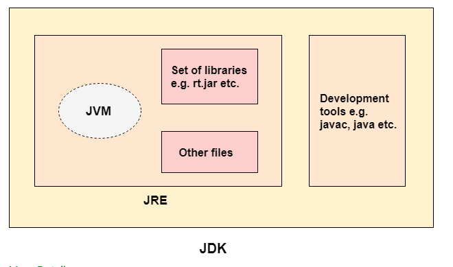
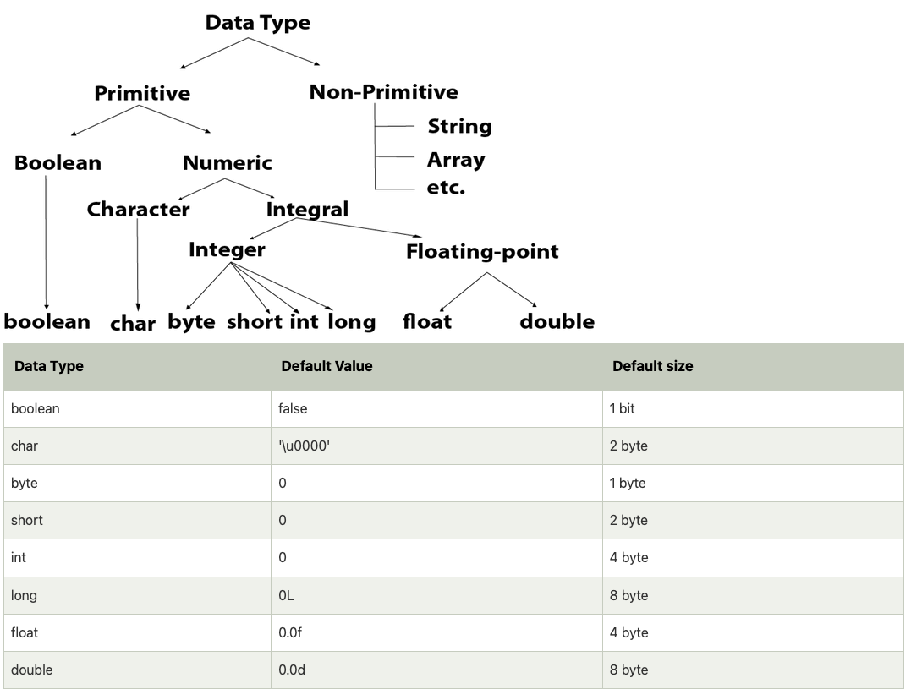
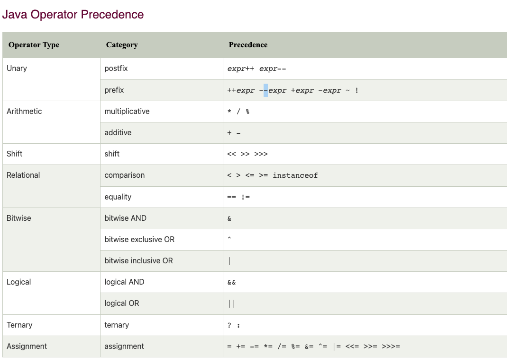
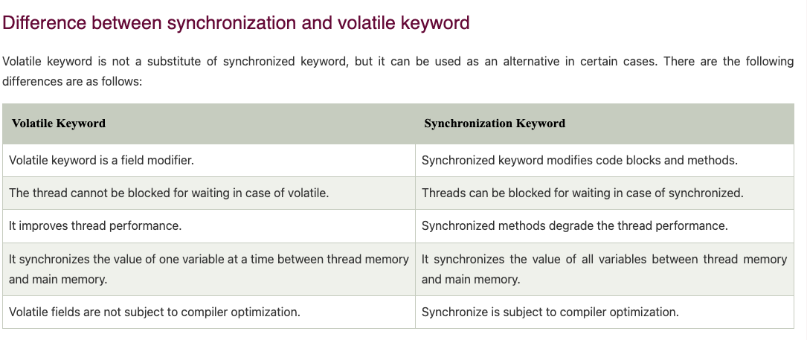
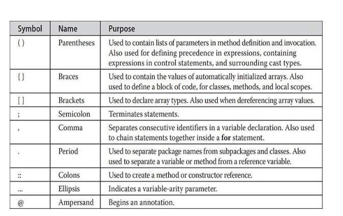
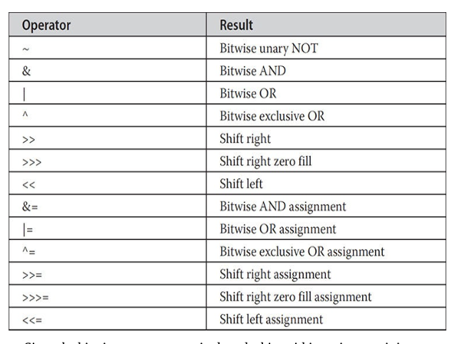

# java-basic-to-master

have resume of :

head First JAVA, 2nd edition.pdf
java - the complete reference - 11 edition.pdf


## what is computation

* problem solving
* knowledge of concepts
* programming skill


concepts : 

* data structures
* iteration and recursion 

* abstraction 
* organize and modularize (readability)

* algorithms (searching and sorting)
* complexity of algoritms


computer -> do calculations, store somewhere(remember)


type of knowledge

declarative knowledge - statements of fact

imperative knowledge - recipe or how-to -> sequence of steps

two types of computers

fixed program -> calculator
store program - machine stores and exucute instructions

turing showed that you can compute anything using 6 primitives
move left, move right, read , write, scan and do nothing.

expressions ->  variable(object) + operation

syntax error -> wrong word
semantic error -> the order of the words


 


## java tutorial

Java is an object-oriented, class-based, concurrent, secured and general-purpose computer-programming language.

Java is a programming language and a platform. Java is a high level, robust, object-oriented and secure programming language.

Java was developed by Sun Microsystems (which is now the subsidiary of Oracle) in the year 1995. James Gosling is known as the father of Java. Before Java, its name was Oak.

Platform: Any hardware or software environment in which a program runs, is known as a platform. Since Java has a runtime environment (JRE) and API, it is called a platform.

Simple.java

### Types of Java Applications

There are mainly 4 types of applications that can be created using Java programming:

Standalone Application - Standalone applications are also known as desktop applications or window-based applications

Web Application - An application that runs on the server side and creates a dynamic page is called a web application. Currently, Servlet, JSP, Struts, Spring, Hibernate, JSF, etc. technologies are used for creating web applications in Java.

Enterprise Application - An application that is distributed in nature, such as banking applications, etc. is called an enterprise application. It has advantages like high-level security, load balancing, and clustering. In Java, EJB is used for creating enterprise applications.

Mobile Application - An application which is created for mobile devices is called a mobile application. Currently, Android and Java ME are used for creating mobile applications.

### Java Platforms / Editions

Java SE (Java Standard Edition)

It is a Java programming platform. It includes Java programming APIs such as java.lang, java.io, java.net, java.util, java.sql, java.math etc. It includes core topics like OOPs, String, Regex, Exception, Inner classes, Multithreading, I/O Stream, Networking, AWT, Swing, Reflection, Collection, etc.

Java EE (Java Enterprise Edition)

It is an enterprise platform that is mainly used to develop web and enterprise applications. It is built on top of the Java SE platform. It includes topics like Servlet, JSP, Web Services, EJB, JPA, etc.

Java ME (Java Micro Edition)

It is a micro platform that is dedicated to mobile applications.

JavaFX

It is used to develop rich internet applications. It uses a lightweight user interface API.

current version - Java SE 18 (to be released by March 2022)

java is 

Simple
Object-Oriented
Portable
Platform independent
Secured
Robust
Architecture neutral
Interpreted
High Performance
Multithreaded
Distributed
Dynamic

Java is best known for its security. With Java, we can develop virus-free systems. Java is secured because:

No explicit pointer

Java Programs run inside a virtual machine sandbox

Classloader: Classloader in Java is a part of the Java Runtime Environment (JRE) which is used to load Java classes into the Java Virtual Machine dynamically. It adds security by separating the package for the classes of the local file system from those that are imported from network sources.

Bytecode Verifier: It checks the code fragments for illegal code that can violate access rights to objects.

Security Manager: It determines what resources a class can access such as reading and writing to the local disk.


Distributed

Java is distributed because it facilitates users to create distributed applications in Java. RMI and EJB are used for creating distributed applications. This feature of Java makes us able to access files by calling the methods from any machine on the internet.

Dynamic

Java is a dynamic language. It supports the dynamic loading of classes. It means classes are loaded on demand. It also supports functions from its native languages, i.e., C and C++.

Java supports dynamic compilation and automatic memory management (garbage collection).

To compile(generate simple.class -> bytecode):
javac Simple.java

To execute:
java Simple

valid java main() method signature

public static void main(String[] args)  
public static void main(String []args)  
public static void main(String args[])  
public static void main(String... args)  
static public void main(String[] args)  
public static final void main(String[] args)  
final public static void main(String[] args)  
final strictfp public static void main(String[] args)  

you can set temporary or permant path in Java

We must understand the differences between JDK, JRE, and JVM before proceeding further to Java.

JVM (Java Virtual Machine) is an abstract machine. It is called a virtual machine because it doesn't physically exist. It is a specification that provides a runtime environment in which Java bytecode can be executed. It can also run those programs which are written in other languages and compiled to Java bytecode.

Loads code
Verifies code
Executes code
Provides runtime environment

JRE is an acronym for Java Runtime Environment. It is also written as Java RTE. The Java Runtime Environment is a set of software tools which are used for developing Java applications. It is used to provide the runtime environment. It is the implementation of JVM. It physically exists. It contains a set of libraries + other files that JVM uses at runtime.

JRE = + JVM + SET OF libraries + other files

JDK is an acronym for Java Development Kit. The Java Development Kit (JDK) is a software development environment which is used to develop Java applications and applets. It physically exists. It contains JRE + development tools.

JDK is an implementation of any one of the below given Java Platforms released by Oracle Corporation:

Standard Edition Java Platform
Enterprise Edition Java Platform
Micro Edition Java Platform



JVM (Java Virtual Machine) is an abstract machine. It is a specification that provides runtime environment in which java bytecode can be executed.


A variable is a container which holds the value while the Java program is executed. A variable is assigned with a data type.

Variable is a name of memory location. There are three types of variables in java: local, instance and static.

There are two types of data types in Java: primitive and non-primitive.

A variable is the name of a reserved area allocated in memory.

A variable declared inside the body of the method is called local variable.

A local variable cannot be defined with "static" keyword.

variable declared inside the class but outside the body of the method, is called an instance variable.

A variable that is declared as static is called a static variable. It cannot be local. You can create a single copy of the static variable and share it among all the instances of the class. Memory allocation for static variables happens only once when the class is loaded in the memory.

Variable.java

widening - to increase the width, scope, or extent of widen a road widen an investigation.

widening -> int to float

```java
int a=10;  
float f=a;  
```

Narrowing (Typecasting)

narrowing -> float to int

```java
float f=10.5f;  
//int a=f;//Compile time error  
int a=(int)f;  
```

Primitive data types: The primitive data types include 
boolean, char, byte, short, int, long, float and double.

boolean data type
byte data type
char data type

short data type
int data type
long data type

float data type
double data type


Non-primitive data types: The non-primitive data types include Classes, Interfaces, and Arrays.




Byte Data Type

1 byte -> 8 bits ->  (max) 127 to -128 (min)

The byte data type is an example of primitive data type. It isan 8-bit signed two's complement integer. Its value-range lies between -128 to 127 (inclusive). Its minimum value is -128 and maximum value is 127. Its default value is 0.

The byte data type is used to save memory in large arrays where the memory savings is most required. It saves space because a byte is 4 times smaller than an integer. It can also be used in place of "int" data type.

```java
byte a = 10, byte b = -20  
```

The short data type is a 16-bit signed two's complement integer. Its value-range lies between -32,768 to 32,767

The int data type is a 32-bit signed two's complement integer. Its value-range lies between - 2,147,483,648 (-2^31) to 2,147,483,647 (2^31 -1)

The long data type is a 64-bit two's complement integer. Its value-range lies between -9,223,372,036,854,775,808(-2^63) to 9,223,372,036,854,775,807(2^63 -1)(inclusive).

```java
long a = 100000L, long b = -200000L  
```

The float data type is a single-precision 32-bit IEEE 754 floating point.Its value range is unlimited. It is recommended to use a float (instead of double) if you need to save memory in large arrays of floating point numbers. The float data type should never be used for precise values, such as currency. 

```java
float f1 = 234.5f  
```

The double data type is a double-precision 64-bit IEEE 754 floating point. Its value range is unlimited. The double data type is generally used for decimal values just like float. The double data type also should never be used for precise values, such as currency.

The char data type is a single 16-bit Unicode character. Its value-range lies between '\u0000' (or 0) to '\uffff' (or 65,535 inclusive).The char data type is used to store characters.

```java
chart letterA = 'a'
```

Java us 2 bytes - It is because java uses Unicode system not ASCII code system. The \u0000 is the lowest range of Unicode system. 

Unicode is a universal international standard character encoding that is capable of representing most of the world's written languages.

Before Unicode, there were many language standards:

* ASCII (American Standard Code for Information Interchange) for the United States.
* ISO 8859-1 for Western European Language.
* KOI-8 for Russian.
* GB18030 and BIG-5 for chinese, and so on.


This caused two problems:
* A particular code value corresponds to different letters in the various language standards. (no standard)
* The encodings for languages with large character sets have variable length.Some common characters are encoded as single bytes, other require two or more byte.

lowest value:\u0000
highest value:\uFFFF

Operator in Java is a symbol that is used to perform operations. For example: +, -, *, / etc.

here are many types of operators in Java which are given below:

Unary Operator,
Arithmetic Operator,
Shift Operator,
Relational Operator,
Bitwise Operator,
Logical Operator,
Ternary Operator and
Assignment Operator.




java unary operator

incrementing/decrementing a value by one
negating an expression
inverting the value of a boolean

```java
System.out.println(x++);//10 (11)  
System.out.println(++x);//12  
System.out.println(x--);//12 (11)  
System.out.println(--x);//10  
````

result : 10 12 12 10

```java
int a=10;  
int b=-10;  
boolean c=true;  
boolean d=false;  
System.out.println(~a);//-11 (minus of total positive value which starts from 0)  
System.out.println(~b);//9 (positive of total minus, positive starts from 0)  
System.out.println(!c);//false (opposite of boolean value)  
System.out.println(!d);//true  
```

java arithmetic 

```java
System.out.println(a+b);//15  
System.out.println(a-b);//5  
System.out.println(a*b);//50  
System.out.println(a/b);//2  
System.out.println(a%b);//0  
```


The Java left shift operator << is used to shift all of the bits in a value to the left side of a specified number of times.

```java
System.out.println(10<<2);//10*2^2=10*4=40  
System.out.println(10<<3);//10*2^3=10*8=80  
System.out.println(20<<2);//20*2^2=20*4=80  
System.out.println(15<<4);//15*2^4=15*16=240  
```

The Java right shift operator >> is used to move the value of the left operand to 
right by the number of bits specified by the right operand.

```java
System.out.println(10>>2);//10/2^2=10/4=2  
System.out.println(20>>2);//20/2^2=20/4=5  
System.out.println(20>>3);//20/2^3=20/8=2  
```

Java Shift Operator Example: >> vs >>>

```java
//For positive number, >> and >>> works same  
System.out.println(20>>2);  
System.out.println(20>>>2);  
//For negative number, >>> changes parity bit (MSB) to 0  
System.out.println(-20>>2);  
System.out.println(-20>>>2);  
```

Java AND Operator Example: Logical && and Bitwise &

The logical && operator doesn't check the second condition if the first condition is false. It checks the second condition only if the first one is true.

The bitwise & operator always checks both conditions whether first condition is true or false.

```java
nt a=10;  
int b=5;  
int c=20;  
System.out.println(a<b&&a<c);//false && true = false  
System.out.println(a<b&a<c);//false & true = false  
```

Java AND Operator Example: Logical && vs Bitwise &

```java
int a=10;  
int b=5;  
int c=20;  
System.out.println(a<b&&a++<c);//false && true = false  
System.out.println(a);//10 because second condition is not checked  
System.out.println(a<b&a++<c);//false && true = false  
System.out.println(a);//11 because second condition is checked  
```

Java OR Operator Example: Logical || and Bitwise |

The logical || operator doesn't check the second condition if the first condition is true. It checks the second condition only if the first one is false.

The bitwise | operator always checks both conditions whether first condition is true or false.

```java
int a=10;  
int b=5;  
int c=20;  
System.out.println(a>b||a<c);//true || true = true  
System.out.println(a>b|a<c);//true | true = true  
//|| vs |  
System.out.println(a>b||a++<c);//true || true = true  
System.out.println(a);//10 because second condition is not checked  
System.out.println(a>b|a++<c);//true | true = true  
System.out.println(a);//11 because second condition is checked  
```

Java Ternary operator is used as one line replacement for if-then-else statement and used a lot in Java programming. It is the only conditional operator which takes three operands.

Ternary.java


Java assignment operator is one of the most common operators. It is used to assign the value on its right to the operand on its left.

```java
int a=10;  
int b=20;  
a+=4;//a=a+4 (a=10+4)  
b-=4;//b=b-4 (b=20-4)  
a*=2;//9*2  
a/=2;//18/2  
```


Java keywords are also known as reserved words. Keywords are particular words that act as a key to a code. These are predefined words by Java so they cannot be used as a variable or object name or class name.


* abstract: Java abstract keyword is used to declare an abstract class. An abstract class can provide the implementation of the interface. It can have abstract and non-abstract methods.
* boolean: Java boolean keyword is used to declare a variable as a boolean type. It can hold True and False values only.
* break: Java break keyword is used to break the loop or switch statement. It breaks the current flow of the program at specified conditions.
* byte: Java byte keyword is used to declare a variable that can hold 8-bit data values.
* case: Java case keyword is used with the switch statements to mark blocks of text.
* catch: Java catch keyword is used to catch the exceptions generated by try statements. It must be used after the try block only.
* char: Java char keyword is used to declare a variable that can hold unsigned 16-bit Unicode characters
* class: Java class keyword is used to declare a class.
* continue: Java continue keyword is used to continue the loop. It continues the current flow of the program and skips the remaining code at the specified condition.
* default: Java default keyword is used to specify the default block of code in a switch statement.
* do: Java do keyword is used in the control statement to declare a loop. It can iterate a part of the program several times.
* double: Java double keyword is used to declare a variable that can hold 64-bit floating-point number.
* else: Java else keyword is used to indicate the alternative branches in an if statement.
* enum: Java enum keyword is used to define a fixed set of constants. Enum constructors are always private or default.
* extends: Java extends keyword is used to indicate that a class is derived from another class or interface.
* final: Java final keyword is used to indicate that a variable holds a constant value. It is used with a variable. It is used to restrict the user from updating the value of the variable.
* finally: Java finally keyword indicates a block of code in a try-catch structure. This block is always executed whether an exception is handled or not.
* float: Java float keyword is used to declare a variable that can hold a 32-bit floating-point number.
* for: Java for keyword is used to start a for loop. It is used to execute a set of instructions/functions repeatedly when some condition becomes true. If the number of iteration is fixed, it is recommended to use for loop.
* if: Java if keyword tests the condition. It executes the if block if the condition is true.
* implements: Java implements keyword is used to implement an interface.
* import: Java import keyword makes classes and interfaces available and accessible to the current source code.
* instanceof: Java instanceof keyword is used to test whether the object is an instance of the specified class or implements an interface.
* int: Java int keyword is used to declare a variable that can hold a 32-bit signed integer.
* interface: Java interface keyword is used to declare an interface. It can have only abstract methods.
* long: Java long keyword is used to declare a variable that can hold a 64-bit integer.
native: Java native keyword is used to specify that a method is implemented in native code using JNI (Java Native Interface).
* new: Java new keyword is used to create new objects.
* null: Java null keyword is used to indicate that a reference does not refer to anything. It removes the garbage value.
* package: Java package keyword is used to declare a Java package that includes the classes.
* private: Java private keyword is an access modifier. It is used to indicate that a method or variable may be accessed only in the class in which it is declared.
* protected: Java protected keyword is an access modifier. It can be accessible within the package and outside the package but through inheritance only. It can't be applied with the class.
* public: Java public keyword is an access modifier. It is used to indicate that an item is accessible anywhere. It has the widest scope among all other modifiers.
* return: Java return keyword is used to return from a method when its execution is complete.
* short: Java short keyword is used to declare a variable that can hold a 16-bit integer.
* static: Java static keyword is used to indicate that a variable or method is a class method. The static keyword in Java is mainly used for memory management.
* strictfp: Java strictfp is used to restrict the floating-point calculations to ensure portability.
* super: Java super keyword is a reference variable that is used to refer to parent class objects. It can be used to invoke the immediate parent class method.
* switch: The Java switch keyword contains a switch statement that executes code based on test value. The switch statement tests the equality of a variable against multiple values.
synchronized: Java synchronized keyword is used to specify the critical sections or methods in multithreaded code.
* this: Java this keyword can be used to refer the current object in a method or constructor.
* throw: The Java throw keyword is used to explicitly throw an exception. The throw keyword is mainly used to throw custom exceptions. It is followed by an instance.
* throws: The Java throws keyword is used to declare an exception. Checked exceptions can be propagated with throws.
* transient: Java transient keyword is used in serialization. If you define any data member as transient, it will not be serialized.
* try: Java try keyword is used to start a block of code that will be tested for exceptions. The try block must be followed by either catch or finally block.
* void: Java void keyword is used to specify that a method does not have a return value.
* volatile: Java volatile keyword is used to indicate that a variable may change asynchronously.
* while: Java while keyword is used to start a while loop. This loop iterates a part of the program several times. If the number of iteration is not fixed, it is recommended to use the while loop.

continue

```java
//for loop  
for(int i=1;i<=10;i++){  
    if(i==5){  
        //using continue statement  
        continue;//it will skip the rest statement  
    }  
    System.out.println(i);  
}  
```


Java default keyword

A Java default keyword is an access modifier. If you didn't assign any access modifier to variables, methods, constructors and, classes, by default, it is considered as default access modifier.

The default access modifier is accessible within the package only.

Java null reserved word

In Java, null is a reserved word for literal values. It seems like a keyword, but actually, it is a literal similar to true and false.

The access to a null reference generates a NullPointerException.

Java strictfp keyword 

ensures that you will get the same result on every platform if you perform operations in the floating-point variable. The precision may differ from platform to platform that is why java programming language have provided the strictfp keyword, so that you get same result on every platform. So, now you have better control over the floating-point arithmetic.

The strictfp keyword can be applied on methods, classes and interfaces.

```java
strictfp class A{}//strictfp applied on class  

strictfp interface M{}//strictfp applied on interface  

class A{  
    strictfp void m(){}//strictfp applied on method  
}  
```


Volatile Keyword in Java

Volatile keyword is used to modify the value of a variable by different threads. It is also used to make classes thread safe. It means that multiple threads can use a method and instance of the classes at the same time without any problem. The volatile keyword can be used either with primitive type or objects.

The volatile keyword does not cache the value of the variable and always read the variable from the main memory. The volatile keyword cannot be used with classes or methods. However, it is used with variables. It also guarantees visibility and ordering. It prevents the compiler from the reordering of code.

```java
class Test  {  
    static volatile int var =5;  
}  
```

When to use it?

* You can use a volatile variable if you want to read and write long and double variable automatically.
* It can be used as an alternative way of achieving synchronization in Java.
* All reader threads will see the updated value of the volatile variable after completing the write operation. If you are not using the volatile keyword, different reader thread may see different values.
* It is used to inform the compiler that multiple threads will access a particular statement. It prevents the compiler from doing any reordering or any optimization.
* If you do not use volatile variable compiler can reorder the code, free to write in cache value of volatile variable instead of reading from the main memory.




to check your java version in the command

```terminal
java - version
```

java comments 

```java
/*
multiline comments

*/

// this is inline comment

// javadoc comments

/**
 * Multiple lines of Javadoc text are written here,
 * wrapped normally...
 */

/** An especially short bit of Javadoc. */

```


Object − Objects have states and behaviors. Example: A dog has states - color, name, breed as well as behavior such as wagging their tail, barking, eating. An object is an instance of a class.

Class − A class can be defined as a template/blueprint that describes the behavior/state that the object of its type supports.

Methods − A method is basically a behavior. A class can contain many methods. It is in methods where the logics are written, data is manipulated and all the actions are executed.

Instance Variables − Each object has its unique set of instance variables. An object's state is created by the values assigned to these instance variables.

Case Sensitivity − Java is case sensitive, which means identifier Hello and hello would have different meaning in Java.

Class Names − For all class names the first letter should be in Upper Case. If several words are used to form a name of the class, each inner word's first letter should be in Upper Case.

Example: class MyFirstJavaClass

Method Names − All method names should start with a Lower Case letter. If several words are used to form the name of the method, then each inner word's first letter should be in Upper Case.

Example: public void myMethodName()


Java Modifiers

Access Modifiers − default, public , protected, private

Non-access Modifiers − final, abstract, strictfp


java variables

Local Variables

Class Variables (Static Variables)

Instance Variables (Non-static Variables)

Enums were introduced in Java 5.0. Enums restrict a variable to have one of only a few predefined values. The values in this enumerated list are called enums.

enums can be declared as their own or inside a class. Methods, variables, constructors can be defined inside enums as well.


In Java language, an interface can be defined as a contract between objects on how to communicate with each other. 


f you don't want others (or yourself) to overwrite existing values, use the final keyword (this will declare the variable as "final" or "constant", which means unchangeable and read-only):

java multiple variables : 

int x = 5, y = 6, z = 50;

Java Identifiers
All Java variables must be identified with unique names.

These unique names are called identifiers.

```java
// Good
int minutesPerHour = 60;
```

Primitive data types - includes byte, short, int, long, float, double, boolean and char

Non-primitive data types - such as String, Arrays and Classes (you will learn more about these in a later chapter)


java numbers 

Integer types stores whole numbers, positive or negative (such as 123 or -456), without decimals. Valid types are byte, short, int and long. Which type you should use, depends on the numeric value.

Floating point types represents numbers with a fractional part, containing one or more decimals. There are two types: float and double.


ASCII values as char
char myVar1 = 65, myVar2 = 66, myVar3 = 67;

The main difference between primitive and non-primitive data types are:

Primitive types are predefined (already defined) in Java. Non-primitive types are created by the programmer and is not defined by Java (except for String).

Non-primitive types can be used to call methods to perform certain operations, while primitive types cannot.

A primitive type has always a value, while non-primitive types can be null.

A primitive type starts with a lowercase letter, while non-primitive types starts with an uppercase letter.

The size of a primitive type depends on the data type, while non-primitive types have all the same size.

Examples of non-primitive types are Strings, Arrays, Classes, Interface, etc.

### Java Type Casting


Type casting is when you assign a value of one primitive data type to another type.

In Java, there are two types of casting:

Widening Casting (automatically) - converting a smaller type to a larger type size
byte -> short -> char -> int -> long -> float -> double

Narrowing Casting (manually) - converting a larger type to a smaller size type
double -> float -> long -> int -> char -> short -> byte

Widening Casting

```java

int myInt = 9;
double myDouble = myInt;

```

Narrowing Casting

```java

double myDouble = 9.78d;
int myInt = (int) myDouble; // manual casting: double to int

```


java is an object oriented language that supports : 

Polymorphism

Inheritance

Encapsulation

Abstraction

Classes

Objects

Instance

Method

Message Passing

Object − Objects have states and behaviors. Example: A dog has states - color, name, breed as well as behaviors – wagging the tail, barking, eating. An object is an instance of a class.

Class − A class can be defined as a template/blueprint that describes the behavior/state that the object of its type support.


A class can contain any of the following variable types.

Local variables − Variables defined inside methods, constructors or blocks are called local variables. The variable will be declared and initialized within the method and the variable will be destroyed when the method has completed.

Instance variables − Instance variables are variables within a class but outside any method. These variables are initialized when the class is instantiated. Instance variables can be accessed from inside any method, constructor or blocks of that particular class.

Class variables − Class variables are variables declared within a class, outside any method, with the static keyword.

Constructors

very class has a constructor. If we do not explicitly write a constructor for a class, the Java compiler builds a default constructor for that class.

```java

public class Puppy {
    public Puppy() {

    }

    public Puppy(String name) {

    }
}
```

Java also supports Singleton Classes where you would be able to create only one instance of a class.


Creating an Object

There are three steps when creating an object from a class −

Declaration − A variable declaration with a variable name with an object type.

Instantiation − The 'new' keyword is used to create the object.

Initialization − The 'new' keyword is followed by a call to a constructor. This call initializes the new object.


Java Package - In simple words, it is a way of categorizing the classes and interfaces.

Decision Making statements


* if statements
* switch statement


Loop statements

* do while loop
* while loop
* for loop
* for-each loop

Jump statements

* break statement
* continue statement


if statement

* Simple if statement
* if-else statement
* if-else-if ladder
* Nested if-statement


In Java, Switch statements are similar to if-else-if statements. The switch statement contains multiple blocks of code called cases and a single case is executed based on the variable which is being switched.

* The case variables can be int, short, byte, char, or enumeration. String type is also supported since version 7 of Java
* Cases cannot be duplicate
* Default statement is executed when any of the case doesn't match the value of expression. It is optional.
* Break statement terminates the switch block when the condition is satisfied.
It is optional, if not used, next case is executed.
* While using switch statements, we must notice that the case expression will be of the same type as the variable. However, it will also be a constant value.

```java

int num = 2;

switch(num) {
    case 0: System.out.println("number is 0"); break;
    case 1: System.out.println("number is 1"); break;
    default: System.out.println(num); 
}

```


for statement

We use the for loop only when we exactly know the number of times, we want to execute the block of code.

ForExample.java

```java

int sum =0;

for(int i = 1; i <=10; i++>) {
    sum=sum+i;
}


```

Java for-each loop

Java provides an enhanced for loop to traverse the data structures like array or collection. In the for-each loop, we don't need to update the loop variable. The syntax to use the for-each loop in java is given below.

```java
String[] names = {"Java","C","C++","Python","JavaScript"}

for(String name: names) System.out.println(name);
```

Java while loop

The while loop is also used to iterate over the number of statements multiple times. However, if we don't know the number of iterations in advance, it is recommended to use a while loop. Unlike for loop, the initialization and increment/decrement doesn't take place inside the loop statement in while loop.


```java

int i = 0;

while(i<=10>) {
    Sysmte.out.println(i);
}

```

Java do-while loop

The do-while loop checks the condition at the end of the loop after executing the loop statements. When the number of iteration is not known and we have to execute the loop at least once, we can use do-while loop.


```java

int i = 0;

do {
    System.out.println(i);
}while(i <=10)

```

Jump Statements

Jump statements are used to transfer the control of the program to the specific statements. In other words, jump statements transfer the execution control to the other part of the program. 


java break statement


As the name suggests, the break statement is used to break the current flow of the program and transfer the control to the next statement outside a loop or switch statement. However, it breaks only the inner loop in the case of the nested loop.


The break statement cannot be used independently in the Java program, i.e., it can only be written inside the loop or switch statement.


```java

for(int i = 0; i <= 10; i++) {
    System.out.println(i);
    if(i == 6) break;    
}

```

0
1
2
3
4
5
6

Java continue statement

Unlike break statement, the continue statement doesn't break the loop, whereas, it skips the specific part of the loop and jumps to the next iteration of the loop immediately.

```java


for(int i = 0; i <= 10; i++) {
    if(i == 6) continue;    
    System.out.println(i);
}

```

0
1
2
3
4
5
7
8
9
10

ContinueExample.java


nested swtich example

```java

char branch = 'C';                 
int collegeYear = 4;  
switch( collegeYear )  
{  
    case 1:  
        System.out.println("English, Maths, Science");  
        break;  
    case 2:  
        switch( branch )   
        {  
            case 'C':  
                System.out.println("Operating System, Java, Data Structure");  
                break;  
            case 'E':  
                System.out.println("Micro processors, Logic switching theory");  
                break;  
            case 'M':  
                System.out.println("Drawing, Manufacturing Machines");  
                break;  
        }  
        break;  
    case 3:  
        switch( branch )   
        {  
            case 'C':  
                System.out.println("Computer Organization, MultiMedia");  
                break;  
            case 'E':  
                System.out.println("Fundamentals of Logic Design, Microelectronics");  
                break;  
            case 'M':  
                System.out.println("Internal Combustion Engines, Mechanical Vibration");  
                break;  
        }  
        break;  
    case 4:  
        switch( branch )   
        {  
            case 'C':  
                System.out.println("Data Communication and Networks, MultiMedia");  
                break;  
            case 'E':  
                System.out.println("Embedded System, Image Processing");  
                break;  
            case 'M':  
                System.out.println("Production Technology, Thermal Engineering");  
                break;  
        }  
        break;  
}  

```

Java Wrapper in Switch Statement

Java allows us to use four wrapper classes: Byte, Short, Integer and Long in switch statement.

```java
Integer age = 18;        
switch (age)  
{  
    case (16):            
        System.out.println("You are under 18.");  
        break;  
    case (18):                
        System.out.println("You are eligible for vote.");  
        break;  
    case (65):                
        System.out.println("You are senior citizen.");  
        break;  
    default:  
        System.out.println("Please give the valid age.");  
        break;  
}             
```

Java Enum in Switch Statement

Java allows us to use enum in switch statement. Java enum is a class that represent the group of constants. (immutable such as final variables). We use the keyword enum and put the constants in curly braces separated by comma.

EnumSwitchExample.java

java keywords

https://www.w3schools.com/java/java_ref_keywords.asp

math library

https://www.w3schools.com/java/java_ref_math.asp


java docs

https://www.tutorialspoint.com/java/java_documentation.htm

java email library to send email

https://www.tutorialspoint.com/java/java_sending_email.htm


Java divides the operators into the following groups:

* Arithmetic operators
* Assignment operators
* Comparison operators
* Logical operators
* Bitwise operators


Java Special Characters

\'	'	Single quote

\"	"	Double quote

\\	\	Backslash

\n	New Line	

\r	Carriage Return	

\t	Tab	

\b	Backspace	

\f	Form Feed


The solution to avoid this problem, is to use the backslash escape character.

```java
String txt = "We are the so-called \"Vikings\" from the north.";
String txt = "It\'s alright.";
```

The Java Math class has many methods that allows you to perform mathematical tasks on numbers.

The Math.max(x,y) method can be used to find the highest value of x and y:

The Math.sqrt(x) method returns the square root of x:

The Math.abs(x) method returns the absolute (positive) value of x:

```java
Math.max(5, 10);
Math.min(5, 10);
Math.sqrt(64);
Math.abs(-4.7);
Math.random();
```

ternary operator

There is also a short-hand if else, which is known as the ternary operator because it consists of three operands.

```java
variable = (condition) ? expressionTrue :  expressionFalse;
```

```java
int time = 20;
Stringr result = (time < 20) ? "soon":"late";
```

switch

```java
switch(expression) {
  case x:
    // code block
    break;
  case y:
    // code block
    break;
  default:
    // code block
}
```

java for

```java
for (statement 1; statement 2; statement 3) {
  // code block to be executed
}
```

Statement 1 is executed (one time) before the execution of the code block.

Statement 2 defines the condition for executing the code block.

Statement 3 is executed (every time) after the code block has been executed.


for each

used to loop thorugh elements in java collection


```java
for (type variableName : arrayName) {
  // code block to be executed
}
```

Java Arrays

Arrays are used to store multiple values in a single variable, instead of declaring separate variables for each value.

```java
String[] cars = {"Volvo", "BMW", "Ford", "Mazda"};
int[] myNum = {10, 20, 30, 40};
cars[0] = "Opel";
System.out.println(cars[0]);

//array length
System.out.println(cars.length);

// traditional for loop on collection
for (int i = 0; i < cars.length; i++) {
  System.out.println(cars[i]);
}

```

Multidimensional Arrays

A multidimensional array is an array of arrays.

To create a two-dimensional array, add each array within its own set of curly braces:

```java
int[][] myNumbers = { {1, 2, 3, 4}, {5, 6, 7} };
int x = myNumbers[1][2];  // 7 

```


Java Literals

A literal is a source code representation of a fixed value. They are represented directly in the code without any computation.

byte, int, long, and short can be expressed in decimal(base 10), hexadecimal(base 16) or octal(base 8) number systems as well.


```java
byte a = 68;
char a = 'A';

int decimal = 100;
int octal = 0144;
int hexa =  0x64;

```

String and char types of literals can contain any Unicode characters.

```java
char a = '\u0001';
String a = "\u0001";
```


\n	Newline (0x0a)

\r	Carriage return (0x0d)

\f	Formfeed (0x0c)

\b	Backspace (0x08)

\s	Space (0x20)

\t	tab

\"	Double quote

\'	Single quote

\\	backslash

\ddd	Octal character (ddd)

\uxxxx	Hexadecimal UNICODE character (xxxx)


static variable example : 

```java
public class Employee {

   // salary  variable is a private static variable
   private static double salary;

   // DEPARTMENT is a constant
   public static final String DEPARTMENT = "Development ";

   public static void main(String args[]) {
      salary = 1000;
      System.out.println(DEPARTMENT + "average salary:" + salary);
   }
}
```

Modifiers are keywords that you add to those definitions to change their meanings. Java language has a wide variety of modifiers, including the following −

Java Access Modifiers

Non Access Modifiers

To use a modifier, you include its keyword in the definition of a class, method, or variable.

Access Control Modifiers

Java provides a number of access modifiers to set access levels for classes, variables, methods and constructors. 

Visible to the package, the default. No modifiers are needed.

Visible to the class only (private).

Visible to the world (public).

Visible to the package and all subclasses (protected).

Non-Access Modifiers

Java provides a number of non-access modifiers to achieve many other functionality.

The static modifier for creating class methods and variables.

The final modifier for finalizing the implementations of classes, methods, and variables.

The abstract modifier for creating abstract classes and methods.

The synchronized and volatile modifiers, which are used for threads.

The bitwise operators

Java defines several bitwise operators, which can be applied to the integer types, long, int, short, char, and byte.

Bitwise operator works on bits and performs bit-by-bit operation. Assume if a = 60 and b = 13; now in binary format they will be as follows −

a = 0011 1100

b = 0000 1101

-----------------

a&b = 0000 1100

a|b = 0011 1101

a^b = 0011 0001

~a  = 1100 0011


* << (left shift)	Binary Left Shift Operator. The left operands value is moved left by the number of bits specified by the right operand.	A << 2 will give 240 which is 1111 0000

C <<= 2 is same as C = C << 2

*  (right shift) >>	Binary Right Shift Operator. The left operands value is moved right by the number of bits specified by the right operand.	A >> 2 will give 15 which is 1111

* (zero fill right shift) >>>	Shift right zero fill operator. The left operands value is moved right by the number of bits specified by the right operand and shifted values are filled up with zeros.	A >>>2 will give 15 which is 0000 1111


instanceof Operator

This operator is used only for object reference variables. The operator checks whether the object is of a particular type (class type or interface type)

```java
( Object reference variable ) instanceof  (class/interface type)
```

```java
String name = "James"
Vehicle a = new Car();

// following will return true since name is type of String
boolean result = name instanceof String;
// This operator will still return true, if the object being compared is the assignment compatible with the type on the right.
boolean result =  a instanceof Car;  // true

```

Precedence of Java Operators

For example, x = 7 + 3 * 2; here x is assigned 13, not 20 because operator * has higher precedence than +, so it first gets multiplied with 3 * 2 and then adds into 7.

Here, operators with the highest precedence appear at the top of the table, those with the lowest appear at the bottom. Within an expression, higher precedence operators will be evaluated first.


Postfix	expression++ expression--	Left to right

Unary	++expression –-expression +expression –expression ~ !	Right to left

Multiplicative	* / %	Left to right

Additive	+ -	Left to right

Shift	<< >> >>>	Left to right

Relational	< > <= >= instanceof	Left to right

Equality	== !=	Left to right

Bitwise AND	&	Left to right

Bitwise XOR	^	Left to right

Bitwise OR	|	Left to right

Logical AND	&&	Left to right

Logical OR	||	Left to right

Conditional	?:	Right to left

Assignment	= += -= *= /= %= ^= |= <<= >>= >>>=	Right to left


A method is a block of code which only runs when it is called.

You can pass data, known as parameters, into a method.

Methods are used to perform certain actions, and they are also known as functions.

Why use methods? To reuse code: define the code once, and use it many times.

```java
public class Main {
    static void myMethod() {
        // code to be executed
    }
}
```

static means that the method belongs to the Main class and not an object of the Main class.

Parameters and Arguments

Information can be passed to methods as parameter. Parameters act as variables inside the method.

With method overloading, multiple methods can have the same name with different parameters:

```java
int myMethod(int x)
float myMethod(float x)
double myMethod(double x, double y)

static int plusMethod(int x, int y) {
  return x + y;
}

static double plusMethod(double x, double y) {
  return x + y;
}

```

Java Scope

In Java, variables are only accessible inside the region they are created. This is called scope.

Method Scope

Variables declared directly inside a method are available anywhere in the method

```java
public static void main(String[] args) {

    // Code here CANNOT use x

    int x = 100;

    // Code here can use x
    System.out.println(x);
}
```

Block Scope

A block of code refers to all of the code between curly braces {}.

Variables declared inside blocks of code are only accessible by the code between the curly braces

```java

public static void main(String[] args) {

    // Code here CANNOT use x

    { // This is a block

        // Code here CANNOT use x

        int x = 100;

        // Code here CAN use x
        System.out.println(x);

    } // The block ends here

    // Code here CANNOT use x           

}
```

Java Recursion

Recursion is the technique of making a function call itself. This technique provides a way to break complicated problems down into simple problems which are easier to solve.

```java
public static int sum(int k) {
    if (k > 0) {
        return k + sum(k - 1);
    } else {
        return 0;
    }
}
```

10 + sum(9)
10 + ( 9 + sum(8) )
10 + ( 9 + ( 8 + sum(7) ) )
...
10 + 9 + 8 + 7 + 6 + 5 + 4 + 3 + 2 + 1 + sum(0)
10 + 9 + 8 + 7 + 6 + 5 + 4 + 3 + 2 + 1 + 0

Halting Condition

Just as loops can run into the problem of infinite looping, recursive functions can run into the problem of infinite recursion. Infinite recursion is when the function never stops calling itself. Every recursive function should have a halting condition, which is the condition where the function stops calling itself. In the previous example, the halting condition is when the parameter k becomes 0.

```java
public static int sum(int start, int end) {
    if (end > start) {
      return end + sum(start, end - 1);
    } else {
      return end;
    }
}
```

Normally, when we work with Numbers, we use primitive data types such as byte, int, long, double, etc.

However, in development, we come across situations where we need to use objects instead of primitive data types. In order to achieve this, Java provides wrapper classes.

All the wrapper classes (Integer, Long, Byte, Double, Float, Short) are subclasses of the abstract class Number.

The object of the wrapper class contains or wraps its respective primitive data type. Converting primitive data types into object is called boxing, and this is taken care by the compiler. Therefore, while using a wrapper class you just need to pass the value of the primitive data type to the constructor of the Wrapper class.

And the Wrapper object will be converted back to a primitive data type, and this process is called unboxing. The Number class is part of the java.lang package.


```java
    Integer x = 5; // boxes int to an Integer object
    x =  x + 10;   // unboxes the Integer to a int
    System.out.println(x); 
```

Nested for Loop

If we have a for loop inside the another loop, it is known as nested for loop. 


Java Labeled For Loop
We can have a name of each Java for loop. To do so, we use label before the for loop. It is useful while using the nested for loop as we can break/continue specific for loop.

```java
//Using Label for outer and for loop  
aa:  
    for(int i=1;i<=3;i++){  
        bb:  
            for(int j=1;j<=3;j++){  
                if(i==2&&j==2){  
                    break aa;  
                }  
                System.out.println(i+" "+j);  
            }  

```
If you use break bb;, it will break inner loop only which is the default behaviour of any loop.

Java Infinitive for Loop

If you use two semicolons ;; in the for loop, it will be infinitive for loop.

```java
for(;;){  
//code to be executed  
}  
```

it became obvious that Java would also be useful on the server side. The result was the servlet. A servlet is a small program that executes on the server.

Because servlets (like all Java programs) are compiled into bytecode and executed by the JVM, they are highly portable. Thus, the same servlet can be used in a variety of different server environments. The only requirements are that the server support the JVM and a servlet container

To better understand how Java is robust, consider two of the main reasons for program failure: memory management mistakes and mishandled exceptional conditions (that is, run-time errors). 

In computer science, robustness is the ability of a computer system to cope with errors during execution and cope with erroneous input. 


Java was designed to meet the real-world requirement of creating interactive, networked programs. To accomplish this, Java supports multithreaded programming

Java is designed for the distributed environment of the Internet because it handles TCP/IP protocols. In fact, accessing a resource using a URL is not much different from accessing a file. Java also supports Remote Method Invocation (RMI). This feature enables a program to invoke methods across a network.

Dynamic

Java programs carry with them substantial amounts of run-time type information that is used to verify and resolve accesses to objects at run time.

Java 1 -> 1.1

Java 2 -> 1.2 added support for a number of new features, such as Swing and the Collections Framework, and it enhanced the Java Virtual Machine and various programming tools. 


Java 1.3 ->  first major upgrade to the original Java 2 release. For the most part, it added to existing functionality and “tightened up” the development environment. 

j2se 1.4 - >  it added the new keyword assert, chained exceptions, and a channel-based I/O subsystem. It also made changes to the Collections Framework and the networking classes.

J2SE 5 -> expanded the scope, power, and range of the language.

* Generics
* Annotations
* Autoboxing and auto-unboxing
* Enumerations
* Enhanced, for-each style for loop
* Variable-length arguments (varargs) 
* Static import
* Formatted I/O
* Concurrency utilities


Java SE 6 - but it did enhance the API libraries, added several new packages, and offered improvements to the run time.

Java SE 7 -> jdk 7 -> first major release of Java since Sun Microsystems was acquired by Oracle. new features, including significant additions to the language and the API libraries. Upgrades to the Java run-time system that support non- Java languages were also included. The purpose of Project Coin was to identify a number of small changes to the Java language that would be incorporated into JDK 7.

* A String can now control a switch statement.
*  Binary integer literals.
*  Underscores in numeric literals.
*  An expanded try statement, called try-with-resources, that supports
automatic resource management. (For example, streams can be closed
automatically when they are no longer needed.)
*  Type inference (via the diamond operator) when constructing a generic
instance.
*  Enhanced exception handling in which two or more exceptions can be
caught by a single catch (multi-catch) and better type checking for
exceptions that are rethrown.
*  Although not a syntax change, the compiler warnings associated with
some types of varargs methods were improved, and you have more control over the warnings.

 Two of the most important were the enhancements to the NIO Framework and the addition of the Fork/Join Framework.

 The Fork/Join Framework provides important support for parallel programming.

Parallel programming is the name commonly given to the techniques that make effective use of computers that contain more than one processor, including multicore systems.

The Fork/Join Framework addressed parallel programming by:

* Simplifying the creation and use of tasks that can execute concurrently 
* Automatically making use of multiple processors

Java SE 8 -> 1.8. JDK 8 -> 


the lambda expression -> lambda expressions add functional programming features to Java

The addition of lambda expressions also caused a new operator (the –>) and a new syntax element to be added to the language.

One of the most important was the new stream API, which is packaged in java.util.stream. The stream API supports pipeline operations on data and is optimized for lambda expressions. Another new package was ava.util.function. It defines a number of functional interfaces, which provide additional support for lambda expressions.

Another lambda-inspired feature affects interface. is now possible to define a default implementation for a method specified by an interface. If no implementation for a default method is created, then the default defined by the interface is used. This feature enables interfaces to be gracefully evolved over time because a new method can be added to an interface without breaking existing code

ther new features in JDK 8 include a new time and date API, type annotations, and the ability to use parallel processing when sorting an array, among others.

Java SE 9. -> 

The primary new JDK 9 feature was modules, which enable you to specify the relationship and dependencies of the code that comprises an application. Modules also add another dimension to Java’s access control features. The inclusion of modules caused a new syntax element and several keywords to be added to Java. Furthermore, a tool called jlink was added to the JDK, which enables a programmer to create a run-time image of an application that contains only the necessary modules

 JShell, which is a tool that supports interactive program experimentation and learning.

Support for private interface methods.
JDK 9 added a search feature to the javadoc tool and a new tag called @index to support it.

JDK 9 deprecated the entire applet API.

 Java SE 10 - 

Support for local variable type inference.

With local variable type inference, it is now possible to let the type of a local variable be inferred from the type of its initializer, rather than being explicitly specified.

To support this new capability, the context-sensitive identifier var was added to Java as a reserved type name.

Type inference can streamline code by eliminating the need to redundantly specify a variable’s type when it can be inferred from its initializer. It can also simplify declarations in cases in which the type is difficult to discern or cannot be explicitly specified.

Local variable type inference has become a common part of the contemporary programming

 JDK 10 also redefined the Java version string, changing the meaning of the version numbers so that they better align with the new time-based release schedule.

https://www.javatpoint.com/java-versions

Java SE 11 -  

he primary new language feature in JDK 11 is support for the use of var in a lambda expression

new networking API, which will be of interest to a wide range of developers. Called the HTTP Client API, it is packaged in java.net.http, and it provides enhanced, updated, and improved networking support for HTTP clients.

Also, another execution mode was added to the Java launcher that enables it to directly execute simple single-file programs. JDK 11 also removes some features

Support for another deployment-related technology called Java Web Start has also been removed from JDK 11. As the execution environment has continued to evolve, both applets and Java Web Start were rapidly losing relevance. Another key change in JDK 11 is that JavaFX is no longer included in the JDK.

* java 12
* java 13
* java 14
* java 15
* java 16
* java 17
* java 18(march 2022)

https://en.wikipedia.org/wiki/Java_version_history#Java_11


Object-oriented programming (OOP) is at the core of Java.

All computer programs consist of two elements: code and data. Furthermore, a program can be conceptually organized around its code or around its data.


An essential element of object-oriented programming is abstraction. Humans manage complexity through abstraction. For example, people do not think of a car as a set of tens of thousands of individual parts. They think of it as a well- defined object with its own unique behavior. This abstraction allows people to use a car to drive to the grocery store without being overwhelmed by the complexity of the individual parts. They can ignore the details of how the engine, transmission, and braking systems work. Instead, they are free to utilize the object as a whole.

The Three OOP Principles

All object-oriented programming languages provide mechanisms that help you implement the object-oriented model. They are encapsulation, inheritance, and polymorphism.

Encapsulation is the mechanism that binds together code and the data it manipulates, and keeps both safe from outside interference and misuse. One way to think about encapsulation is as a protective wrapper that prevents the code and data from being arbitrarily accessed by other code defined outside the wrapper.


Inheritance is the process by which one object acquires the properties of another object. This is important because it supports the concept of hierarchical classification. As mentioned earlier, most knowledge is made manageable by hierarchical (that is, top-down) classifications. For example, a Golden Retriever is part of the classification dog, which in turn is part of the mammal class, which is under the larger class animal. 

Inheritance interacts with encapsulation as well. If a given class encapsulates some attributes, then any subclass will have the same attributes plus any that it adds as part of its specialization

Polymorphism (from Greek, meaning “many forms”) is a feature that allows one interface to be used for a general class of actions.

More generally, the concept of polymorphism is often expressed by the phrase “one interface, multiple methods.”

More generally, the concept of polymorphism is often expressed by the phrase “one interface, multiple methods.” This means that it is possible to design a generic interface to a group of related activities

When properly applied, polymorphism, encapsulation, and inheritance combine to produce a programming environment that supports the development of far more robust and scaleable programs than does the process-oriented model

java basic compile

```
javac Example.java
java Example
```

In, Java is case-sensitive, so VALUE is a different identifier than Value.

Literals

A constant value in Java is created by using a literal representation of it. 

In Java, there are a few characters that are used as separators. The most commonly used separator in Java is the semicolon. As you have seen, it is often used to terminate statements. The separators are shown in the following table:




Java Is a Strongly Typed Language

 First, every variable has a type, every expression has a type, and every type is strictly defined. Second, all assignments, whether explicit or via parameter passing in method calls, are checked for type compatibility.


The Primitive Types

Java defines eight primitive types of data: byte, short, int, long, char, float, double, and boolean

* Integers This group includes byte, short, int, and long, which are for whole-valued signed numbers.
* Floating-point numbers This group includes float and double, which represent numbers with fractional precision.
* Characters This group includes char, which represents symbols in a character set, like letters and numbers.
* Boolean This group includes boolean, which is a special type for representing true/false values.

Java defines four integer types: byte, short, int, and long. All of these are signed, positive and negative values

The smallest integer type is byte. This is a signed 8-bit type that has a range from –128 to 127. Variables of type byte are especially useful when you’re working with a stream of data from a network or file. They are also useful when you’re working with raw binary data that may not be directly compatible with Java’s other built-in types.

The type float specifies a single-precision value that uses 32 bits of storage. Single precision is faster on some processors and takes half as much space as double precision, but will become imprecise when the values are either very large or very small.

Double precision, as denoted by the double keyword, uses 64 bits to store a value. Double precision is actually faster than single precision on some modern processors that have been optimized for high-speed mathematical calculations.

Notice that ch1 is assigned the value 88, which is the ASCII (and Unicode) value that corresponds to the letter X

You can embed one or more underscores in an integer literal. Doing so makes it easier to read large integer literals. When the literal is compiled, the underscores are discarded. For example, given

int x = 123_456_789;

the value given to x will be 123,456,789.The underscores will be ignored.

double num = 9_423_497_862.0;
the value given to num will be 9,423,497,862.0. The underscores will be ignored. 

declare variable
int a, b, c;

initializaing variable
b = 2;

dynamic initialization - > allows variables to be initialized dynamically, using any expression valid at the time the variable is declared.

```java
double a = 3.0, b= 4.0;

double c = Math.sqrt(a*a+b*b);
```

Type Conversion and Casting

If the two types are compatible, then Java will perform the conversion automatically. For example, it is always possible to assign an int value to a long variable. However, not all types are compatible, and thus, not all type conversions are implicitly allowed. For instance, there is no automatic conversion defined from double to byte. Fortunately, it is still possible to obtain a conversion between incompatible types. To do so, you must use a cast,

```java
int a;
byte b;
b = (byte) a;
```

Automatic Type Promotion in Expressions

```java
byte a = 40;
byte b = 50;
byte c = 100;
int d = a * b / c;
```

The Type Promotion Rules

First, all byte, short, and char values are promoted to int, as just described. Then, if one operand is a long, the whole expression is promoted to long. If one operand is a float, the entire expression is promoted to float. If any of the operands are double, the result is double.


An array is a group of like-typed variables that are referred to by a common name. Arrays of any type can be created and may have one or more dimensions.  convenient means of grouping related information.

A one-dimensional array is, essentially, a list of like-typed variables

```java
int month_days[] = new int[12];
month_days[0] = 31;
int algo[] = {31,24,24};
```
In Java, multidimensional arrays are implemented as arrays of arrays. 

```java
int twoD[][] = new int[4][5];

int al[] = new int[3]; 
int[] a2 = new int[3];

int[] nums, nums2, nums3;
int nums[], nums2[], nums3[];

```

Introducing Type Inference with Local Variables

Recently, an exciting new feature called local variable type inference was added to the Java language. To begin, let’s review two important aspects of variables. First, all variables in Java must be declared prior to their use. Second, a variable can be initialized with a value when it is declared.

```java

double avg = 10.0;
var avg2 = 10.0;

```


In both cases, avg will be of type double. In the first case, its type is explicitly specified. In the second, its type is inferred as double because the initializer 10.0 is of type double.

There are a few places in which the use of var is illegal. It cannot be used as the name of a class, for example.

The preceding example uses var to declare only simple variables, but you can also use var to declare an array. For example:

Notice that neither var nor myArray has brackets. Instead, the type of myArray is inferred to be int[ ]. Furthermore, you cannot use brackets on the left side of a var declaration. Thus, both of these declarations are invalid:

It is important to emphasize that var can be used to declare a variable only when that variable is initialized.

```java
var myArray = new int[10]; // This is valid.
var[] myArray = new int[10]; // Wrong

var counter; // Wrong! Initializer required.
```
Also, remember that var can be used only to declare local variables. It cannot be used when declaring instance variables, parameters, or return types, for example.

In addition to those mentioned in the preceding discussion, several other restrictions apply to the use of var. Only one variable can be declared at a time; a variable cannot use null as an initializer; and the variable being declared cannot be used by the initializer expression. Although you can declare an array type using var, you cannot use var with an array initializer. For example, this is valid:

```java

var myArray = new int[10]; // This is valid.
var myArray = { 1, 2, 3 }; // Wrong

```

As mentioned earlier, var cannot be used as the name of a class. It also cannot be used as the name of other reference types, including an interface, enumeration, or annotation, or as the name of a generic type parameter


```java
x = 42; 
y = ++x;
```

In this case, y is set to 43 as you would expect, because the increment occurs before x is assigned to y. Thus, the line y = ++x; is the equivalent of these two statements:

```java
x = x + 1; 
y = x;
```

However, when written like this,

```java
x = 42; 
y = x++;
```

the value of x is obtained before the increment operator is executed, so the value of y is 42. Of course, in both cases x is set to 43. Here, the line y = x++; is the equivalent of these two statements:

```java
y = x;
x = x + 1;
```

Java defines several bitwise operators that can be applied to the integer types: long, int, short, char, and byte



The logical Boolean operators, &, |, and ^, operate on boolean values in the same way that they operate on the bits of an integer. The logical ! operator inverts the Boolean state: !true == false and !false == true.

As you can see from the preceding table, the OR operator results in true when A is true, no matter what B is. Similarly, the AND operator results in false when A is false, no matter what B is.

If you use the || and && forms, rather than the | and & forms of these operators, Java will not bother to evaluate the right-hand operand when the outcome of the expression can be determined by the left operand alone.

This is very useful when the right-hand operand depends on the value of the left one in order to function properly.

```java
if (denom != 0 && num / denom > 10)
```

It is standard practice to use the short-circuit forms of AND and OR in cases involving Boolean logic, leaving the single-character versions exclusively for bitwise operations. 

Parentheses raise the precedence of the operations that are inside them. This is often necessary to obtain the result you desire.

```java
(a >> b) + 3
```


